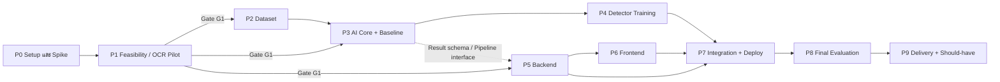

# KeyCheck — Implementation Plan

**อ้างอิง:** [`keycheck-technical0-specification.md`](./keycheck-technical0-specification.md) (v1.0, 30 ก.ย. 2026)
**เวอร์ชันแผน:** 0.1 — 1 ตุลาคม 2026
**สถานะ:** ร่างสำหรับตกลงลำดับงาน ยังไม่ได้เริ่ม Implement

> ระยะเวลาในแผนนี้เป็นค่าประมาณเพื่อจัดลำดับเท่านั้น ต้องปรับหลังผ่าน Gate ของ Phase 1 เพราะผล OCR Pilot เป็นตัวกำหนดว่าต้องเพิ่มงาน Classifier สำรองหรือไม่

---

## 0. หลักการจัดลำดับ

1. **พิสูจน์ว่าอ่านคีย์แคปได้ก่อนสร้างระบบเต็ม** (Spec §18) — ถ้า OCR/Geometry ไม่ผ่าน งานเว็บทั้งหมดจะสูญเปล่า
2. **ล็อก Contract เร็ว** — Layout JSON, Result schema (§11.4) และ Error contract (§11.5) ต้องนิ่งก่อน Backend/Frontend เริ่ม เพื่อให้ทำคู่ขนานกับงาน AI ได้ด้วย Mock pipeline
3. **Baseline ก่อน Detector** — ใช้ OCR + Matching + Decision ชุดเดียวกัน Detector เป็นแค่ตัวเสียบเพิ่ม (§6.4, §8.3)
4. **Test split ห้ามแตะจนถึง Phase 8** — แบ่งและล็อกตั้งแต่ Phase 2 ใช้ Validation เลือกทุกอย่าง
5. **Must-have ให้ครบก่อน Should-have** (§3.1 / §3.2)

### 0.1 ภาพรวม Phases และการพึ่งพา

มีสองสายงานหลักหลังผ่าน Gate G1:

| สาย | Phases | ลักษณะ |
| --- | --- | --- |
| **A: AI/Data** (Critical path) | P2 → P3 → P4 → P8 | ใช้เวลาจริงมากที่สุด: ถ่ายภาพ, Annotate, ฝึกโมเดล |
| **B: Web** | P5 → P6 → P7 | ทำคู่ขนานได้ ใช้ Mock/Baseline pipeline ระหว่างรอ Detector |

### 0.2 ตารางเวลาตัวอย่าง (สมมติ ~16 สัปดาห์)

| สัปดาห์ | สาย A: AI/Data | สาย B: Web |
| --- | --- | --- |
| 1 | P0 Setup, Dependency spike | P0 Generate backend/frontend |
| 2–3 | P1 OCR Pilot, Layout v1, Rectification | — |
| 4–6 | P2 ถ่าย/Annotate Dataset, Pilot pipeline 50–80 ภาพ | P5 Backend (Upload, Session, Queue, Worker + Mock) |
| 6–8 | P3 AI Core + Baseline บน Validation | P5 ต่อ / P6 Frontend |
| 8–11 | P4 Train YOLO11n, Faster R-CNN (SSDLite ถ้าเหลือเวลา) | P6 Frontend, UX บนมือถือ |
| 11–12 | P4 เลือกโมเดลจาก Validation | P7 Integration, Docker, HTTPS proxy |
| 13–14 | P8 รัน Test ครั้งเดียว, Benchmark, Error analysis | P7 E2E/UX tests |
| 15–16 | P9 รายงาน, Model card, Demo | P9 Should-have ที่เหลือ |

---

## Phase 0 — Project Setup และ Dependency Spike

**เป้าหมาย:** มีโครงสร้าง Repo ตาม Spec §15 และรู้ตั้งแต่ต้นว่า Dependency หลักอยู่ด้วยกันได้หรือไม่

### 0.A จัดโครงสร้าง Repository

สถานะปัจจุบัน: `backend/` คือ Source ของ **create-fastapi** และ `frontend/` คือ Source ของ **create-sveltekitten** (เป็นตัว Generator ไม่ใช่แอป) และมี `keycheck/.git` ซ้อนอยู่อีกชั้น

- [ ] ตัดสินใจเรื่อง Generator: ย้ายไป `tools/` หรือลบออกหลังใช้งาน เพื่อให้ `backend/` และ `frontend/` เป็นโค้ดแอปจริงตาม §15
- [ ] ตรวจสอบและจัดการ `keycheck/.git` ที่ซ้อนอยู่ (น่าจะสร้างโดยไม่ตั้งใจ)
- [ ] สร้างโครงสร้าง: `ai/`, `layouts/`, `data/manifests/`, `experiments/`, `tests/`, `docs/`
- [ ] `.gitignore`: ภาพ Dataset, Weights, `.env`, ผลรัน Experiment ขนาดใหญ่

### 0.B Generate Backend (create-fastapi)

- [ ] DB = **Beanie (MongoDB)**
- [ ] Background worker = **No** — Spec §4.3 ใช้ MongoDB เป็นคิว ไม่ใช้ Redis/arq ใน MVP
- [ ] Examples = No
- [ ] Auth: Template มี JWT user auth แต่ KeyCheck ต้องการ **Anonymous server-issued session ใน HttpOnly cookie** (§13) → เลือก Cookie strategy แล้วแทนที่ด้วย Session module ภายหลัง (P5) หรือตัด User auth ออก
- [ ] ตรวจ `uv run` + health endpoint + เชื่อม MongoDB ได้

### 0.C Generate Frontend (create-sveltekitten)

- [ ] เลือก Template: **แนะนำ SPA (adapter-static) + Reverse proxy แบบ Same-origin** — Backend ออก Session cookie เอง, Proxy (เช่น Caddy) ให้ HTTPS ที่จำเป็นต่อกล้องบนมือถือ (§10.3) และไม่ต้องใช้ Drizzle/Server auth ของ SSR template
- [ ] ตัด JWT-in-memory auth และ Example feature `items` ที่ไม่ใช้
- [ ] ตั้ง `pnpm openapi` ให้ Generate types จาก FastAPI

### 0.D Dependency Spike (สำคัญ ทำก่อนเริ่มเขียนโค้ดจริง)

- [ ] ทดลองติดตั้ง `paddleocr`/`paddlepaddle` + `torch`/`torchvision` + `ultralytics` + `opencv` ใน Env เดียว (CPU) เพื่อตรวจว่าชนกันหรือไม่ (§14.2)
- [ ] ตัดสินใจ: Serving env เดียว (Worker) หรือแยก Training env ออก
- [ ] ตรวจ GPU/VRAM ที่มีจริงสำหรับการฝึก (Local / Colab / Lab server)
- [ ] ตั้ง `ai/` เป็น Python package ของตัวเอง (pyproject แยก) เพื่อให้ Worker และ Training scripts import ร่วมกัน

**Exit criteria:** Repo มีโครงสร้างครบ, Backend/Frontend รันได้เปล่า ๆ, รู้ Env strategy และ Hardware ที่ใช้ฝึก

---

## Phase 1 — Feasibility: OCR Pilot และ Geometry (Spec §18 ระยะ 1)

**เป้าหมาย:** ตอบให้ได้ว่า "PP-OCRv5 อ่านตัวอักษรบนคีย์แคปชุดนี้ได้พอไหม" และ "ปัญหาหลักอยู่ที่การอ่านหรือ Geometry"

### 1.A คู่มือถ่ายและ Layout อ้างอิง

- [ ] เขียน `docs/capture-guide.md` ฉบับร่าง: มุม ระยะ แสง ห้ามมือบัง ห้ามมีป้ายกำกับในภาพ (§5.3)
- [ ] กำหนด `reference_corners_definition` — จุดสี่มุมบนคีย์บอร์ดที่ผู้ใช้ต้องแตะ (ต้องชี้ได้ชัดบนตัวเครื่องจริง)
- [ ] วัดคีย์บอร์ดจริงเพื่อกำหนด `canonical_width/height` ตามอัตราส่วนจริง
- [ ] สร้าง `layouts/qwerty_reference_v1.json`: 26 Slots พร้อม `slot_id`, `expected_label`, `center`, `region`, `row`, และ `key_pitch` — **วัดจากภาพจริงที่เรียงถูก ไม่ใช้กริดเท่ากัน** (§12.1)

### 1.B เก็บภาพ Pilot

- [ ] ถ่าย 20–30 ภาพ: ถูกทั้งหมด + สลับบางคู่ หลายแสง
- [ ] บันทึกสี่มุมด้วยมือและ `actual_label` ของทุกช่อง

### 1.C Prototype scripts (ใน `ai/`, ยังไม่ต้องสวย)

- [ ] EXIF orientation normalization (Pillow `ImageOps.exif_transpose`)
- [ ] Rectification: `cv2.getPerspectiveTransform` + `warpPerspective` ไปที่ Canonical canvas
- [ ] **OCR บน Crop ที่ตัดด้วยมือ** → วัด Character accuracy แยกโมดูล
- [ ] **Baseline แบบ Fixed layout crops** → OCR → เทียบ Layout
- [ ] ทดลอง Crop ทั้งปุ่ม เทียบ Crop เฉพาะบริเวณตัวอักษร (§6.2)
- [ ] ทดลอง Resolution ของ Canonical canvas (ต้องละเอียดพอให้ OCR อ่านได้)

### 1.D Error report

- [ ] สรุปว่า Error มาจาก OCR (อ่านผิด/อ่านไม่ออก) หรือ Geometry (Crop เลื่อน) เป็นหลัก
- [ ] ล็อกชื่อ OCR weights/config ที่ใช้จริง

### ⛳ Gate G1 — ตัดสินใจก่อนเดินต่อ

| ผล Pilot | การตัดสินใจ |
| --- | --- |
| OCR อ่านได้ดีบน Crop ด้วยมือ | ใช้ PP-OCRv5 ต่อ เริ่ม P2/P3/P5 |
| OCR อ่านไม่ได้ในระดับที่ยอมรับได้ | เพิ่มงาน **Classifier A–Z สำรอง** (`YOLO11n-cls`, §6.3) เข้า P3 และต้องเก็บ Crop ที่ Label แล้วเพิ่มใน P2 |
| Geometry เป็นปัญหาหลัก | ปรับ Corner definition / Canonical canvas / จำกัดมุมถ่าย ก่อนเก็บ Dataset จริง |

**Exit criteria:** มี Pilot report, Layout v1, ตัดสินใจ OCR vs Classifier แล้ว

---

## Phase 2 — Dataset และ Annotation (Spec §5)

**เป้าหมาย:** Dataset ~400 ภาพที่ Label ครบ แบ่ง Split แบบกลุ่ม และล็อก Test ไว้

### 2.A เอกสารและนโยบาย

- [ ] `docs/annotation-guide.md`: กรอบคีย์แคปทุกปุ่มที่มองเห็น (ไม่ใช่แค่ A–Z), นโยบายปุ่มโดนตัดขอบ, การบันทึก `readable`
- [ ] **ตัดสินใจเรื่องพิกัด Annotation:** แนะนำ Annotate กรอบบนภาพ `original_oriented` + สี่มุมอ้างอิง แล้วใช้สคริปต์สร้างชุด Rectified สำหรับฝึก (ไม่ผูก Annotation กับ Canvas version) และใช้การ Jitter มุมจำลองความคลาดเคลื่อนตอนผู้ใช้แตะ
- [ ] แผนการจัดวาง (Arrangement schedule): หมุนเวียนคู่สลับให้ **ทุกตัวอักษรอยู่นอกตำแหน่งหลายครั้ง** ทั้งข้างกันและคนละแถว (§5.3) และกันบางรูปแบบไว้ให้ Test เท่านั้น

### 2.B เก็บภาพ

- [ ] Pilot pipeline 50–80 ภาพก่อน → ตรวจว่า Annotation/Converter/Split ใช้ได้ทั้งเส้น
- [ ] เก็บให้ได้เป้า: ถูกทั้งหมด 100 / สลับหนึ่งคู่ 200 / สลับ 2–3 คู่ 100 (§5.2) จากหลายรอบถ่าย
- [ ] ชุดภาพใช้ไม่ได้แยกต่างหาก: เบลอ, สะท้อน, ปิดบัง, ถ่ายไม่ครบ

### 2.C Annotation

- [ ] เลือกเครื่องมือ (เช่น CVAT / Label Studio) ที่ Export COCO ได้
- [ ] ใช้ Assist annotation (เช่นโมเดลจาก Pilot) แล้วให้คนตรวจทาน (§19)
- [ ] ตาราง Ground Truth รายช่อง: `slot_id`, `expected_label`, `actual_label`, `readable`, `ground_truth_status`, หมายเหตุ
- [ ] Metadata ระดับภาพ: `image_id`, `capture_session_id`, `arrangement_id`, `device`, `lighting`, `split`

### 2.D Tooling (ใน `ai/`)

- [ ] สคริปต์สร้าง Manifest พร้อม SHA-256 ของทุกภาพ + ตรวจ Duplicate / Near-duplicate
- [ ] **Group split 70/15/15** ตาม `capture_session_id` + `arrangement_id` (Burst อยู่ Split เดียวกัน, §5.5)
- [ ] Validator: กรอบอยู่ในภาพ, Class ID ถูก, 26 Slots ครบ, ไม่มีภาพซ้ำข้าม Split
- [ ] Converter: COCO → YOLO format และ COCO → Torchvision dataset (Background class ตาม API)
- [ ] บันทึก `dataset_version` และ `split_manifest_hash`

**Exit criteria:** Labels ผ่าน Validator, ไม่มีภาพซ้ำข้าม Split, **Test split ถูกล็อก** (Hash ใน Git)

---

## Phase 3 — AI Core Pipeline และ Baseline (Spec §6.4, §7)

**เป้าหมาย:** Pipeline ที่ Detector-agnostic พร้อม Baseline ที่วัดผลได้บน Validation ส่วนนี้คือแกนที่ Worker ใช้จริง

### 3.A Contracts (ทำเป็นอันดับแรก — สาย B รอส่วนนี้)

- [ ] Pydantic models: `PipelineInput`, `SlotResult`, `InspectionResult` ตาม §11.4 รวม `detector_score`, `ocr_score`, `assignment_distance`, `reason_codes`, `timings_ms`, `warnings` (ค่าที่ไม่มี = `null`)
- [ ] Interface `Detector.predict(rectified_image) -> list[Box]` และ `Recognizer.read(crop) -> Reading`
- [ ] Reason codes: `detection_unavailable`, `mapping_ambiguous`, `ocr_low_confidence`, `ocr_invalid_label`, `crop_quality_low`, `label_mismatch`

### 3.B โมดูล

| โมดูล | Path | งาน |
| --- | --- | --- |
| Preprocessing | `ai/preprocessing/` | EXIF normalize, Quality (Variance of Laplacian, Exposure clipping ratio), Corner validation (อยู่ในภาพ / ไม่ไขว้ / พื้นที่พอ / ลำดับ TL→TR→BR→BL), Homography |
| Coordinates | `ai/preprocessing/` | แปลงระหว่าง `original_oriented` ↔ `rectified` ↔ `model_input` (ย้อน Letterbox), แปลงมุมกรอบทั้งสี่ด้วย H⁻¹ เป็น Polygon |
| Recognition | `ai/recognition/` | PP-OCRv5 wrapper, Normalize (Uppercase, trim), ยอมรับ A–Z ตัวเดียว, ไม่แปลง 0→O / 1→I, **ไม่ใช้ Expected label ช่วย OCR** |
| Matching | `ai/matching/` | Center + Normalized distance ด้วย `key_pitch`, Cost matrix + **Dummy/unmatched columns**, Gating, `linear_sum_assignment`, ตรวจ Ambiguity (ระยะคู่ดีสุดใกล้คู่รอง) |
| Decision | `ai/matching/` | Threshold แยกแต่ละหลักฐาน (ไม่คูณรวม) → `correct` / `incorrect` / `uncertain` + Reason |
| Suggestion | `ai/matching/` | Mutual swap เมื่อทั้งสองช่องยืนยันได้; Cycle ให้แสดงรายการช่อง; ไม่เสนอเมื่อมี Uncertain ที่เกี่ยวข้อง |
| Baseline detector | `ai/detection/` | `FixedLayoutDetector` คืนกรอบจาก `region` ของ Layout — ใช้ Interface เดียวกับ Detector จริง |
| Evaluation | `ai/evaluation/` | Metrics §9.1–9.2 ทั้งหมด: Precision/Recall/F1 ของ `incorrect`, Coverage, Uncertain rate, Strict full-board accuracy, False-alarm image rate, Observed-label accuracy, Confusion matrix, Convention N/A เมื่อหารศูนย์ |

### 3.C Unit tests (Spec §16.1)

- [ ] H ไป/กลับได้ตำแหน่งเดิมภายใน Tolerance
- [ ] ภาพ EXIF หมุน vs ภาพปกติได้พิกัดอ้างอิงเดียวกัน
- [ ] Assignment ไม่ให้สอง Detection เข้าช่องเดียว; กรอบขาด/เกิน/ห่างมากไม่ถูกบังคับจับคู่
- [ ] OCR ว่าง / หลายตัว / Score ต่ำ → `uncertain`
- [ ] Mutual swap เสนอเฉพาะคู่ที่ยืนยันแล้ว
- [ ] Summary รวม = 26 และตรงกับ Slots เสมอ
- [ ] Test cases จาก §17.1 (26/0/0, 24/2/0, 22/4/0, 25/0/1, rejected)

### 3.D รัน Baseline

- [ ] รัน Baseline บน Validation ด้วย GT corners และด้วย Corners ที่ Jitter
- [ ] ปรับ OCR threshold, Gating, Unmatched cost **บน Validation เท่านั้น**
- [ ] Baseline error report (แยกขั้น: Geometry / OCR / Matching)
- [ ] ถ้า Gate G1 ตัดสินให้ใช้ Classifier สำรอง → ฝึก `YOLO11n-cls` ที่นี่ (Crop สืบทอด Split จากภาพแม่)

**Exit criteria:** มีผล Baseline บน Validation + Error report, Unit tests ผ่าน, Result schema นิ่ง

---

## Phase 4 — Detector Training และการเลือกโมเดล (Spec §6.1, §8)

**เป้าหมาย:** Detector อย่างน้อยสองสถาปัตยกรรมที่ทำซ้ำได้ และเลือกตัวเดียวจากผลทั้งระบบบน Validation

### 4.A โครงสร้างการทดลอง

- [ ] `experiments/<run_id>/`: config, seed, dataset version, split hash, library versions, hardware, loss components, training time, model size, peak memory
- [ ] Augmentation เฉพาะ Train: Brightness/Contrast, Noise, Blur อ่อน, Scale/มุมเล็กน้อย — **ห้าม Flip / หมุนแรง**, ปิด Mosaic/MixUp ในการทดลองหลัก (§5.6)
- [ ] สคริปต์ตรวจ Bounding box หลัง Augment

### 4.B ฝึกโมเดล (ตามลำดับ)

1. [ ] **YOLO11n** (Ultralytics) หนึ่งคลาส `keycap` — เทียบ Input 640 vs 960 ถ้า GPU พอ
2. [ ] **Faster R-CNN ResNet50-FPN V2** (Torchvision) — เปลี่ยน Head เป็น 2 คลาส (Background + keycap), บันทึก Min/Max resize
3. [ ] **SSDLite320 MobileNetV3** — ทำเมื่อสองตัวแรกเสร็จและยังมีเวลา (Should-have)

ทุกตัว: Pretrained weights, Early stopping บน Validation, Max detections ครอบคลุมทุกปุ่มที่เห็น (ไม่ตัดเหลือ 26), ไม่ทำ NMS ซ้ำ, เป้า 3 Seeds สำหรับโมเดลหลัก

### 4.C Detector adapters

- [ ] `ai/detection/yolo.py`, `faster_rcnn.py`, (`ssdlite.py`) → คืน `Box` ในพิกัด `rectified` ผ่าน Interface เดียวกับ Baseline

### 4.D ประเมินและเลือก

- [ ] Detection metrics: mAP@0.5, mAP@0.5:0.95, Precision, Recall
- [ ] **ทั้ง Pipeline** (OCR + Matching + Decision เดียวกัน) บน Validation เทียบกับ Baseline
- [ ] Latency (Warm-up / Cold start แยก), Memory บน Hardware เดียวกัน
- [ ] เลือก Detector สุดท้ายด้วยผลทั้งระบบ + ความเร็ว + ทรัพยากร (§1) — **ถ้า Baseline ดีเท่ากันและเร็วกว่า ให้รายงานตามจริง**
- [ ] สร้าง Model bundle: `bundle_id`, `checkpoint_hash`, `ocr_model_id`, `preprocessing_version`, `thresholds`, `dataset_version`, `split_manifest_hash`, `library_versions`, `validation_metrics`

**Exit criteria:** Checkpoints + Validation metrics ทำซ้ำได้, Model bundle ที่เลือกพร้อมใช้ใน Worker

---

## Phase 5 — Backend (Spec §4.3, §11, §12, §13)

**เริ่มได้หลัง Gate G1** และใช้ `ai/` Result schema จาก P3.A — ระหว่างรอ Detector ให้ Worker รัน Baseline หรือ Mock pipeline

### 5.A ลำดับงาน

1. [ ] **Config** (`pydantic-settings`): `MONGODB_URI`, `STORAGE_ROOT`, `MODEL_BUNDLE_ID`, `MAX_UPLOAD_BYTES`, `MAX_IMAGE_PIXELS`, `QUEUE_CAPACITY`, `IMAGE_RETENTION_HOURS`, `SESSION_SECRET`
2. [ ] **Error contract** — Exception handler รูปแบบ §11.5 + Error codes ทั้งหมด, HTTP 413/415/422/429/409, ไม่ส่ง Stack trace
3. [ ] **Session** — Token สุ่มใน HttpOnly cookie (Secure, SameSite), เก็บเฉพาะ Hash (`owner_session_hash`), ตรวจ Origin สำหรับ Request ที่เปลี่ยนข้อมูล
4. [ ] **Beanie documents + Indexes** — `layouts`, `uploads`, `inspections` (Index `(owner_session_hash, created_at)`, `(status, created_at)`), `model_bundles`
5. [ ] **Storage service** — ตั้งชื่อไฟล์เองจาก Internal ID, ไม่รับ Path จากผู้ใช้, ไม่เปิด Directory listing
6. [ ] **Layout service** + Seed `qwerty_reference_v1` + `GET /api/v1/layouts`
7. [ ] **Upload service** — ตรวจ Magic bytes (JPEG/PNG), Size/Pixel limits (ตั้งต้น 15 MiB / 24 MP), Decode จริง, EXIF transpose, ลบ EXIF (GPS), SHA-256, `expires_at`
   - `POST /api/v1/uploads`, `GET /uploads/{id}/image`, `DELETE /uploads/{id}` (Conflict ถ้าผูกงานแล้ว)
8. [ ] **Inspection service** — Validate corners (ซ้ำกับ Frontend), Idempotency key / Client request ID, จำกัดงานต่อ Session และ `QUEUE_CAPACITY`
   - `POST /api/v1/inspections` → 202, `GET /inspections/{id}`, `GET /inspections/{id}/overlay`, `DELETE /inspections/{id}` (409 ถ้า `processing`)
9. [ ] **Inference worker** (Process แยกจาก API, `backend/app/worker/`)
   - โหลด Model bundle ครั้งเดียวตอนเริ่ม
   - Claim งาน `queued` ด้วย `find_one_and_update` แบบ Atomic
   - `worker_lease`: `worker_id`, `claimed_at`, `heartbeat_at`, `retry_count`
   - กู้งานค้าง: Lease หมดอายุ → Requeue แบบมีขอบเขต หรือ `failed`
   - อัปเดต `stage` ระหว่างทาง (ใช้แสดง Progress ตามชื่อขั้นตอน), บันทึก `timings_ms`, `model_bundle_id`, `layout_version`
10. [ ] **Model registry** — อ่าน Bundle ที่ `active` จาก Read-only model volume, ไม่รับ Path จาก Client
11. [ ] **Retention worker** — ลบไฟล์จริง + อัปเดตสถานะ (ภาพ 24 ชม. / Metadata 7 วัน), `reference_count`
12. [ ] **Health** — `GET /api/v1/health` บอก API/DB/Model readiness โดยไม่เปิด Secrets
13. [ ] **Logging** — เฉพาะ ID, Status, Error code ไม่ Log Token หรือภาพ

### 5.B Integration tests (Spec §16.2)

- [ ] Upload → Inspection → Worker → Result ครบวงจร (ใช้ Mock pipeline ได้)
- [ ] Worker ล่ม / Model โหลดไม่ได้ → งานไม่ค้าง `processing` ตลอดไป
- [ ] Session อื่นอ่าน/ลบภาพหรือผลไม่ได้
- [ ] ไฟล์ใหญ่ / ชนิดผิด / Decode ไม่ได้ → Reject พร้อม Error code ถูกต้อง
- [ ] Submit ซ้ำด้วย Idempotency key เดียวกัน → ไม่เกิดงานซ้ำ
- [ ] ลบงานและ Retention ไม่ทิ้งไฟล์หลง

**Exit criteria:** Integration tests ผ่าน, OpenAPI schema นิ่งให้ Frontend Generate types

---

## Phase 6 — Frontend (Spec §10, §17)

**เริ่มได้เมื่อ P5 มี Upload + Inspection endpoints** (ใช้ Mock worker ได้)

### 6.A ลำดับงาน

1. [ ] API client จาก OpenAPI types + จัดการ Error contract และ Retry
2. [ ] State machine: `idle`, `camera_permission`, `preview`, `uploading`, `calibrating`, `queued`, `processing`, `completed`, `rejected`, `failed`
3. [ ] **`/`** — ขอบเขตที่รองรับ, วิธีถ่าย, ปุ่มถ่าย/เลือกภาพ, ชื่อ Layout (ไม่ทำ Dropdown ตัวเลือกเดียว)
4. [ ] **`Camera` component** — `getUserMedia` + `facingMode: environment`, Fallback `<input type="file" accept="image/*" capture="environment">` เมื่อปฏิเสธสิทธิ์/ไม่มี MediaDevices, หยุด Media tracks เมื่อถ่ายเสร็จ/ออกหน้า, ส่งภาพความละเอียดเต็ม, แจ้งไม่รองรับ HEIC
5. [ ] **`/inspect` + `CornerPicker`** — ใช้ภาพจาก Backend (หลัง EXIF) เป็นฐาน, Normalized 0–1, ลำดับ TL→TR→BR→BL, Undo/Reset, Pointer events + `touch-action: none` กันหน้าเลื่อน, Validate Quadrilateral, ล้างมุมเมื่อเปลี่ยนภาพ, ปุ่ม Submit กันกดซ้ำ + Client request ID
6. [ ] **`/inspections/[id]`** — Poll ทุก 1–2 วินาที หยุดเมื่อจบหรือออกหน้า, แสดงชื่อขั้นตอน (ไม่แสดง % ที่ไม่ได้วัด)
7. [ ] **`ResultOverlay`** — SVG ที่ `viewBox` ตามขนาดภาพจริง เพื่อให้ Polygon ตรงทุกขนาดจอ; สี + ไอคอน + ข้อความ (ไม่ใช้สีอย่างเดียว)
8. [ ] **`SlotList`** — `expected_label` / `observed_label` / Reason, แตะแล้วเน้นกรอบ, Keyboard navigation
9. [ ] Summary: แยก "ประมวลผลเสร็จ" กับ "ทุกปุ่มถูกต้อง", ไม่ประกาศ "ถูกทั้งหมด" ถ้ามี `uncertain`, แสดงคำแนะนำสลับเฉพาะที่ยืนยันได้, ปุ่มถ่ายตรวจใหม่
10. [ ] ภาพหมดอายุ: แจ้งผู้ใช้แม้ Metadata ยังอยู่

### 6.B UX tests (Spec §16.3)

- [ ] มือถือแนวตั้ง/แนวนอน + Desktop
- [ ] อนุญาต / ปฏิเสธกล้อง / ไม่มี MediaDevices
- [ ] เครือข่ายช้าและขาดระหว่าง Poll
- [ ] Preview ไม่ปะปนกับภาพงานก่อน

**Exit criteria:** ใช้งานบนมือถือจริงผ่าน HTTPS ได้ครบ Flow

---

## Phase 7 — Integration และ Deployment (Spec §14)

- [ ] `docker-compose.yml`: `frontend`, `api`, `worker`, `mongodb`, `proxy` (HTTPS + Same-origin routing)
- [ ] Storage volume แชร์ระหว่าง API/Worker (ไม่เปิดภายนอก), Model volume แบบ Read-only
- [ ] Lockfiles: `uv.lock` (backend, ai), `pnpm-lock.yaml`; Pin PaddleOCR/Paddle, Torch/Torchvision, CUDA หลังทดสอบ
- [ ] `.env.sample` ไม่มี Secret จริง
- [ ] ต่อ Model bundle จริงจาก P4 เข้า Worker
- [ ] E2E test: ถ่ายบนมือถือ → Result
- [ ] Benchmark ระบบ: Median/P95 latency แยกขั้นตอน + End-to-end, Peak memory (CPU inference)
- [ ] ตรวจเกณฑ์ตรวจรับเชิงฟังก์ชัน §9.3 ทีละข้อ

**Exit criteria:** `docker compose up` แล้วใช้งานจากมือถือได้ครบ Flow ด้วยโมเดลจริง

---

## Phase 8 — Final Evaluation (Spec §9, §16.4)

- [ ] **ล็อก Config ทั้งหมด** (Model bundle, Thresholds, Layout version) และ Commit ก่อนรัน Test
- [ ] รัน Test split **ครั้งเดียว** สำหรับ: Baseline, YOLO11n, Faster R-CNN, (SSDLite)
- [ ] รายงาน Metrics §9.1 ครบทุกระดับ พร้อม Counts (ไม่ใช่แค่ %)
- [ ] ชุด Robustness แยก: ภาพใช้ไม่ได้ และช่องที่ GT อ่านไม่ได้
- [ ] Error analysis: แยกตามแสง มุม Blur ชนิดการสลับ, ตัวอย่าง FP/FN, Letter confusion matrix
- [ ] ตอบคำถามวิจัย §2.3 ทั้งสี่ข้อ พร้อมข้อจำกัด
- [ ] ระบุชัดว่าการเปรียบเทียบใช้ Input resolution ต่างกัน = เปรียบเทียบ Configuration ไม่ใช่ Architecture ล้วน (§8.2)

**Exit criteria:** รายงานผลทดสอบที่ทำซ้ำได้ อธิบายได้ว่าทำไมเลือกโมเดลสุดท้าย

---

## Phase 9 — Delivery และ Should-have (Spec §3.2, §20)

### 9.A Delivery (Must)

- [ ] Model card (ขอบเขต, ข้อมูลฝึก, Metrics, ข้อจำกัด, License/Attribution ของ Weights)
- [ ] คู่มือรัน (`README.md`), Capture guide, Annotation guide ฉบับสุดท้าย
- [ ] รายงาน: Metrics, Latency, Error analysis, ตัวอย่างภาพจริง
- [ ] Demo ที่ไม่ปะปนผลจำลองกับผลโมเดลจริง (Mockup ต้องระบุว่าเป็นข้อมูลจำลอง, §17.3)
- [ ] ตรวจ License ของโค้ดและ Weights (§13)

### 9.B Should-have (ทำตามเวลาที่เหลือ ตามลำดับนี้)

1. [ ] `/history` + `GET /api/v1/inspections` (ประวัติใน Session)
2. [ ] ส่งออกผลเป็น JSON
3. [ ] ดาวน์โหลดภาพผลตรวจ (Overlay)
4. [ ] กราฟเปรียบเทียบ Metrics จากผลจริง
5. [ ] SSDLite (ถ้ายังไม่ได้ทำใน P4)

---

## 10. Definition of Done (สรุปจาก Spec §20)

| รายการ | Phase |
| --- | --- |
| Specification และขอบเขตที่อาจารย์เห็นชอบ | ก่อน P0 |
| Dataset + Label + Annotation guide + Split manifest | P2 |
| Training/Evaluation scripts + Config ที่ทำซ้ำได้ | P3, P4 |
| ผลเปรียบเทียบอย่างน้อย 2 Detector + Baseline | P4, P8 |
| Model bundle ที่เลือก + Model card | P4, P9 |
| API และเว็บ Capture-to-result | P5, P6, P7 |
| Tests: พิกัด, Assignment, Upload, การงดตอบ | P3, P5 |
| รายงาน Metrics, Latency, Error analysis, ภาพจริง | P8, P9 |
| คู่มือรันและ Demo | P9 |

---

## 11. การตัดสินใจที่ต้องทำก่อน/ระหว่างทาง

| # | เรื่อง | ข้อเสนอ | เมื่อไหร่ |
| --- | --- | --- | --- |
| D1 | จัดการ Generator repos ใน `backend/` `frontend/` และ `keycheck/.git` ที่ซ้อน | ย้าย Generator ออก ใช้ชื่อโฟลเดอร์สำหรับแอปจริง | P0 |
| D2 | Frontend template SPA vs SSR | SPA + Same-origin proxy | P0 |
| D3 | Env เดียวหรือแยก Training/Serving | ตัดสินจาก Dependency spike | P0 |
| D4 | Hardware สำหรับฝึก | ระบุ GPU/VRAM จริง | P0 |
| D5 | OCR หรือ Classifier สำรอง | ตัดสินที่ Gate G1 | P1 |
| D6 | Annotate บนภาพ Original หรือ Rectified | Original + สี่มุม แล้ว Generate Rectified | P2 |
| D7 | เครื่องมือ Annotation | CVAT หรือ Label Studio (Export COCO) | P2 |
| D8 | เป้าตัวเลขความแม่นยำ/เวลารอ | ตกลงหลัง Pilot + Hardware benchmark ก่อนล็อก Test (§9.3) | ปลาย P4 |

## 12. ความเสี่ยงที่กระทบลำดับงาน

| ความเสี่ยง | ผลต่อแผน | การรับมือ |
| --- | --- | --- |
| OCR ไม่ผ่าน Pilot | P3 ใหญ่ขึ้น (ต้องฝึก Classifier) | Gate G1 ตัดสินเร็ว, เก็บ Crop ที่ Label แล้วตั้งแต่ P2 |
| Annotation ช้า | P4 เลื่อน → P8 เลื่อน | Assist annotation, เริ่ม Pilot pipeline 50–80 ภาพก่อน |
| Paddle กับ Torch ชนกัน | Worker ต้องแยก Process/Env | รู้ตั้งแต่ Dependency spike ใน P0 |
| GPU ไม่พอ | ฝึก 960 / Faster R-CNN / 3 Seeds ไม่ทัน | เริ่ม YOLO11n 640 ก่อน, ตัด SSDLite และลด Seeds เป็นอันดับแรก |
| Scope บาน | Must-have ไม่ครบ | ไม่แตะ Should-have จนกว่า P7 ผ่าน |
