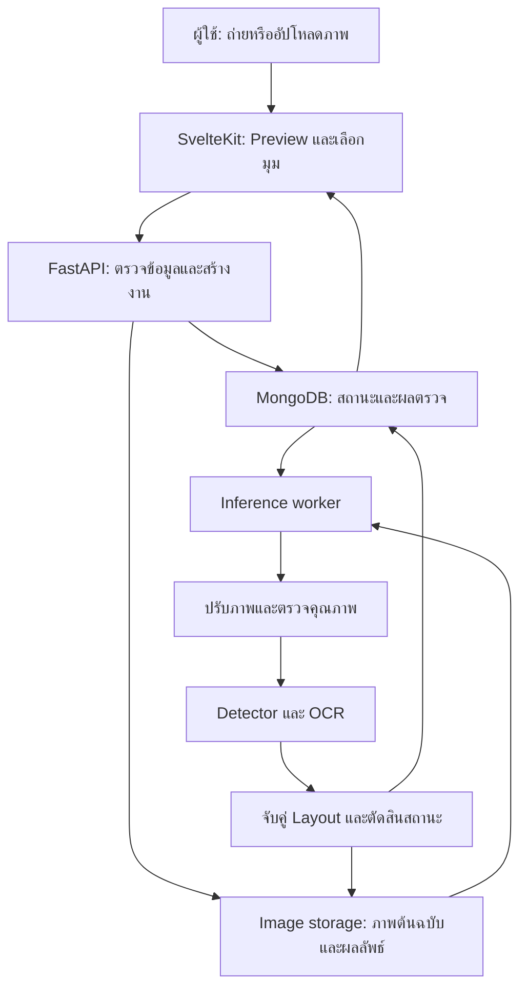

# KeyCheck — Technical Specification

**ระบบตรวจสอบคีย์แคปผิดตำแหน่งจากภาพถ่ายด้วย AI**  
**English title:** Keycap Placement Inspection Using Object Detection and Optical Character Recognition  
**ประเภท:** AI/ML Mini Project + Mobile-first Web Application  
**เวอร์ชันเอกสาร:** 1.1 — 1 ตุลาคม 2026  
**สถานะ:** ข้อเสนอสำหรับพัฒนา ยังไม่ใช่ระบบที่ผ่านการฝึกหรือทดสอบจริง

> **การเปลี่ยนแปลงใน v1.1 (รออาจารย์เห็นชอบ):** ขยายขอบเขตจากคีย์บอร์ดรุ่นเดียวเป็น **Tier 2** — คีย์บอร์ด QWERTY แบบแถวเยื้อง (ANSI/ISO) หลายรุ่น ที่มีตัวอักษรอังกฤษพิมพ์บนหน้าปุ่ม รวมถึงปุ่มที่มีอักษรไทยร่วม โดยระบบ **อ่านและตรวจเฉพาะตัวอักษรอังกฤษ A–Z** และไม่สนใจอักษรไทย เปลี่ยน Layout อ้างอิงเป็น Generic letter-block ในหน่วยปุ่ม (1u) และเพิ่ม Leave-keyboard-out test ส่วนที่แก้: §1, §2, §3, §4.1, §5, §6.2, §6.3, §7.2, §7.4, §7.8, §9.1, §10.4, §11.3, §11.5, §12.1, §16.1, §16.4, §17.1, §17.2, §18, §19, §20

> ค่าจำนวนภาพ การตั้งค่าฝึก และขีดจำกัดระบบในเอกสารนี้เป็นข้อเสนอเริ่มต้น ต้องปรับหลังทำ Pilot ไม่ใช่ผลทดลองหรือการรับประกันความแม่นยำ

## 1. สรุปแนวคิดและการตัดสินใจหลัก

KeyCheck รับภาพคีย์บอร์ดที่ผู้ใช้กดถ่ายหรืออัปโหลด จากนั้นปรับภาพให้ตรง ตรวจจับคีย์แคป อ่านตัวอักษร และเปรียบเทียบกับตำแหน่งอ้างอิง เพื่อบอกว่าปุ่มใดประกอบผิดตำแหน่ง

ตัวอย่าง: ช่องที่ควรเป็น A พบคีย์แคป S และช่องที่ควรเป็น S พบ A ระบบวงทั้งสองตำแหน่งและเสนอให้สลับกลับ

| ประเด็น | การตัดสินใจสำหรับรุ่นแรก |
| --- | --- |
| รูปแบบใช้งาน | กดถ่าย → ตรวจภาพ → ประมวลผล → แสดงผล ไม่ใช่ Real-time |
| กลุ่มเป้าหมาย | ผู้ใช้ที่ถอดคีย์แคปทำความสะอาดหรือเปลี่ยนชุดคีย์แคป |
| ขอบเขต | คีย์บอร์ด QWERTY แถวเยื้อง (ANSI/ISO) หลายรุ่น ตัวอักษรอังกฤษพิมพ์บนหน้าปุ่ม; รองรับปุ่มที่มีอักษรไทยร่วม |
| ตัวอักษรที่อ่าน | เฉพาะอังกฤษ A–Z; อักษรไทยบนปุ่มถูกละไว้ ไม่อ่านและไม่ตรวจ |
| ตำแหน่งที่ตรวจ | A–Z จำนวน 26 ตำแหน่ง |
| Layout อ้างอิง | Generic letter-block ในหน่วยปุ่ม (1u) ใช้ร่วมกันทุกรุ่นที่รองรับ ไม่ต้องวัดใหม่ทีละรุ่น |
| การพิสูจน์ใช้ได้หลายรุ่น | Leave-keyboard-out: คีย์บอร์ดบางตัวอยู่ใน Test เท่านั้น |
| Detector หลัก | YOLO11n แบบ Fine-tune หนึ่งคลาส `keycap` |
| Detector เปรียบเทียบ | Faster R-CNN ResNet50-FPN V2 |
| Detector เสริม | SSDLite320 MobileNetV3 Large หากเวลาพอ |
| อ่านตัวอักษร | PaddleOCR/PP-OCRv5 ทดลองสำเร็จรูปก่อน |
| Baseline | ปรับภาพให้ตรง → ตัดตามช่อง Layout → OCR โดยไม่ใช้ Detector |
| ประมวลผล | Backend บนคอมพิวเตอร์ ไม่รันโมเดลบนมือถือใน MVP |
| Frontend / Backend | SvelteKit + TypeScript / Python + FastAPI |
| ข้อมูลระบบ | MongoDB + Beanie; เก็บภาพแยกจากฐานข้อมูล |
| ผลรายช่อง | `correct`, `incorrect`, `uncertain` |
| วิธีเลือกโมเดลสุดท้าย | พิจารณาผลทดสอบทั้งระบบ ความเร็ว และทรัพยากรร่วมกัน |

โมเดลที่ฝึกเปรียบเทียบไม่จำเป็นต้องรันพร้อมกันตอนใช้งานจริง รุ่นใช้งานเลือก Detector เพียงตัวเดียวจากผล Validation แล้วประเมินบน Test ที่ล็อกไว้

## 2. ปัญหา วัตถุประสงค์ และคำถามวิจัย

### 2.1 ปัญหา

ผู้ใช้สามารถประกอบคีย์แคปผิดช่องได้หลังถอดออก โดยเฉพาะปุ่มขนาดใกล้เคียงกัน ระบบตรวจอัตโนมัติจำเป็นต้องแยกให้ออกระหว่าง “ตัวอักษรที่เห็นจริง” กับ “ตัวอักษรที่ควรอยู่ในช่องนั้น”

การตรวจนี้เป็นการตรวจตำแหน่งคีย์แคปทางกายภาพ ไม่ใช่การตรวจ Key Mapping ของระบบปฏิบัติการหรือความเสียหายของสวิตช์

### 2.2 วัตถุประสงค์

1. สร้าง Dataset ภาพจากคีย์บอร์ดหลายรุ่นพร้อม Bounding Box และ Ground Truth ของตำแหน่ง A–Z
2. ฝึกและเปรียบเทียบ Detector อย่างน้อย 2 สถาปัตยกรรม
3. อ่านตัวอักษรอังกฤษบนปุ่มและตรวจการประกอบผิดตำแหน่ง
4. สร้างเว็บต้นแบบที่ถ่ายภาพ อัปโหลด และแสดงผลได้
5. แสดงสถานะไม่แน่ใจเมื่อหลักฐานไม่พอ แทนการเดาว่าปุ่มถูกหรือผิด
6. ประเมินทั้งรายโมดูลและผลลัพธ์ปลายทาง
7. ประเมินบนคีย์บอร์ดที่ไม่เคยเห็นในการฝึก และปฏิเสธรุ่นที่ไม่รองรับอย่างปลอดภัย

### 2.3 คำถามวิจัย

- Detector ใดให้ผลตรวจคีย์แคปผิดดีที่สุดภายใต้ทรัพยากรที่มี?
- การเพิ่ม Detector ช่วยเหนือกว่า Baseline ที่ตัดตาม Layout หรือไม่ และในสภาพใด?
- Error ส่วนใหญ่เกิดจากการปรับภาพ การตรวจกรอบ การอ่านตัวอักษร หรือการจับคู่ตำแหน่ง?
- แสง มุมภาพ และรูปแบบการสลับที่ไม่อยู่ในชุดฝึกส่งผลอย่างไร?
- ระบบทำงานบนคีย์บอร์ดที่ไม่เคยเห็นได้ดีแค่ไหนเทียบกับคีย์บอร์ดที่เคยเห็น และลักษณะใด (สีปุ่ม ฟอนต์ อักษรไทยร่วม Profile) ทำให้แย่ลง?

## 3. ขอบเขตและลำดับความสำคัญ

### 3.1 Must-have: งานหลักของ Mini Project

- ภาพนิ่งทีละภาพ เห็นบริเวณ A–Z ครบ
- คีย์บอร์ด QWERTY แถวเยื้อง (ANSI/ISO) หลายรุ่น อ้างเฉพาะลักษณะที่มีใน Dataset และรายงานผลแยกรุ่นที่เคยเห็น/ไม่เคยเห็น
- ตัวพิมพ์ใหญ่ภาษาอังกฤษ A–Z ที่อยู่บนหน้าปุ่มและมองเห็นชัด; ปุ่มที่มีอักษรไทยร่วมรองรับ โดยอ่านเฉพาะอังกฤษ
- ตรวจการสลับปุ่มระหว่าง 26 ช่อง ไม่ใช่ตรวจการหายหรือกลับหัวของปุ่ม
- ปรับ Perspective ด้วยการระบุจุดอ้างอิงสี่จุดของบล็อกตัวอักษรด้วยมือได้ (§7.2)
- ตรวจว่าปุ่มที่พบเข้ากับ Letter-block มาตรฐานหรือไม่ ถ้าไม่เข้าให้ปฏิเสธภาพ (§7.8)
- Fine-tune YOLO11n และ Faster R-CNN; ใช้ OCR และกฎตรวจเดียวกัน
- มี Baseline แบบไม่ใช้ Detector
- แสดงกรอบผลตรวจ ตัวที่ควรเป็น ตัวที่พบ และเหตุผลเมื่อไม่แน่ใจ
- ปฏิเสธภาพใช้ไม่ได้และให้ถ่ายใหม่
- รายงานการทดลองที่ทำซ้ำได้

### 3.2 Should-have: เพิ่มเมื่อส่วนหลักทำงานแล้ว

- เปรียบเทียบ SSDLite เป็นโมเดลที่สาม
- ประวัติการตรวจใน Session เดียวกันและส่งออกผล JSON
- ปุ่มดาวน์โหลดภาพผลตรวจ
- กราฟเปรียบเทียบ Metrics จากผลทดลองจริง
- ตัวจำแนกภาพ A–Z ที่ฝึกเอง หาก OCR ไม่ผ่าน Pilot
- หาจุดอ้างอิงสี่จุดอัตโนมัติจากผล Detector โดยให้ผู้ใช้ยืนยัน/แก้ไข

### 3.3 Out of scope

- คีย์บอร์ดที่ไม่ใช่แถวเยื้องมาตรฐาน เช่น Ortholinear, Split, Alice/Ergo และ Layout อื่น เช่น AZERTY, QWERTZ, Dvorak
- การอ่านหรือตรวจอักษรไทย (อักษรไทยบนปุ่มถูกละไว้)
- Laptop/Chiclet keyboard ในชุดประเมินหลัก
- คีย์แคปไม่มีตัวอักษร Side-print Artisan/Novelty หรือภาพเอียงมาก
- การตรวจสวิตช์เสีย Key Chatter หรือรหัสที่ระบบปฏิบัติการได้รับ
- การยืนยันว่าปุ่มหายจากการตรวจไม่พบเพียงอย่างเดียว
- การตรวจความสูง/ทรงคีย์แคปผิดแถว และการกลับหัว
- การระบุรุ่นคีย์บอร์ดอัตโนมัติ
- Real-time video, Tracking, LLM และการรัน AI บนมือถือ
- ระบบสมาชิกเต็มรูปแบบ การชำระเงิน และการเปิดสาธารณะโดยไม่มีการควบคุมสิทธิ์

## 4. User Flow และสถาปัตยกรรม

### 4.1 User Flow

1. เปิดหน้าตรวจคีย์บอร์ดและอ่านขอบเขตที่รองรับ
2. เลือกถ่ายภาพหรืออัปโหลดไฟล์
3. ตรวจภาพ Preview และถ่ายใหม่ได้ก่อนอัปโหลด
4. หลังอัปโหลด ใช้ภาพที่ Backend แก้ EXIF orientation แล้วเป็นภาพอ้างอิงเดียวกัน
5. ระบุจุดอ้างอิงสี่จุดของบล็อกตัวอักษรตามลำดับ TL → TR → BR → BL (กึ่งกลางช่อง Q, P, M, Z ตามตำแหน่ง ไม่ใช่ตามตัวอักษรที่เห็น §7.2)
6. ยืนยันการตรวจและเห็นสถานะงาน
7. ดูภาพพร้อมกรอบและรายการรายช่อง
8. แก้ปุ่มตามคำแนะนำแล้วสร้างการตรวจใหม่

### 4.2 โครงสร้างระบบ



### 4.3 การจัดงานประมวลผล

- API รับไฟล์และสร้างงานได้โดยไม่รอ AI ทำเสร็จ
- ใช้ Worker แยกจาก API และเริ่มด้วยหนึ่ง Worker เพื่อควบคุมหน่วยความจำ
- Worker โหลดโมเดลครั้งเดียวตอนเริ่ม ไม่โหลดใหม่ทุก Request
- ใช้ MongoDB เป็นคิวแบบง่ายใน MVP โดย Claim งาน `queued` ด้วย Atomic update
- บันทึก `worker_id`, `claimed_at`, `heartbeat_at` และจำนวน Retry เพื่อกู้คืนงานค้าง
- งานที่ Worker ล่มไม่ค้างเป็น `processing` ตลอดไป; Retry แบบมีขอบเขตหรือเปลี่ยนเป็น `failed`
- Frontend Poll สถานะประมาณทุก 1–2 วินาทีระหว่างมีงาน หยุดเมื่อจบหรือออกจากหน้า
- ยังไม่จำเป็นต้องเพิ่ม Redis/Celery; เพิ่มเมื่อมีงานพร้อมกันมากขึ้นเท่านั้น

## 5. กลยุทธ์ข้อมูลและ Annotation

### 5.1 แหล่งข้อมูล

ใช้ภาพคีย์บอร์ดจริงที่ถ่ายเองเป็นข้อมูลหลัก เพื่อควบคุมสิทธิ์ใช้งานและรู้คำตอบจริง

| แหล่ง | ใช้ได้กับ | เงื่อนไข |
| --- | --- | --- |
| ถ่ายเอง: คีย์บอร์ดที่ถอดปุ่มได้ (ยืมเพื่อน/ชมรม) | ทุกส่วน รวมภาพสลับและ Ground Truth รายช่อง | แหล่งหลัก |
| ถ่ายเอง: คีย์บอร์ดที่ถอดปุ่มไม่ได้หรือไม่ควรถอด (เช่นห้องแล็บ) | ภาพถูกทั้งหมด: ฝึก Detector และวัด False-alarm | ต้องได้รับอนุญาตถ่าย |
| Public dataset ที่ Label แล้ว (เช่น Roboflow Universe, Kaggle) | Train ของ Detector คลาส `keycap` เท่านั้น | ตรวจ License, แยกเป็นการทดลองเสริม, ห้ามอยู่ใน Validation/Test |
| ภาพออนไลน์อื่น | Train ของ Detector เท่านั้น | เฉพาะที่มี License ชัด เช่น Creative Commons; บันทึก `source_url` และ `license` รายภาพ |

Pretrained Weights ใช้สำหรับ Transfer Learning ไม่ได้ทดแทน Dataset ของคีย์แคป

### 5.2 Pilot และจำนวนตั้งต้น

- Pilot OCR: 20–30 ภาพ จากคีย์บอร์ดอย่างน้อย 3 ตัว โดยต้องมีทั้งแบบอังกฤษล้วนและแบบไทย-อังกฤษ ตัดภาพปุ่มด้วยมือและดูข้อผิดพลาดก่อนทำเว็บเต็มระบบ
- Pilot Pipeline: 50–80 ภาพ สำหรับทดสอบ Detector, OCR และพิกัดร่วมกัน
- Dataset ตั้งต้น: ประมาณ 400 ภาพต้นฉบับที่มี Ground Truth รายช่อง จากคีย์บอร์ดเป้าหมาย 8–12 ตัว หลายรอบถ่าย (ประมาณ 30–50 ภาพต่อตัว) บวกภาพถูกทั้งหมดจากคีย์บอร์ดเพิ่มเติมตามที่หาได้; Pilot ที่คุณภาพผ่านรวมใน Train ได้ แต่ไม่ใช้เป็น Test ที่ไม่เคยเห็น
- คีย์บอร์ดควรต่างกันทั้งสีปุ่ม/สีตัวอักษร ฟอนต์ ตำแหน่งตัวอักษรบนปุ่ม (กลาง/มุมซ้ายบน) Profile และการมี/ไม่มีอักษรไทย

| กลุ่ม | จำนวนเป้าหมายตั้งต้น | ลักษณะ |
| --- | ---: | --- |
| ถูกทั้งหมด | 100 | ช่วยวัดการแจ้งผิดเกินจริง |
| สลับหนึ่งคู่ | 200 | ปุ่มผิดสองช่อง หมุนเวียนหลายตัวและหลายแถว |
| สลับสองถึงสามคู่ | 100 | ปุ่มผิดสี่ถึงหกช่อง |

เพิ่มชุดทดสอบภาพใช้ไม่ได้แยกต่างหาก เช่น ภาพเบลอ สะท้อนมาก ปิดบัง หรือถ่ายไม่ครบ ไม่ใช้เพื่ออ้างว่าระบบรองรับการตรวจปุ่มหาย

### 5.3 ความหลากหลายที่ต้องเก็บ

- คีย์บอร์ดหลายรุ่น สี ฟอนต์ และแบบมี/ไม่มีอักษรไทย (ความหลากหลายที่สำคัญที่สุดสำหรับ Tier 2)
- แสงธรรมชาติ/แสงในห้อง ระยะถ่าย และเงาที่เปลี่ยนไป
- กล้องและคีย์บอร์ดย้ายตำแหน่งจริงระหว่างรอบ
- ภาพตรงและเอียงเล็กน้อยตามขอบเขต
- สลับทั้งปุ่มข้างกันและคนละแถว
- ทุกตัวอักษรปรากฏนอกตำแหน่งเดิมหลายครั้ง
- หลีกเลี่ยง Background ที่บอกคำตอบ เช่น ป้ายกำกับชนิดการสลับอยู่ในภาพ

### 5.4 ข้อมูลกำกับ

| ระดับ | Fields | วัตถุประสงค์ |
| --- | --- | --- |
| ภาพ | `image_id`, `keyboard_id`, `capture_session_id`, `arrangement_id`, `device`, `lighting`, `split`, `source`, `license` | แยกข้อมูลและวิเคราะห์ตามสภาพ |
| คีย์บอร์ด | `keyboard_id`, `form_factor` (ANSI/ISO, 60%/TKL/Full), `legend_style` (`en_only`/`th_en`), `legend_position`, `keycap_color`, `legend_color`, `profile` | วิเคราะห์ผลตามลักษณะคีย์บอร์ด |
| ภาพ | จุดอ้างอิงสี่จุด (§7.2), ขนาดภาพหลังแก้ EXIF | ปรับภาพและตรวจพิกัด |
| วัตถุ | Bounding Box ของทุกคีย์แคปที่มองเห็น, คลาส `keycap` | ฝึก Detector หนึ่งคลาส |
| ช่อง A–Z | `slot_id`, `expected_label`, `actual_label`, `readable` | ประเมิน OCR และความผิดตำแหน่ง |
| ช่อง A–Z | `ground_truth_status`, หมายเหตุผู้ตรวจ | แยกความจริงจากผล AI |

ต้อง Annotate คีย์แคปอื่นที่มองเห็นในภาพด้วย ไม่ปล่อยวัตถุชนิดเดียวกันที่อยู่ข้าง A–Z เป็น Background โดยไม่ได้กำหนดนโยบายชัดเจน กฎเทียบ Layout จะประเมินเฉพาะ 26 ช่องเป้าหมาย

เก็บ Annotation กลางเป็น COCO JSON และตาราง Ground Truth รายช่อง จากนั้นแปลงเป็น YOLO format หรือ Torchvision dataset โดยตรวจความสอดคล้องของกรอบและ Class IDs

### 5.5 Train / Validation / Test

- **Leave-keyboard-out:** กัน **Unseen test keyboards** อย่างน้อย 2–3 ตัว (รวมอย่างน้อยหนึ่งตัวแบบไทย-อังกฤษ) ไว้ใน Test เท่านั้น ไม่มีภาพของคีย์บอร์ดเหล่านั้นใน Train/Validation
- ส่วน Test ที่เหลือมาจากคีย์บอร์ดที่เคยเห็นแต่เป็นรอบถ่ายใหม่ เพื่อรายงานแยก Seen keyboards / Unseen keyboards
- ถ้ามีคีย์บอร์ดพอ ให้กัน **Held-out validation keyboard** อีก 1 ตัวไว้ใน Validation เท่านั้น (ไม่มีภาพใน Train) เพื่อเลือก Model/Threshold ที่ Generalize ข้ามรุ่น ไม่ใช่เก่งเฉพาะรุ่นใน Train
- คีย์บอร์ดที่เหลือแบ่ง 70/15/15 โดยอิงกลุ่ม ไม่ใช่สุ่มแยกภาพที่แทบเหมือนกัน
- ภาพ Burst และภาพจากการจัดวางเดียวกันในรอบเดียวกันต้องอยู่ Split เดียวกัน
- กันรอบถ่ายใหม่และรูปแบบการสลับบางแบบไว้ใน Test
- การเรียงถูกทั้งหมดมีได้หลาย Split หากถ่ายคนละรอบจริงและไม่มีภาพซ้ำใกล้เคียง
- Crop ทุกปุ่มต้องสืบทอด Split จากภาพแม่ รวมถึงเมื่อฝึก Classifier สำรอง
- ทำ Augmentation เฉพาะ Train หลังแบ่งชุดแล้ว
- เลือก Hyperparameters, Thresholds และโมเดลจาก Validation ไม่ใช้ Test ปรับระบบ
- ล็อก Manifest พร้อม Hash ภาพ เพื่อตรวจ Duplicate และทำซ้ำการทดลอง

### 5.6 Augmentation

ใช้ Brightness/Contrast, Noise, Blur อ่อน ๆ และการเปลี่ยนขนาด/มุมเล็กน้อยที่ยังอ่านตัวอักษรได้ ตรวจ Bounding Box หลังแปลงทุกครั้ง

ห้ามกลับภาพซ้าย–ขวา กลับบน–ล่าง หรือหมุนแรงโดยไม่เปลี่ยนโจทย์ เพราะทำให้ตัวอักษรกลับด้าน หลีกเลี่ยง Mosaic/MixUp ที่ทำลายโครงสร้าง Layout ในการประเมินทั้งระบบ; ถ้าทดลองกับ Detector ให้ระบุเป็นการทดลองแยก

## 6. โมเดล AI และการเปรียบเทียบ

### 6.1 Detector ที่วางแผนใช้

| โมเดล | แนวทาง | จุดเด่นที่คาดหวัง | ข้อจำกัดที่ต้องทดสอบ | สถานะ |
| --- | --- | --- | --- | --- |
| YOLO11n | One-stage | โมเดลขนาดเล็กและ Workflow ฝึก/ใช้งานตรงไปตรงมา | ปุ่มเล็กและกรอบชิดกันอาจพลาด ขึ้นกับขนาดภาพ | หลัก |
| Faster R-CNN ResNet50-FPN V2 | Two-stage, Region proposals และ FPN | เปรียบเทียบสถาปัตยกรรมต่างจาก YOLO และใช้ Features หลายระดับ | ใช้ทรัพยากรมากกว่า ต้องวัดเวลาจริง | เปรียบเทียบหลัก |
| SSDLite320 MobileNetV3 Large | Lightweight One-stage | ตัวเปรียบเทียบด้านขนาดและต้นทุนประมวลผล | อินพุต 320 อาจเสียรายละเอียดของวัตถุเล็ก | เสริม |

ใช้ Pretrained Weights แล้วปรับ Detection head ให้ตรงกับคลาสของโครงการ ทั้งสามโมเดลไม่ได้ตรวจคีย์แคปพร้อมใช้จาก Weights เดิม [S1–S3]

คำกล่าวเรื่องความเร็วและความแม่นยำเป็นสมมติฐานในการเลือกทดลอง ต้องวัดบนข้อมูลและเครื่องเดียวกัน ไม่ใช้คะแนน COCO มาแทนผล KeyCheck

### 6.2 OCR

- เริ่มจาก PaddleOCR / PP-OCRv5 และล็อกชื่อ Weights/config ที่ใช้จริงหลัง Pilot [S4]
- Input: Crop ของคีย์แคปจากภาพ Rectified ที่มีรายละเอียดสูง
- Output: ข้อความดิบ กรอบข้อความ และ Recognition score ตามที่ Pipeline รองรับ
- ทดลอง Crop ทั้งปุ่มเทียบกับบริเวณตัวอักษร หากรูปแบบการพิมพ์คงที่
- ใช้ Uppercase และตัด Whitespace; ยอมรับ A–Z เพียงตัวเดียวในโหมด MVP
- **ปุ่มที่มีอักษรไทยร่วม:** กรองเฉพาะ Text box ที่เป็นตัวละติน A–Z ตัวเดียว แล้วละ Box ที่เป็นอักษรไทย/สัญลักษณ์อื่น; ไม่ใช้ตำแหน่ง Legend บนปุ่มเป็นกฎตายตัว เพราะต่างกันตามรุ่น
- ระวังอักษรไทยที่หน้าตาคล้ายละติน ถูกอ่านเป็นตัวละติน; ต้องวัด Error นี้ใน Pilot ด้วยคีย์บอร์ดไทย-อังกฤษ และเลือก Recognition model/ภาษาให้เหมาะหลัง Pilot
- ถ้าเจอตัวละติน A–Z มากกว่าหนึ่งตัว สัญลักษณ์คลุมเครือ หรือคะแนนต่ำ ให้ `uncertain`
- อย่าแทน `0` เป็น `O`, `1` เป็น `I` อัตโนมัติโดยไม่มีผล Validation รองรับ
- ห้ามใช้ตัวอักษรที่ Layout คาดหวังไปบังคับ OCR ให้ตอบตรง เพราะจะซ่อนความผิดจริง
- Detector confidence และ OCR score เป็นคนละค่า ไม่ถือว่าเป็นความน่าจะเป็นที่ Calibration แล้ว

### 6.3 โมเดลอ่านตัวอักษรสำรอง

หาก OCR ไม่ผ่าน Pilot ให้ Fine-tune `YOLO11n-cls` หรือเลือก Classifier ขนาดเล็กเพียงตัวเดียว แบ่งคลาส A–Z โดยใช้ Crop ที่ตรวจ Label แล้ว

ใช้ Cross-entropy สำหรับการจำแนกหลายคลาส ปรับเกณฑ์ Reject จาก Validation และมีตัวอย่าง Blur/ตัวอักษรนอกขอบเขตสำหรับทดสอบการ Reject; Softmax สูงไม่ได้รับประกันว่าเป็นข้อมูลในขอบเขต

ใน Tier 2 Classifier ที่ฝึกเองเสี่ยงไม่ Generalize ข้ามฟอนต์มากกว่า OCR สำเร็จรูป จึงต้องประเมินบน Unseen keyboards ก่อนเลือกใช้ และ Crop เฉพาะบริเวณตัวอักษรเพื่อลดการจำรูปทรงปุ่ม

ไม่ฝึก OCR และ Classifier เพิ่มพร้อมกันโดยไม่มีเหตุผล หากเปลี่ยนตัวอ่าน ต้องใช้ตัวอ่านเดียวกันในทุก Detector ที่เปรียบเทียบ หรือรายงานเป็นการทดลองอีกชุด

### 6.4 Baseline ที่จำเป็น

**Rectification → Fixed layout crops → OCR → Layout comparison**

Baseline ตัดภาพตามบริเวณแต่ละช่องที่บันทึกไว้หลังปรับภาพให้ตรง ไม่ใช้ Detector แต่ใช้ OCR และ Logic เดียวกัน เพื่อพิสูจน์ว่าการเพิ่ม Detector ช่วยจริงหรือไม่

หาก Baseline ทำได้ดีเท่ากันและเร็วกว่า ต้องรายงานตามจริง การศึกษาประสิทธิภาพของ ML ไม่จำเป็นต้องจบว่า ML ชนะทุกกรณี

## 7. รายการอัลกอริทึมทั้งหมด

| ขั้นตอน | อัลกอริทึม/เทคนิค | เป็น ML หรือไม่ | หน้าที่ |
| --- | --- | --- | --- |
| Decode | EXIF orientation normalization | ไม่ใช่ | จัดทิศทางภาพให้เหมือนกัน |
| Quality | Variance of Laplacian, Exposure checks | ไม่ใช่ | เตือน Blur/มืด/สว่างผิดปกติ |
| Geometry | Homography / Perspective warp | ไม่ใช่ | ปรับภาพเป็นมุมอ้างอิง |
| Detection | YOLO / Faster R-CNN / SSDLite | ใช่ | หาตำแหน่งคีย์แคป |
| Training | Transfer Learning, Backpropagation, Optimizer | ใช่ | ปรับ Weights จากข้อมูลโครงการ |
| Postprocess | Confidence filtering, NMS ตามโมเดล | ไม่ใช่โมเดลเรียนรู้แยก | กรองกรอบซ้ำและคะแนนต่ำ |
| Recognition | PP-OCRv5 หรือ Classifier สำรอง | ใช่ | อ่านตัวอักษรจากหน้าปุ่ม |
| Matching | Linear sum assignment พร้อม Unmatched options | ไม่ใช่ | จับคู่หนึ่งปุ่มต่อหนึ่งช่อง |
| Decision | Thresholding และ Label comparison | ไม่ใช่ | ถูก/ผิด/ไม่แน่ใจ |
| Suggestion | Mutual-swap / cycle checks | ไม่ใช่ | อธิบายการสลับเมื่อหลักฐานชัด |
| Evaluation | IoU, AP, Precision, Recall, F1, Coverage | ไม่ใช่ | วัดผล |

### 7.1 การตรวจคุณภาพภาพ

ใช้ค่าเริ่มต้นเชิง Heuristic:

$$B = \operatorname{Var}(\nabla^2 I_{gray})$$

ค่า B ต่ำอาจบ่งชี้ความเบลอ แต่ขึ้นกับความละเอียดและพื้นผิว จึงต้องตั้งเกณฑ์จากภาพ Validation ที่ขนาดมาตรฐานเดียวกัน ไม่ใช้ค่าเดียวแบบสากล

Exposure checks ใช้สัดส่วน Pixel ที่ใกล้ค่ามืดหรือสว่างสุดเป็นตัวเตือน ไม่สรุปว่าตัวอักษรอ่านไม่ได้จากค่าเฉลี่ยภาพเพียงอย่างเดียว

แยกสองระดับ: ภาพเสีย/Decode ไม่ได้ให้ Reject; ภาพคุณภาพน่าสงสัยให้เตือนและ/หรือประเมินราย Crop

### 7.2 Homography และระบบพิกัด

$$\lambda\begin{bmatrix}x'\\y'\\1\end{bmatrix}=H\begin{bmatrix}x\\y\\1\end{bmatrix}$$

- H คือเมทริกซ์ 3×3 จากจุดอ้างอิงสี่จุดที่สอดคล้องกัน
- ใช้ `getPerspectiveTransform` และ `warpPerspective` ของ OpenCV [S5]
- ตรวจจุดให้อยู่ในขอบภาพ ไม่ไขว้กัน มีพื้นที่เพียงพอ และลำดับถูก
- หน้าปุ่มไม่ได้อยู่บนระนาบเดียวสมบูรณ์ จึงจำกัดมุมถ่ายและทดสอบผลกระทบ

**Generic letter-block (Tier 2):** คีย์บอร์ด QWERTY แถวเยื้องแบบ ANSI และ ISO วางปุ่ม A–Z สัมพันธ์กันเหมือนกันเมื่อวัดในหน่วยปุ่ม (1u): แถว A เยื้องจากแถว Q ไป 0.25u และแถว Z เยื้องไป 0.75u จึงใช้พิกัดอ้างอิงชุดเดียวได้ทุกรุ่นที่รองรับ

| จุดอ้างอิง | ตำแหน่งบนคีย์บอร์ด | พิกัด Canonical (u) |
| --- | --- | --- |
| TL | กึ่งกลางช่องซ้ายสุดของแถวบนของตัวอักษร (ปกติ Q) | (0, 0) |
| TR | กึ่งกลางช่องขวาสุดของแถวบน (ปกติ P) | (9, 0) |
| BR | กึ่งกลางช่องขวาสุดของแถวล่าง (ปกติ M) | (6.75, 2) |
| BL | กึ่งกลางช่องซ้ายสุดของแถวล่าง (ปกติ Z) | (0.75, 2) |

- ผู้ใช้แตะตาม **ตำแหน่งช่อง** ไม่ใช่ตามตัวอักษรที่เห็น เพราะปุ่มอาจถูกสลับอยู่
- สี่จุดเป็นรูปสี่เหลี่ยมคางหมู ไม่ใช่สี่เหลี่ยมผืนผ้า ซึ่ง Homography รองรับได้
- Canonical canvas = พิกัด u × `px_per_unit` บวก Margin รอบบล็อก; ตั้ง `px_per_unit` ให้ความละเอียดพอสำหรับ OCR จากผล Pilot
- ขนาดปุ่มจริงต่างกันตามรุ่น (เช่น Pitch ประมาณ 19 มม. บน Desktop) แต่เมื่อ Normalize เป็นหน่วย u แล้วใช้กฎเดียวกันได้

เก็บระบบพิกัดสามชุดอย่างชัดเจน:

1. `original_oriented`: ภาพหลังแก้ EXIF ที่ผู้ใช้ใช้เลือกมุม
2. `rectified`: ภาพ Canonical สำหรับจับคู่ Layout และ Crop
3. `model_input`: ภาพที่โมเดล Resize/Pad ภายใน

ต้องย้อน Resize/Letterbox ก่อนใช้กรอบ และใช้ H inverse แปลงมุมกรอบทั้งสี่กลับสู่ภาพต้นฉบับ กรอบ Overlay บนภาพต้นฉบับเป็น Polygon ได้ ไม่สมมติว่าเป็นสี่เหลี่ยมตรงเสมอ

### 7.3 IoU และ NMS

$$IoU(A,B)=\frac{|A\cap B|}{|A\cup B|}$$

ใช้ IoU สำหรับประเมิน Bounding Box และใช้ใน NMS ตาม Implementation ของ Detector เพื่อกรองกรอบซ้ำ ไม่ใช้ค่าต่ำจนกดทับกรอบปุ่มข้างเคียง

ถ้า Library ทำ NMS แล้ว ไม่ทำซ้ำโดยไม่มีเหตุผล และตั้งจำนวน Detection สูงสุดให้ครอบคลุมคีย์แคปที่ปรากฏจริง ไม่ตัดผลเหลือ 26 ก่อนจับคู่ Layout

### 7.4 จุดกึ่งกลางและระยะจับคู่

$$c_x=\frac{x_{min}+x_{max}}{2},\quad c_y=\frac{y_{min}+y_{max}}{2}$$

ใช้ระยะที่ Normalize ตามระยะห่างช่องโดยประมาณ:

$$d_{ij}=\sqrt{\left(\frac{c_{x,i}-r_{x,j}}{s_x}\right)^2+\left(\frac{c_{y,i}-r_{y,j}}{s_y}\right)^2}$$

โดย r_j คือจุดกึ่งกลางช่องอ้างอิง และ s_x, s_y คือ Key pitch ในภาพ Canonical ค่าเหล่านี้ทำให้ระยะไม่ขึ้นกับจำนวน Pixel โดยตรง ใน Generic letter-block ค่า s_x = s_y = 1u (= `px_per_unit` pixel) เหมือนกันทุกรุ่น

### 7.5 One-to-one assignment

สร้าง Cost matrix จาก d_ij และหา Assignment ที่มี Cost รวมต่ำ โดยมีข้อจำกัดหนึ่ง Detection ต่อหนึ่งช่อง

ใช้ `scipy.optimize.linear_sum_assignment` ซึ่งเป็นตัวแก้ปัญหา Linear assignment; Implementation ที่อ้างอิงใช้ Modified Jonker–Volgenant ไม่ควรระบุว่าตัวฟังก์ชันเป็น Hungarian implementation โดยตรง [S6]

- ตัดคู่ที่อยู่นอกระยะ/พื้นที่ยอมรับด้วย Cost สูง
- เพิ่ม Dummy/unmatched choices สำหรับแต่ละช่อง เพื่อไม่บังคับจับคู่เมื่อมีปุ่มตรวจหาย
- กำหนด Unmatched cost และ Gating threshold จาก Validation
- Detection ส่วนเกินที่เป็นปุ่มนอก A–Z ไม่เป็น Error โดยตัวมันเอง
- หากคู่ที่ดีที่สุดกับคู่ทางเลือกมีระยะใกล้กันมาก ให้ตรวจ Ambiguity หรือรายงานไม่แน่ใจ
- ห้ามใช้ข้อความที่คาดหวังเป็นหลักจับคู่ เพราะจะย้ายปุ่มผิดไปช่องที่ดูเหมือนถูก

### 7.6 การตัดสินรายช่อง

$$status_j=\begin{cases}\text{uncertain},&\text{หลักฐานไม่ผ่านเกณฑ์}\\\text{correct},&a_j=e_j\\\text{incorrect},&a_j\ne e_j\end{cases}$$

เกณฑ์หลักฐานประกอบด้วยคุณภาพภาพ คะแนนตรวจจับ ความน่าเชื่อถือการจับคู่ และคะแนนอ่านตัวอักษร ตั้งแยกกัน ไม่คูณทุกคะแนนแล้วเรียกว่าโอกาสถูกต้อง

Reason codes อย่างน้อย:

- `detection_unavailable`
- `mapping_ambiguous`
- `ocr_low_confidence`
- `ocr_invalid_label`
- `crop_quality_low`

### 7.7 คำแนะนำแก้ไข

ถ้าช่อง A พบ S และช่อง S พบ A โดยทั้งสองช่องยืนยันได้ ให้เสนอ “สลับ A กับ S”

ถ้าเป็นวงจรหลายปุ่ม เช่น A พบ S, S พบ D, D พบ A ให้แสดงรายการช่องก่อน ส่วนการสร้างลำดับย้ายปุ่มเป็นงานเสริม ไม่สร้างคำแนะนำสลับคู่ที่ทำให้ช่องอื่นผิดเพิ่ม

หากมีตัวอ่านซ้ำ ตัวไม่ครบ หรือช่องใดไม่แน่ใจ ให้แสดงเฉพาะสิ่งที่ตรวจพบ ไม่บังคับให้ผลมี A–Z อย่างละหนึ่งตัว

### 7.8 ตรวจว่าคีย์บอร์ดเข้ากับ Letter-block มาตรฐาน

ก่อนตัดสินรายช่อง ให้ตรวจว่าปุ่มที่ Detector พบในภาพ Rectified วางตัวตรงกับกริดมาตรฐานหรือไม่ เพื่อไม่ให้ระบบตอบผิดอย่างมั่นใจบนคีย์บอร์ดที่ไม่รองรับ (เช่น Ortholinear/Split) หรือเมื่อผู้ใช้แตะจุดอ้างอิงผิดช่อง

- วัดสัดส่วนช่องที่มี Detection อยู่ในระยะ Gating และค่า Residual เฉลี่ยของระยะจับคู่
- ถ้าต่ำกว่าเกณฑ์ ให้ `rejected` พร้อม Error code `LAYOUT_MISMATCH` และขอให้ตรวจจุดอ้างอิงใหม่ ไม่สร้าง Summary
- ตั้งเกณฑ์จาก Validation และทดสอบกับภาพ Ortholinear/Split ที่เก็บไว้เป็นชุด Robustness
- Baseline แบบ Fixed crops ไม่มี Detection จึงตรวจข้อนี้ไม่ได้ ต้องรายงานเป็นข้อจำกัดของ Baseline

## 8. Training Specification

### 8.1 รูปแบบการฝึก

- ใช้ Transfer Learning ไม่เริ่ม Weights สุ่มทั้งหมด
- Detection class = `keycap`; Torchvision ต้องจัดการ Background class ตาม API
- Loss ของ Detector ใช้ตาม Implementation ที่เลือก ประกอบด้วยส่วนจำแนกและปรับกรอบ; บันทึก Loss components จริง ไม่สมมติว่าทั้งสามโมเดลใช้สูตรเดียวกัน
- ใช้ Optimizer ที่แต่ละ Library รองรับ เช่น SGD หรือ AdamW โดยบันทึก Learning rate, Weight decay, Scheduler และ Batch size
- ใช้ Validation เลือก Checkpoint และ Early stopping
- บันทึก Random seed และเวอร์ชัน Dataset, Preprocessing, Library, Weights

### 8.2 ค่าตั้งต้นสำหรับ Pilot

| รายการ | ข้อเสนอเริ่มต้น |
| --- | --- |
| Epoch budget | 50–100 เป็นเพดานเริ่มต้น ปรับหลังดู Learning curves |
| Early stopping | หยุดเมื่อ Validation ไม่ดีขึ้นตาม Patience ที่บันทึกไว้ |
| YOLO input | เปรียบเทียบ 640 กับ 960 หาก GPU พอ |
| Faster R-CNN input | บันทึก Min/Max resize ของ Model transform ที่ใช้จริง |
| SSDLite input | ใช้ข้อกำหนด 320 ของรุ่นที่เลือกและรายงานข้อจำกัด |
| Batch size | ปรับตาม VRAM และบันทึก Effective batch size |
| Detection/OCR thresholds | ปรับบน Validation ไม่ถือ 0.5 เป็นคำตอบตายตัว |
| Repeated runs | เป้าหมาย 3 Seeds สำหรับโมเดลหลักหากงบเวลาพอ |

การใช้ Input resolution ต่างกันเป็นการเปรียบเทียบ Configuration ที่ใช้งานจริง ไม่ใช่ข้อพิสูจน์ผลของ Architecture ล้วน ๆ ต้องระบุในรายงาน

### 8.3 ความเป็นธรรมของการทดลอง

- ใช้ Split และ Annotation เดียวกัน
- ใช้ Layout, OCR, Crop policy และกฎตัดสินเหมือนกัน
- ให้แต่ละโมเดลมีงบปรับค่าที่ระบุชัด ไม่จูนเฉพาะตัวที่ชอบ
- บันทึกเวลาฝึก ขนาดไฟล์ Model และหน่วยความจำที่ใช้
- วัด Inference บน Hardware เดียวกัน แยก Warm-up/Cold start
- เลือกโมเดลด้วย Validation; รัน Test เพื่อรายงานครั้งสุดท้าย ไม่จูนจาก Test

## 9. การประเมินผลและเกณฑ์ตรวจรับ

### 9.1 Metrics รายโมดูล

| ระดับ | Metrics | รายละเอียด |
| --- | --- | --- |
| Detection | mAP@0.5, mAP@0.5:0.95, Precision, Recall | บน Bounding Box Ground Truth |
| OCR แยกโมดูล | Character accuracy บน GT crops | แยกปัญหาการอ่านออกจากปัญหากรอบ |
| OCR ปลายทาง | Label accuracy บน Crop จาก Pipeline | รวมผลกระทบ Detector และ Geometry |
| Mapping | Slot assignment accuracy | Detection ถูกจับไปช่องถูกหรือไม่ |
| สถานะปุ่ม | Precision/Recall/F1 ของ `incorrect` | ประเมินตามช่องอ้างอิง ไม่ใช่นับจำนวนกรอบอย่างเดียว |
| การงดตอบ | Coverage และ Uncertain rate | ต้องรายงานคู่กับ Accuracy |
| ทั้งภาพ | Strict full-board accuracy | ทั้ง 26 ช่องถูกต้องและไม่มี Uncertain |
| ภาพถูกทั้งหมด | False-alarm image rate | ภาพที่ไม่มีปุ่มผิดแต่ระบบแจ้งผิดอย่างน้อยหนึ่งช่อง |
| ระบบ | Median/P95 latency, Peak memory | แยกขั้นตอนและ End-to-end |
| ข้ามรุ่น | ทุก Metric ข้างต้นแยก Seen / Unseen keyboards และแยกราย `keyboard_id` | ช่องว่างระหว่าง Seen กับ Unseen คือหลักฐานว่าใช้กับคีย์บอร์ดคนอื่นได้แค่ไหน |
| ข้ามรุ่น | แยกตาม `legend_style` (`en_only` / `th_en`) | ผลของอักษรไทยร่วมต่อ OCR |
| การปฏิเสธ | Rejection rate ของภาพ Ortholinear/Split และภาพจุดอ้างอิงผิด | ระบบปฏิเสธรุ่นที่ไม่รองรับได้จริง |

### 9.2 นิยามการตรวจปุ่มผิด

$$Precision=\frac{TP}{TP+FP},\quad Recall=\frac{TP}{TP+FN}$$

$$F1=\frac{2\cdot Precision\cdot Recall}{Precision+Recall}$$

- TP: ช่องที่ผิดจริงและระบบระบุ `incorrect`
- FP: ช่องที่ถูกจริงแต่ระบบระบุ `incorrect`
- FN: ช่องที่ผิดจริงแต่ระบบระบุ `correct` หรือ `uncertain`
- แยกวัดการระบุ `observed_label` ให้ถูกด้วย เพราะแจ้งว่าช่องผิดถูกต้องไม่ได้แปลว่าอ่านตัวอักษรถูก
- ช่องที่ Ground Truth อ่านไม่ได้/อยู่นอกขอบเขต ให้รายงานเป็นชุดทดสอบ Robustness แยกจากชุดมาตรฐานที่มีคำตอบครบ
- หากตัวหารเป็นศูนย์ ให้ใช้ Convention ที่ประกาศในรายงาน เช่น N/A พร้อม Counts ไม่แทนด้วย 100% เงียบ ๆ

$$Coverage=\frac{N_{correct}+N_{incorrect}}{N_{target\ slots}}$$

สำหรับภาพที่รับตรวจครบ 26 ช่อง ต้องมี `correct + incorrect + uncertain = 26` เสมอ ส่วนภาพที่ Reject ก่อนตรวจไม่ใช้ยอดศูนย์มาแสดงว่าตรวจผ่าน

### 9.3 เกณฑ์ตรวจรับเชิงฟังก์ชัน

- ผู้ใช้ถ่าย/อัปโหลดภาพที่รองรับและเห็นผลได้ครบ Flow
- ผลการตรวจเก็บ Model version และ Layout version ไว้ตรวจย้อนกลับ
- ภาพไม่ครบหรือผิดชนิดต้องได้ข้อความแก้ไข ไม่เกิด Server crash
- กรอบผลต้องตรงกับภาพทุกขนาดหน้าจอ
- ไม่อ้าง “ถูกทั้งหมด” หากยังมี `uncertain`
- ไม่เสนอให้สลับคู่หากหลักฐานยังไม่แน่ใจ
- ไม่เข้าถึงภาพหรือผลของ Session อื่นได้
- รายงานเปรียบเทียบอย่างน้อยสอง Detector และหนึ่ง Baseline บน Test เดียวกัน

เป้าหมายตัวเลขด้านความแม่นยำและเวลารอควรตกลงหลัง Pilot และ Hardware benchmark ก่อนล็อก Test ไม่กำหนดผลสำเร็จล่วงหน้าโดยไม่มีข้อมูล

## 10. Web Frontend Specification

### 10.1 Technology

SvelteKit + TypeScript, Tailwind CSS, Fetch API, Canvas/SVG overlay และ Browser File API ใช้ UI components เท่าที่จำเป็น ไม่เพิ่ม Dashboard ที่ไม่เกี่ยวกับการตรวจ

### 10.2 หน้าจอและเส้นทาง

| Route | หน้าที่ | องค์ประกอบหลัก |
| --- | --- | --- |
| `/` | เริ่มตรวจ | ขอบเขต ปุ่มถ่าย/เลือกภาพ วิธีถ่าย |
| `/inspect` | Preview และ Calibration | ภาพ เลือกจุดอ้างอิงสี่จุด ย้อนกลับ/ถ่ายใหม่ ยืนยัน |
| `/inspections/[id]` | สถานะและผลตรวจ | ภาพ Overlay, Counts, รายการผิด/ไม่แน่ใจ |
| `/history` | ประวัติใน Session | งานล่าสุดและลิงก์กลับไปดูผล; Should-have |

มี Layout เดียวให้แสดงชื่อ Layout ไม่ทำ Dropdown ตัวเลือกเดียว หากรองรับเพิ่มในอนาคตจึงเพิ่มตัวเลือก

### 10.3 Camera และ Upload

- รองรับ `getUserMedia` พร้อม `facingMode: environment` เมื่อ Browser อนุญาต
- กล้องใน Browser ต้องใช้ Secure context เช่น HTTPS หรือ localhost; IP LAN ผ่าน HTTP อาจใช้กล้องไม่ได้ [S7]
- เมื่อสิทธิ์กล้องถูกปฏิเสธให้เลือกไฟล์ได้ ไม่บล็อกทั้งระบบ
- รองรับ `<input type="file" accept="image/*" capture="environment">` เป็นทางเลือกตามอุปกรณ์ โดยไม่รับประกันว่าทุก Browser จะเปิดกล้องเหมือนกัน
- หยุด Media tracks เมื่อถ่ายเสร็จหรือออกจากหน้า
- ส่งภาพความละเอียดเพียงพอ ไม่ใช้ Screenshot ของ Preview ขนาดเล็ก
- JPEG/PNG เป็นชนิดที่รับประกันใน MVP; HEIC/ชนิดอื่นให้แปลงก่อนหรือแจ้งไม่รองรับอย่างชัดเจน
- ตัวอย่างข้อจำกัดเริ่มต้น: ไม่เกิน 15 MiB และไม่เกิน 24 Megapixels ต่อไฟล์ ปรับหลังทดสอบหน่วยความจำ

### 10.4 Calibration UI

- ใช้ภาพจาก Backend หลังจัด Orientation แล้วเป็นฐานเลือกจุด
- เก็บจุดเป็น Normalized coordinates 0–1 อ้างอิงขนาดภาพจริง
- แสดงภาพประกอบว่าต้องแตะกึ่งกลางช่องใด (ปกติ Q → P → M → Z) และย้ำว่าให้แตะตามตำแหน่ง ไม่ใช่ตามตัวอักษรที่เห็น
- มีลำดับจุดและปุ่ม Undo/Reset
- รองรับแตะและลากบนมือถือโดยไม่ให้หน้าเลื่อนระหว่างลากจุด
- ตรวจ Quadrilateral ไม่ไขว้กันทั้ง Frontend และ Backend
- เมื่อเปลี่ยนภาพ ต้องล้างมุมเดิม ห้ามนำ Calibration ของภาพเก่ามาใช้โดยอัตโนมัติ

### 10.5 Result UI

- แสดงภาพต้นฉบับหลังแก้ Orientation พร้อม Polygon ที่แปลงกลับมาแล้ว
- สีเขียว + เครื่องหมายถูก = ถูก; สีแดง + เครื่องหมายเตือน = ผิด; สีเหลือง + เครื่องหมายคำถาม = ไม่แน่ใจ
- ห้ามอาศัยสีอย่างเดียว ต้องมีข้อความสถานะ
- รายการรายช่องแสดง `expected_label`, `observed_label` และ Reason
- แตะรายการแล้วเน้นกรอบของช่องนั้น
- แยก “งานประมวลผลเสร็จ” ออกจาก “ทุกปุ่มถูกต้อง”
- ถ้ายังไม่ชัดให้ถ่ายใหม่ ไม่เสนอผลสำเร็จแบบไม่มีข้อจำกัด
- Confidence เป็นข้อมูลเสริมสำหรับ Debug ไม่ใช้คำว่า “ความแม่นยำ 98%” แทน Score ของภาพเดียว

### 10.6 Frontend states

`idle`, `camera_permission`, `preview`, `uploading`, `calibrating`, `queued`, `processing`, `completed`, `rejected`, `failed`

ปุ่ม Submit ป้องกันกดซ้ำ; Progress แสดงเป็นชื่อขั้นตอน ไม่แสดงเปอร์เซ็นต์ที่ไม่ได้วัด; Network error มี Retry ที่ไม่สร้างงานซ้ำโดยไม่ตั้งใจ

## 11. Backend และ API Specification

### 11.1 Modules

| Module | หน้าที่ |
| --- | --- |
| Upload service | ตรวจชนิด/ขนาด Decode จัด Orientation และเก็บภาพ |
| Layout service | ส่ง Metadata และตำแหน่งอ้างอิงที่มี Version |
| Inspection service | ตรวจคำขอ สร้างงาน และอ่านสถานะ |
| Inference worker | รัน Pipeline พร้อมเก็บเวลาและ Error |
| Model registry | ระบุ Checkpoint, OCR, thresholds และ preprocessing ที่ใช้ |
| Storage service | อ่าน/เขียนภาพโดยใช้ Internal ID ไม่รับ Path จากผู้ใช้ |
| Retention worker | ลบภาพหมดอายุและเก็บสถานะให้สอดคล้อง |

### 11.2 API endpoints

| Method | Endpoint | Input | Output |
| --- | --- | --- | --- |
| GET | `/api/v1/health` | ไม่มี | API/DB readiness แบบไม่เปิดเผย Secrets |
| GET | `/api/v1/layouts` | ไม่มี | รายการ Layout ที่รองรับ |
| POST | `/api/v1/uploads` | Multipart `image` | `image_id`, oriented dimensions, preview URL, expiry |
| GET | `/api/v1/uploads/{id}/image` | ID + สิทธิ์ Session | ภาพ Preview ที่จัด Orientation แล้ว |
| DELETE | `/api/v1/uploads/{id}` | ID + สิทธิ์ Session | ลบไฟล์ที่ยังไม่ผูกงาน หรือแจ้ง Conflict |
| POST | `/api/v1/inspections` | Image ID, Layout ID, จุดอ้างอิง 4 จุด | HTTP 202, Inspection ID, status URL |
| GET | `/api/v1/inspections/{id}` | ID + สิทธิ์ Session | สถานะงานและผลเมื่อเสร็จ |
| GET | `/api/v1/inspections/{id}/overlay` | ID + สิทธิ์ Session | ภาพผลตรวจถ้าสร้างไว้ |
| DELETE | `/api/v1/inspections/{id}` | ID + สิทธิ์ Session | ลบงานที่จบแล้วและไฟล์ที่ไม่ถูกอ้างอิง |
| GET | `/api/v1/inspections` | Pagination | ประวัติ Session; Should-have |

การลบงานที่ `processing` ให้ตอบ 409 ใน MVP ไม่แข่งลบไฟล์ที่ Worker กำลังใช้

### 11.3 ตัวอย่าง Request

```json
{
  "image_id": "img_demo_001",
  "layout_id": "qwerty_stagger_letters_v1",
  "reference_points_normalized": [
    [0.18, 0.34],
    [0.80, 0.33],
    [0.68, 0.61],
    [0.24, 0.62]
  ]
}
```

จุดเป็นตัวอย่างสมมติ เรียงตาม TL → TR → BR → BL = กึ่งกลางช่อง Q, P, M, Z (§7.2) จึงเป็นรูปสี่เหลี่ยมคางหมู ไม่ใช่ค่าที่ใช้ได้กับทุกภาพ Error code `INVALID_CORNERS` คงชื่อเดิมไว้ แต่หมายถึงจุดอ้างอิงสี่จุดนี้ Backend เลือก Model bundle ที่อนุมัติไว้ ไม่รับ Path ของโมเดลหรือคำสั่ง Python จาก Client

### 11.4 ตัวอย่าง Result contract

ตัวอย่างนี้เป็นข้อมูลจำลอง แสดง `slots` เพียงสองรายการเพื่อย่อ; Response จริงต้องมีครบ 26 รายการ

```json
{
  "inspection_id": "ins_demo_001",
  "status": "completed",
  "layout_id": "qwerty_stagger_letters_v1",
  "model_bundle_id": "keycheck_candidate_v1",
  "coordinate_system": "original_oriented_normalized",
  "summary": {
    "total_slots": 26,
    "correct": 24,
    "incorrect": 2,
    "uncertain": 0
  },
  "slots": [
    {
      "slot_id": "A",
      "expected_label": "A",
      "observed_label": "S",
      "status": "incorrect",
      "reason": "label_mismatch",
      "polygon": [[0.14,0.42],[0.18,0.42],[0.18,0.50],[0.14,0.50]]
    },
    {
      "slot_id": "S",
      "expected_label": "S",
      "observed_label": "A",
      "status": "incorrect",
      "reason": "label_mismatch",
      "polygon": [[0.19,0.42],[0.23,0.42],[0.23,0.50],[0.19,0.50]]
    }
  ],
  "suggestions": [{"type":"swap_pair","slots":["A","S"]}]
}
```

Schema จริงเพิ่ม `detector_score`, `ocr_score`, `assignment_distance`, `reason_codes`, `timings_ms` และ `warnings` โดยค่าที่ไม่มีให้เป็น null ไม่สร้างคะแนนขึ้นเอง

### 11.5 Error contract

```json
{
  "error": {
    "code": "INVALID_CORNERS",
    "message": "กรุณาเลือกจุดอ้างอิงใหม่ตามลำดับ Q → P → M → Z",
    "retryable": true
  }
}
```

Codes อย่างน้อย: `UNSUPPORTED_IMAGE`, `IMAGE_TOO_LARGE`, `IMAGE_DECODE_FAILED`, `INVALID_CORNERS`, `LAYOUT_NOT_FOUND`, `LAYOUT_MISMATCH`, `IMAGE_EXPIRED`, `QUEUE_FULL`, `MODEL_UNAVAILABLE`, `PROCESSING_FAILED`

ใช้ 413 สำหรับไฟล์ใหญ่, 415 สำหรับชนิดไม่รองรับ, 422 สำหรับข้อมูลไม่ผ่าน Validation, 429 สำหรับจำกัดปริมาณงาน และไม่ส่ง Stack trace ให้ผู้ใช้

## 12. Database และ Storage Schema

### 12.1 Collection: layouts

| Field | Type / ความหมาย |
| --- | --- |
| `layout_id`, `version` | ตัวระบุถาวรและ Version เช่น `qwerty_stagger_letters_v1` |
| `name`, `supported_form_factors` | ชื่ออ้างอิงและรุ่นที่รองรับ (ANSI/ISO row-staggered) |
| `unit` , `px_per_unit`, `margin_u` | หน่วยพิกัด (u) และความละเอียด Canonical canvas |
| `canonical_width`, `canonical_height` | ขนาด Rectified image ที่คำนวณจากค่าด้านบน |
| `reference_points_definition` | จุดอ้างอิงสี่จุด TL/TR/BR/BL และพิกัด u (§7.2) |
| `slots[]` | 26 ช่อง มี ID, expected_label, center (u), region (u) และ row |
| `key_pitch` | 1u สำหรับ Matching |
| `fit_thresholds` | เกณฑ์ตรวจ Letter-block (§7.8) |

ตำแหน่งช่องใช้มาตรฐานแถวเยื้อง ไม่ใช้กริดสี่เหลี่ยมเท่ากัน และต้องตรวจกับคีย์บอร์ดจริงหลายรุ่นใน Pilot ว่าคลาดเคลื่อนไม่เกิน Gating ถ้ารุ่นใดคลาดเคลื่อนมาก ให้บันทึกเป็นข้อจำกัด ไม่แก้ด้วยการสร้าง Layout เฉพาะรุ่นใน MVP

### 12.2 Collection: uploads

`image_id`, `owner_session_hash`, `storage_key`, `mime_type`, `byte_size`, `width`, `height`, `sha256`, `created_at`, `expires_at`, `reference_count`

เก็บไฟล์ภาพใน Storage volume ไม่เก็บ Base64 ภาพทั้งไฟล์ในทุก Document เก็บภาพที่แก้ Orientation แล้วสำหรับการตรวจ และลบ EXIF ที่ไม่จำเป็น เช่น GPS

### 12.3 Collection: inspections

`inspection_id`, `owner_session_hash`, `image_id`, `layout_id`, `layout_version`, `reference_points`, `homography`, `model_bundle_id`, `status`, `stage`, `summary`, `slots`, `suggestions`, `warnings`, `error`, `timings_ms`, `created_at`, `finished_at`, `expires_at`, `worker_lease`

Index: Unique ID, `(owner_session_hash, created_at)`, และ `(status, created_at)` สำหรับ Claim คิว

### 12.4 Collection: model_bundles

`bundle_id`, `detector_architecture`, `checkpoint_hash`, `ocr_model_id`, `preprocessing_version`, `thresholds`, `dataset_version`, `split_manifest_hash`, `library_versions`, `validation_metrics`, `active`

Weights เก็บนอก MongoDB บน Read-only model volume; Registry ชี้ไป Artifact ที่เชื่อถือได้เท่านั้น

### 12.5 Retention

- ค่าเสนอเริ่มต้น: ภาพหมดอายุภายใน 24 ชั่วโมง และ Metadata ผลตรวจภายใน 7 วัน
- แจ้งผู้ใช้เมื่อภาพหมดอายุแม้ Metadata ยังอยู่
- Retention worker ต้องลบไฟล์จริงด้วย เพราะ TTL index ของ MongoDB ไม่ลบไฟล์นอกฐานข้อมูล
- ผู้ใช้ลบผลของตัวเองได้ก่อนครบกำหนด
- ไม่เอาภาพผู้ใช้ไปเพิ่ม Dataset โดยอัตโนมัติ ต้องมีความยินยอมและตรวจ Label แยกต่างหาก

## 13. ความปลอดภัยและความเป็นส่วนตัว

- จำกัด MVP เป็น Private demo; หากเปิด Public ต้องเพิ่ม Authentication และมาตรการควบคุมการใช้งานก่อน
- ใช้ Server-issued Session token แบบสุ่มใน HttpOnly cookie และตรวจ Ownership ทุก Endpoint ที่อ่าน/ลบภาพ
- ID เดาไม่ได้ไม่ใช่สิ่งทดแทนการตรวจสิทธิ์
- ใช้ Same-origin reverse proxy หากทำได้; จำกัด CORS และตรวจ Origin/CSRF สำหรับคำขอเปลี่ยนข้อมูล
- ตรวจ Magic bytes และ Decode จริง ไม่เชื่อเฉพาะนามสกุล/MIME จาก Client
- จำกัดทั้งขนาดไฟล์ จำนวน Pixel จำนวนงานต่อ Session และจำนวนงานในคิว
- ไม่รับ URL ภายนอกให้ Server ไปดาวน์โหลดภาพใน MVP เพื่อลดความเสี่ยง SSRF
- ตั้งชื่อไฟล์เอง ไม่ใช้ชื่อไฟล์ผู้ใช้เป็น Path และไม่เปิด Storage directory listing
- ไม่อนุญาตอัปโหลด Model weights เพื่อรัน เพราะไฟล์โมเดลบางรูปแบบอาจไม่ปลอดภัย
- Log เฉพาะ ID สถานะและ Error code ไม่บันทึก Session token หรือภาพลง Log
- ตรวจ License ของโค้ด/Weights และคง Attribution ก่อนเผยแพร่ ไม่ถือว่า Open source หมายถึงไม่มีเงื่อนไข

## 14. Deployment และ Reproducibility

### 14.1 Containers ที่เสนอ

| Service | หน้าที่ |
| --- | --- |
| `frontend` | SvelteKit |
| `api` | FastAPI |
| `worker` | Detector + OCR pipeline |
| `mongodb` | Metadata และคิวงาน |
| `proxy` | HTTPS และ Same-origin routing เมื่อทดสอบผ่านมือถือ |

แชร์ Storage volume ระหว่าง API/Worker โดยไม่เปิดให้ภายนอกโดยตรง ส่วน Models mount แบบ Read-only เริ่ม CPU inference ได้หากเวลารอยอมรับได้; GPU ใช้ฝึกและช่วย Inference ตามทรัพยากร

### 14.2 Configuration

Environment variables ตัวอย่าง: `MONGODB_URI`, `STORAGE_ROOT`, `MODEL_BUNDLE_ID`, `MAX_UPLOAD_BYTES`, `MAX_IMAGE_PIXELS`, `QUEUE_CAPACITY`, `IMAGE_RETENTION_HOURS`, `SESSION_SECRET`

- Secrets อยู่ใน Environment ไม่ Commit เข้า Git
- ใช้ Python lockfile และ Frontend lockfile
- Pin เวอร์ชันหลังทดสอบความเข้ากันได้ โดยเฉพาะ PaddleOCR/PaddlePaddle, PyTorch/Torchvision และ CUDA
- ไม่ตั้งสมมติฐานว่าต้องใช้ Python หรือ CUDA รุ่นล่าสุด
- แยก Training environment จาก Serving หาก Dependency ขัดกัน
- เก็บ Seeds, Hardware, Dataset manifest, Config, Model hashes และผลทดลองทุก Run

## 15. โครงสร้างโปรเจกต์ที่เสนอ

| Path | เนื้อหา |
| --- | --- |
| `frontend/src/routes/` | หน้าถ่าย Calibration และผลตรวจ |
| `frontend/src/lib/components/` | Camera, CornerPicker, ResultOverlay, SlotList |
| `backend/app/api/` | Routers และ Schemas |
| `backend/app/services/` | Upload, Inspection, Layout, Storage |
| `backend/app/models/` | Database documents |
| `backend/app/worker/` | Queue claiming, Lease, Retry |
| `ai/preprocessing/` | Orientation, Quality, Rectification |
| `ai/detection/` | Adapter ของ YOLO/Faster R-CNN/SSDLite |
| `ai/recognition/` | OCR และ Normalization |
| `ai/matching/` | Cost matrix, Assignment, Decision |
| `ai/training/` | Scripts ฝึกและ Config |
| `ai/evaluation/` | Metrics, Error analysis, Benchmark |
| `data/manifests/` | Split และ Metadata ไม่ใส่ภาพส่วนตัวโดยไม่จำเป็น |
| `layouts/` | Versioned reference layouts |
| `tests/` | Unit, Integration, End-to-end |
| `experiments/` | Run configs และผลทดลอง |
| `docs/` | Spec, คู่มือเก็บภาพ, Annotation guide, Model card |

## 16. แผนทดสอบ

### 16.1 Unit tests

- แปลงกรอบไป/กลับด้วย H แล้วตำแหน่งสอดคล้องภายใน Tolerance
- ภาพมี EXIF หมุนและภาพปกติใช้พิกัดอ้างอิงถูกต้อง
- Assignment ไม่ให้สอง Detection เข้าช่องเดียวกัน
- มีกรอบขาด/เกิน/ห่างมากแล้วไม่บังคับจับคู่
- OCR ว่าง หลายตัวอักษร หรือ Score ต่ำได้ `uncertain`
- Mutual swap ถูกเสนอเฉพาะคู่ยืนยันแล้ว
- Summary รวมครบ 26 และตรงกับรายการ Slots
- Coordinate overlay หลัง Resize ไม่เลื่อนจากตำแหน่งจริง
- Generic letter-block: จุดอ้างอิง Q/P/M/Z แปลงแล้วได้พิกัด u ตาม §7.2 และ Slot centers ตรงมาตรฐานแถวเยื้อง
- Layout fit check: Detection ที่เรียงแบบ Ortholinear หรือจุดอ้างอิงเลื่อนไปหนึ่งช่อง ได้ `LAYOUT_MISMATCH`
- OCR ปุ่มไทย-อังกฤษ: ได้ตัวละตินตัวเดียว; มีตัวละตินสองตัวได้ `uncertain`

### 16.2 Integration tests

- อัปโหลด → Calibration → สร้างงาน → Worker → Result ครบวงจร
- Worker ล่ม/Model โหลดไม่ได้แล้วงานไม่ค้างถาวร
- Session อื่นอ่านหรือลบภาพไม่ได้
- ไฟล์ใหญ่ ชนิดผิด และภาพ Decode ไม่ได้ถูก Reject
- Submit ซ้ำไม่ทำให้เกิดงานซ้ำโดยไม่ตั้งใจ ใช้ Idempotency key หรือ Client request ID
- ลบงานที่จบแล้วและ Retention cleanup ไม่ทิ้งไฟล์หลง

### 16.3 UX tests

- มือถือแนวตั้ง/แนวนอนและ Desktop
- อนุญาตกล้อง/ปฏิเสธกล้อง/ไม่มี MediaDevices
- เครือข่ายช้าและขาดระหว่าง Poll
- อ่านผลได้โดยไม่อาศัยสี และใช้ Keyboard navigation ได้
- Preview ไม่ปะปนกับภาพของงานก่อนหน้า

### 16.4 ML error analysis

แยกภาพตามแสง มุม Blur ชนิดการสลับ `keyboard_id` และ `legend_style` ตรวจตัวอย่าง False positive/False negative และ Confusion matrix ของตัวอักษร ไม่รายงานเพียงค่าเฉลี่ยรวม

## 17. ตัวอย่างผลลัพธ์และข้อกำหนด Mockup

### 17.1 ตัวอย่างผลจำลอง

| กรณี | ผลที่คาด |
| --- | --- |
| เรียงถูกครบ | `correct=26`, `incorrect=0`, `uncertain=0` |
| A/S สลับและอ่านได้ครบ | `correct=24`, `incorrect=2`, `uncertain=0` พร้อมคำแนะนำสลับ |
| สลับสองคู่และอ่านครบ | `correct=22`, `incorrect=4`, `uncertain=0` |
| ภาพถูกแต่หนึ่งปุ่มอ่านไม่ได้ | `correct=25`, `incorrect=0`, `uncertain=1` ไม่ประกาศผ่านทั้งหมด |
| ภาพไม่ครบตั้งแต่เริ่ม | `rejected` พร้อมขอภาพใหม่ ไม่สร้าง Summary หลอก |
| ปุ่มไทย-อังกฤษ เรียงถูกครบ | `correct=26` เหมือนคีย์บอร์ดอังกฤษล้วน โดย `observed_label` เป็นตัวละตินเท่านั้น |
| คีย์บอร์ด Ortholinear/Split หรือแตะจุดอ้างอิงผิดช่อง | `rejected` ด้วย `LAYOUT_MISMATCH` ไม่สร้าง Summary |

นี่เป็น Expected behavior ไม่ใช่ผลจากโมเดลที่ฝึกแล้ว

### 17.2 หน้าถ่ายภาพ

- Header: KeyCheck
- ข้อความ: ตรวจคีย์แคป A–Z บนคีย์บอร์ด QWERTY แถวเยื้องทั่วไป (อ่านเฉพาะตัวอักษรอังกฤษ)
- พื้นที่ Preview, ปุ่มถ่ายภาพ, เลือกภาพ, ถ่ายใหม่
- ขั้นตอนเลือกจุดอ้างอิงสี่จุดของบล็อกตัวอักษรและยืนยัน
- คำเตือน: ถ่ายด้านบน หลีกเลี่ยงเงาสะท้อนและมือบัง

### 17.3 หน้าผลตรวจ

- ภาพพร้อมกรอบ/Polygon และสัญลักษณ์สถานะ
- Counts ถูก ผิด ไม่แน่ใจ
- รายการตัวอย่าง: “ช่อง A: ควรเป็น A / พบ S” และ “ช่อง S: ควรเป็น S / พบ A”
- คำแนะนำเฉพาะเมื่อยืนยันได้
- ปุ่มถ่ายตรวจใหม่และส่งออกผลเมื่อรองรับ
- ภาพ Mockup ต้องระบุว่าเป็นข้อมูลจำลอง ห้ามใส่คะแนน Accuracy หรือเวลาประมวลผลเหมือนผลทดสอบจริง

## 18. แผนพัฒนาและจุดตัดสินใจ

| ระยะ | งาน | เงื่อนไขก่อนเดินต่อ |
| --- | --- | --- |
| 1: Feasibility | ถ่าย 20–30 ภาพจากคีย์บอร์ด ≥3 ตัว (มีไทย-อังกฤษ) ทดลอง OCR บน Crop ด้วยมือ, Generic layout และ Baseline | รู้ว่าปัญหาหลักคือการอ่านหรือ Geometry และ Generic layout ใช้ได้ข้ามรุ่น |
| 2: Dataset | ยืมคีย์บอร์ด 8–12 ตัว กำหนด Annotation guide ถ่าย/Label/แบ่งกลุ่มข้อมูล | ตรวจ Labels, ไม่มีภาพซ้ำข้าม Split, Unseen keyboards ถูกล็อกใน Test |
| 3: AI baseline | Rectification, Fixed crops, OCR, Matching | มีผล Baseline และ Error report |
| 4: Detector training | YOLO11n และ Faster R-CNN; SSDLite ถ้าเวลาเหลือ | มี Checkpoints/Validation metrics ทำซ้ำได้ |
| 5: Backend | Upload, Queue, Worker, API, Ownership | Integration tests ผ่าน |
| 6: Frontend | Capture, Calibration, Polling, Overlay | ใช้งานบนมือถือได้ครบ Flow |
| 7: Final evaluation | ล็อก Config ทดสอบ Test และ Benchmark | รายงานทั้งคะแนน ความไม่แน่ใจ และข้อจำกัด |
| 8: Delivery | Demo, Model card, คู่มือ และรายงาน | อธิบายได้ว่าทำไมเลือกโมเดลสุดท้าย |

การทำเว็บบางส่วนเดินคู่กับการเตรียมข้อมูลได้ แต่ไม่ควรสร้างเว็บเต็มระบบก่อนพิสูจน์ว่าอ่านคีย์แคปได้

## 19. ความเสี่ยงและวิธีลดความเสี่ยง

| ความเสี่ยง | แนวทาง |
| --- | --- |
| OCR อ่านตัวอักษรเดี่ยวผิด | Pilot ก่อน; Crop ความละเอียดสูง; มี Classifier สำรอง |
| โมเดลจำตำแหน่งแทนหน้าปุ่ม | หมุนเวียนรูปแบบสลับและแยกชุดทดสอบจริง |
| Detector ไม่ช่วยเหนือ Baseline | รายงานผลตามจริง ใช้เป็นข้อค้นพบ ไม่ฝืนเพิ่มความซับซ้อน |
| Annotation ใช้เวลามาก | เริ่ม Pilot ใช้ Assist annotation แล้วตรวจด้วยคน |
| ภาพเอียงทำให้ Matching ผิด | จำกัดมุม ช่วยเลือกจุดอ้างอิง และตั้ง Gating |
| Confidence สูงแต่ผิด | ประเมินบนข้อมูลจริงและรายงาน Error ไม่เรียก Score ว่า Accuracy |
| GPU/Dependency จำกัด | เริ่มโมเดลเล็ก แยก Training/Serving และล็อกเวอร์ชัน |
| ขยาย Scope มากเกินไป | ทำ A–Z ให้ครบก่อน ไม่อ่านภาษาไทย ไม่ทำ Real-time ใน MVP |
| หาคีย์บอร์ดที่ถอดปุ่มได้ไม่พอ | เริ่มจากคีย์บอร์ดตัวเองให้ Pipeline ครบก่อน; ใช้คีย์บอร์ดที่ถอดปุ่มไม่ได้เป็นภาพถูกทั้งหมด; ลดจำนวน Unseen keyboards แต่ไม่ต่ำกว่า 2 ตัว |
| อักษรไทยทำให้ OCR อ่านผิด | Pilot ด้วยคีย์บอร์ดไทย-อังกฤษตั้งแต่ Phase 1; กรองเฉพาะละติน; รายงานผลแยก `legend_style` |
| Generic layout ไม่ตรงบางรุ่น | ตรวจใน Pilot; ใช้ Layout fit check ปฏิเสธแทนการเดา (§7.8) |
| ผลบน Unseen keyboards ต่ำกว่า Seen มาก | รายงานตามจริงเป็นข้อค้นพบ; วิเคราะห์ว่าลักษณะใดของคีย์บอร์ดทำให้แย่ลง |

## 20. สิ่งส่งมอบและ Definition of Done

- [ ] Specification และขอบเขตที่อาจารย์เห็นชอบ
- [ ] Dataset พร้อม Label, Annotation guide และ Split manifest
- [ ] Training/Evaluation scripts และ Config ที่ทำซ้ำได้
- [ ] ผลเปรียบเทียบอย่างน้อย 2 Detector และ Baseline แยก Seen / Unseen keyboards
- [ ] Model bundle ที่เลือกพร้อม Model card และข้อจำกัด
- [ ] API และเว็บ Capture-to-result ที่ใช้งานได้
- [ ] Tests ครอบคลุมพิกัด Assignment Upload และการงดตอบ
- [ ] รายงาน Metrics, Latency, Error analysis และตัวอย่างภาพจริง
- [ ] คู่มือรันและ Demo ที่ไม่ปะปนผลจำลองกับผลโมเดล

## 21. แหล่งอ้างอิงทางเทคนิค

เอกสารตรวจสอบวันที่ 30 กันยายน 2026 แหล่งเหล่านี้อธิบายเครื่องมือและอัลกอริทึม ไม่ได้ยืนยันความแม่นยำบน Dataset KeyCheck ซึ่งต้องทดลองเอง

- **[S1]** [Ultralytics YOLO11](https://docs.ultralytics.com/models/yolo11/)
- **[S2]** [Torchvision Faster R-CNN ResNet50-FPN V2](https://docs.pytorch.org/vision/stable/models/generated/torchvision.models.detection.fasterrcnn_resnet50_fpn_v2.html)
- **[S3]** [Torchvision SSDLite320 MobileNetV3 Large](https://docs.pytorch.org/vision/stable/models/generated/torchvision.models.detection.ssdlite320_mobilenet_v3_large.html)
- **[S4]** [PaddleOCR General OCR Pipeline](https://www.paddleocr.ai/main/en/version3.x/pipeline_usage/OCR.html)
- **[S5]** [OpenCV Geometric Image Transformations](https://docs.opencv.org/4.x/da/d54/group__imgproc__transform.html)
- **[S6]** [SciPy Linear Sum Assignment](https://docs.scipy.org/doc/scipy/reference/generated/scipy.optimize.linear_sum_assignment.html)
- **[S7]** [MDN getUserMedia](https://developer.mozilla.org/en-US/docs/Web/API/MediaDevices/getUserMedia)

## 22. สรุปการเริ่มพัฒนา

เริ่มจาก **ภาพจริง → OCR Pilot → Baseline → Detector สองแบบ → เว็บและ API → ทดสอบบนข้อมูลที่กันไว้** โดยใช้กฎเดียวกันทั้งระบบและแสดงความไม่แน่ใจอย่างชัดเจน

แกนของงาน AI คือการฝึกและประเมิน Detector ร่วมกับตัวอ่านอักษร ส่วนการเทียบ Layout เป็นกฎที่อธิบายได้ ไม่จำเป็นต้องเพิ่มโมเดลให้ทุกขั้นตอน การได้ผลทดลองที่เชื่อถือได้สำคัญกว่าการใช้โมเดลจำนวนมาก