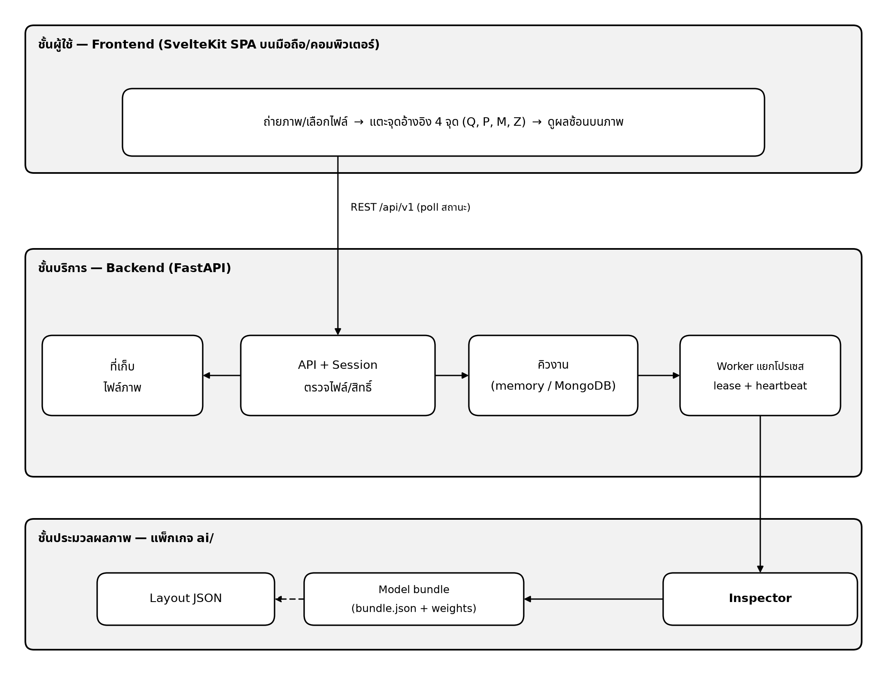
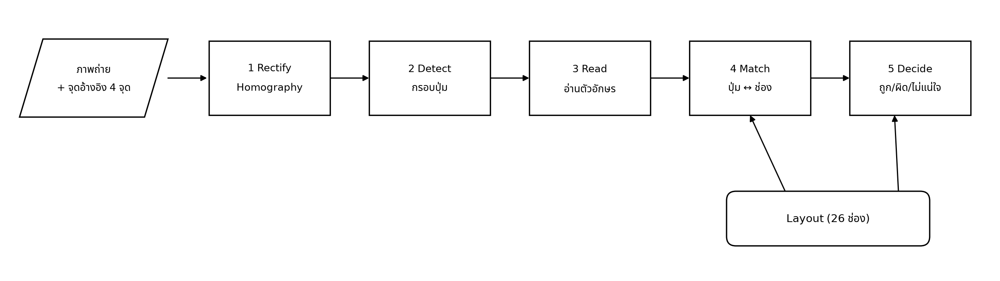
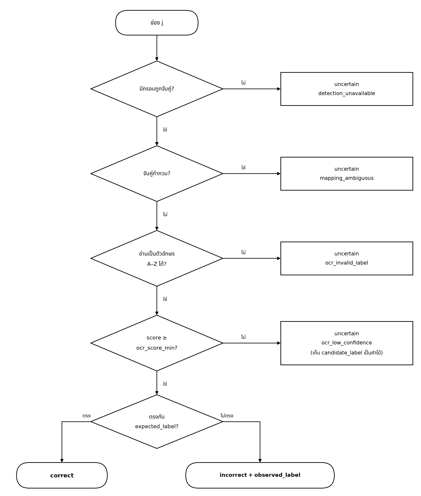

# บทที่ 2 การออกแบบระบบ

บทนี้อธิบายภาพรวมของการออกแบบระบบและเหตุผลในการเลือกแนวทางต่าง ๆ ส่วนรายละเอียดเชิงเทคนิค ได้แก่ API มาตรการด้านความปลอดภัย และ flowchart ของแต่ละส่วนประกอบ นำเสนอไว้ในบทที่ 3

## 2.1 ภาพรวมระบบ

ระบบ KeyCheck แบ่งการทำงานออกเป็น 3 ส่วน แต่ละส่วนมีหน้าที่ชัดเจนและติดต่อกันผ่านช่องทางที่กำหนดไว้ ดังนี้

1. **ส่วนติดต่อผู้ใช้ (Frontend):** เว็บแอปพลิเคชันที่ใช้งานได้ทั้งบนโทรศัพท์มือถือและคอมพิวเตอร์ ผู้ใช้งานใช้สำหรับถ่ายภาพคีย์บอร์ด กำหนดจุดอ้างอิง 4 จุด และดูผลการตรวจ
2. **ส่วนให้บริการ (Backend):** เซิร์ฟเวอร์ FastAPI ทำหน้าที่รับภาพ ตรวจสอบความปลอดภัยของไฟล์ และจัดงานเข้าคิว จากนั้น Worker ซึ่งทำงานแยกเป็นอีกโปรเซสหนึ่งจะนำงานมาประมวลผลทีละงาน
3. **ส่วนประมวลผลภาพ (AI):** ขั้นตอนการตรวจทั้งหมดอยู่ในแพ็กเกจ `ai/` และเรียกใช้งานผ่านคลาส `Inspector` เพียงจุดเดียว ข้อดีของการออกแบบนี้คือโค้ดที่ใช้วัดผลในการทดลองและโค้ดที่ใช้ให้บริการจริงเป็นชุดเดียวกัน ผลการวัดจึงสะท้อนการทำงานของระบบจริง

*รูปภาพที่ 1 แผนภาพการเชื่อมต่อระบบโดยภาพรวม*

## 2.2 ขั้นตอนการทำงาน

เมื่อผู้ใช้งานถ่ายภาพและกำหนดตำแหน่งปุ่ม Q, P, M และ Z บนภาพแล้ว ระบบจะประมวลผลต่อเป็น 5 ขั้นตอน ดังแสดงในรูปภาพที่ 2 และตารางที่ 6

*รูปภาพที่ 2 Pipeline การประมวลผลของ Inspector*

| ขั้นตอน | หน้าที่ | วิธีที่ใช้ |
| --- | --- | --- |
| 1 Rectify | ปรับภาพที่ถ่ายในมุมเอียงให้เป็นมุมมองจากด้านบน | Homography จากจุดอ้างอิง 4 จุด |
| 2 Detect | ระบุตำแหน่งของคีย์แคปแต่ละปุ่มในภาพ | YOLO11n |
| 3 Read | อ่านตัวอักษรบนคีย์แคป | ResNet18 (A–Z หรือ "ไม่ใช่ตัวอักษร") |
| 4 Match | จับคู่คีย์แคปกับช่องทั้ง 26 ช่อง **โดยพิจารณาจากตำแหน่งเพียงอย่างเดียว** | Hungarian algorithm |
| 5 Decide | ตัดสินผลของแต่ละช่องเป็น ถูก ผิด หรือไม่แน่ใจ และเสนอแนะการสลับ | กฎการตัดสินหลายชั้น และกราฟสำหรับค้นหาคู่หรือวงที่สลับกัน |

ตารางที่ 6 แสดง ขั้นตอนของ pipeline และวิธีที่ใช้

**หน่วยวัดระยะ:** ภาพแต่ละภาพมีความละเอียดไม่เท่ากัน หากวัดระยะเป็นพิกเซล เกณฑ์ที่กำหนดไว้สำหรับภาพหนึ่งจะไม่สามารถใช้กับภาพอื่นได้ ระบบจึงวัดระยะในหน่วย **u** โดย 1u เท่ากับระยะห่างระหว่างคีย์แคปที่อยู่ติดกัน ทำให้เกณฑ์ เช่น "จับคู่ได้เมื่อห่างไม่เกินครึ่งปุ่ม" ใช้ได้กับทุกภาพและทุกรุ่น

**ตำแหน่งของปุ่มตัวอักษร:** คีย์บอร์ด QWERTY ทุกรุ่นมีปุ่มตัวอักษร 3 แถว (QWERTYUIOP / ASDFGHJKL / ZXCVBNM) โดยแต่ละแถวเยื้องไปทางขวา 0, 0.25 และ 0.75 ปุ่มตามลำดับ เมื่อทราบตำแหน่งของปุ่ม Q, P, M และ Z ระบบจึงคำนวณตำแหน่งที่ควรเป็นของปุ่มอีก 22 ปุ่มได้ แต่ละช่องกำหนดชื่อตามตำแหน่ง (เช่น `r0c0` หมายถึงแถว 0 ช่อง 0) มิได้กำหนดตามตัวอักษร จึงสามารถรองรับผังปุ่มรูปแบบอื่นได้โดยแก้ไขเพียงไฟล์ JSON

## 2.3 ข้อมูลและการประเมินผล

1. **การใช้ข้อมูลตัวแทน (proxy):** เนื่องจากยังไม่มีภาพคีย์บอร์ดที่ถ่ายเอง คณะผู้จัดทำจึงใช้ภาพคีย์บอร์ด QWERTZ (ผังภาษาเยอรมัน) จาก Kaggle แทน ปุ่มตัวอักษรของผัง QWERTZ อยู่ตำแหน่งเดียวกับผัง QWERTY เกือบทั้งหมด ยกเว้นปุ่ม Y และ Z ที่สลับตำแหน่งกัน ลักษณะนี้เป็นประโยชน์ต่อการทดลอง เนื่องจากได้ "คีย์บอร์ดที่มีปุ่มสลับกันจริง" พร้อมเฉลยโดยไม่ต้องจัดทำเพิ่ม อย่างไรก็ตาม ข้อมูลชุดนี้เป็นภาพสินค้าจากเว็บไซต์ มิใช่ภาพที่ผู้ใช้งานถ่ายด้วยโทรศัพท์มือถือ
2. **การแบ่งชุดข้อมูลตามยี่ห้อ:** คีย์บอร์ดยี่ห้อที่ใช้ในชุดทดสอบจะไม่ปรากฏในชุดฝึกเลย หากแบ่งข้อมูลแบบสุ่มรายภาพ ภาพของคีย์บอร์ดตัวเดียวกันอาจอยู่ทั้งในชุดฝึกและชุดทดสอบ ส่งผลให้ผลการทดลองสูงเกินความเป็นจริง (data leakage)
3. **การล็อกชุดทดสอบ (Test):** ชุดทดสอบสามารถรันได้เพียงครั้งเดียว หลังจากกำหนดค่าทั้งหมดเสร็จสิ้นแล้ว เพื่อป้องกันการปรับระบบตามผลของชุดทดสอบ
4. **ชุดประเมินที่ทราบเฉลยแน่นอน:** คณะผู้จัดทำสร้างสถานการณ์ทดสอบ 4 รูปแบบ ดังตารางที่ 7

| ชุด | วิธีสร้าง | ผลที่คาดหวัง |
| --- | --- | --- |
| S1 เรียงถูกต้อง | ภาพจริงจากชุดข้อมูล | ถูกต้องทั้ง 26 ช่อง |
| S2 สลับ Y↔Z | ภาพเดียวกับ S1 แต่ตรวจด้วยผัง QWERTY | ผิด 2 ช่อง และเสนอให้สลับปุ่ม Y กับ Z |
| S3 สลับจำลอง | นำภาพคีย์แคปมาสลับกัน ทั้งคู่ที่อยู่ติดกัน คู่ที่อยู่ต่างแถว หลายคู่ และวน 3 ปุ่ม | ผิดตามที่สลับไว้ (ใช้เพื่อการทดสอบเท่านั้น ไม่ใช้ฝึก) |
| S4 กรณีพิเศษ | (a) กำหนดจุดอ้างอิงเลื่อนไปหนึ่งช่อง (b) มองเห็นปุ่มไม่ครบ (c) ภาพหมุนผิดทิศ | (a) ปฏิเสธภาพ (b) ช่องที่มองไม่เห็นเป็น "ไม่แน่ใจ" (c) ไม่ให้ผลที่ผิดพลาด |

ตารางที่ 7 แสดง ชุดประเมิน S1–S4

**ตัวชี้วัด:** ประเมินความสามารถในการตรวจพบปุ่มที่ประกอบผิดด้วย Precision, Recall และ F1 โดยหากระบบตอบว่า "ไม่แน่ใจ" ต่อปุ่มที่ผิดจริง จะนับเป็นการตรวจพลาด เพื่อป้องกันไม่ให้ระบบหลีกเลี่ยงความผิดพลาดด้วยการไม่ตอบ นอกจากนี้ยังวัดสัดส่วนช่องที่ระบบให้คำตอบ (Coverage) อัตราการแจ้งเตือนผิดกับคีย์บอร์ดที่ประกอบถูกต้อง (false alarm) และวัดความแม่นยำของโมเดลตรวจจับด้วย mAP

## 2.4 โมเดล

1. **Baseline (ระบบเปรียบเทียบ):** ไม่ใช้โมเดลตรวจจับ แต่ตัดภาพตามตำแหน่งช่องที่คำนวณไว้แล้วส่งไปอ่านตัวอักษรโดยตรง ใช้เพื่อพิจารณาว่าการเพิ่มโมเดลตรวจจับให้ประโยชน์คุ้มค่าหรือไม่
2. **โมเดลตรวจจับ:** เลือกใช้โมเดล 2 ตัวที่มีหลักการทำงานต่างกัน เพื่อให้การเปรียบเทียบมีความหมาย (ตารางที่ 8) ทั้งสองโมเดลตรวจจับบนภาพที่ปรับให้ตรงแล้ว โดยมีคลาสเดียวคือ `keycap` และในการฝึกไม่ใช้การกลับภาพซ้าย-ขวา เนื่องจากจะทำให้ตำแหน่งของปุ่ม Q และ P สลับกัน
3. **ตัวอ่านตัวอักษร:** คณะผู้จัดทำทดลองใช้ OCR สำเร็จรูป (PP-OCRv5) ก่อน แต่พบว่าอัตราการอ่านไม่ได้สูงเกินเกณฑ์ (หัวข้อ 4.1) จึงเปลี่ยนมาฝึก **ResNet18 ให้จำแนกคำตอบ 27 กลุ่ม** ได้แก่ A–Z และ "ไม่ใช่ตัวอักษร" ซึ่งเหมาะสมกว่า เนื่องจากคีย์แคปแต่ละปุ่มมีตัวอักษรเพียงตัวเดียว นอกจากนี้ในการฝึกยังเพิ่มอักษรไทยลงบนภาพคีย์แคป เพื่อให้โมเดลสามารถละเว้นอักษรไทยได้

| | YOLO11n | Faster R-CNN R50-FPN V2 |
| --- | --- | --- |
| หลักการทำงาน | ประมวลผลภาพครั้งเดียวแล้วระบุตำแหน่งปุ่ม (one-stage) | เสนอตำแหน่งที่เป็นไปได้ก่อน แล้วจึงปรับให้แม่นยำ (two-stage) |
| บทบาท | โมเดลหลัก | โมเดลเปรียบเทียบ |
| ขนาด | ขนาดเล็ก (2.58 ล้านพารามิเตอร์) | ขนาดใหญ่กว่ามาก |
| เหตุผลที่เลือก | น้ำหนักเบา ทำงานเร็ว และรันบน CPU ได้ | มีหลักการทำงานต่างจาก YOLO ทำให้การเปรียบเทียบมีความหมาย |

ตารางที่ 8 แสดง การเปรียบเทียบโมเดลตรวจจับที่เลือกใช้

## 2.5 อัลกอริทึมหลัก

ตารางที่ 9 สรุปอัลกอริทึมทั้งหมดที่ใช้ในระบบ รายการที่เป็นตัวหนาคือส่วนที่คณะผู้จัดทำออกแบบขึ้นสำหรับปัญหานี้โดยเฉพาะ ส่วนรายการอื่นเป็นเทคนิคมาตรฐานที่นำมาประกอบใช้งานร่วมกัน

| # | อัลกอริทึม | หน้าที่ | หลักการโดยสังเขป |
| --- | --- | --- | --- |
| 1 | Homography (4 จุด) | ปรับภาพให้อยู่ในมุมมองตรง | แก้สมการเชิงเส้น 8 ตัวแปรจากจุด 4 คู่ แล้วแปลงทั้งภาพ |
| 2 | YOLO11n / Faster R-CNN | ระบุตำแหน่งคีย์แคป | ทำนายกรอบรอบคีย์แคป แล้วตัดกรอบที่ซ้อนทับกันออก (NMS) |
| 3 | ResNet18 + Transfer learning | อ่านตัวอักษร | ต่อยอดจากโมเดลที่ผ่านการฝึกแล้ว ให้จำแนก 1 ใน 27 กลุ่ม พร้อมคะแนนความมั่นใจ |
| 4 | **Hungarian algorithm ที่รองรับการ "ไม่จับคู่"** | จับคู่คีย์แคปกับช่อง | หาการจับคู่แบบหนึ่งต่อหนึ่งที่มีระยะรวมน้อยที่สุด; $O((n+m)^3)$ |
| 5 | **กฎการตัดสินรายช่องและการตรวจผังปุ่ม** | ตัดสินผล ถูก/ผิด/ไม่แน่ใจ และปฏิเสธภาพ | ตรวจสอบเงื่อนไขตามลำดับ และตรวจจับกรณีที่อ่านผิดพร้อมกันเกือบทั้งหมด |
| 6 | **การค้นหาคู่และวงที่สลับกันบนกราฟ** | เสนอแนะการสลับ | แต่ละช่องชี้ไปยังช่องอื่นได้เพียงช่องเดียว จึงค้นหาวงได้รวดเร็ว ($O(k)$) |
| 7 | **Coordinate descent** | หาค่า threshold ที่เหมาะสม | ปรับค่าทีละตัว ลดจำนวนชุดค่าที่ต้องทดลองจาก 124,416 ชุด เหลือประมาณ 105 ชุด |
| 8 | การแบ่งชุดข้อมูลตามยี่ห้อ + SHA-256 | ป้องกันข้อมูลรั่วไหล และทำให้ทำซ้ำได้ | สุ่มโดยกำหนด seed และบันทึกค่า hash ของการแบ่งข้อมูลไว้ตรวจสอบ |
| 9 | Atomic claim + lease + HMAC | ป้องกันงานสูญหายเมื่อระบบขัดข้อง และป้องกันการเข้าถึงข้อมูลของผู้อื่น | รับงานด้วยคำสั่งเดียว; หาก Worker หยุดทำงาน งานจะถูกส่งกลับเข้าคิว |

ตารางที่ 9 แสดง สรุปอัลกอริทึมที่ใช้ในระบบ

### 2.5.1 หลักการ: จับคู่ด้วยตำแหน่ง ไม่ใช้ตัวอักษร

หลักการนี้เป็นแนวคิดที่สำคัญที่สุดของระบบ สมมติว่าคีย์แคป S ถูกประกอบสลับไปอยู่ในช่องของ A หากระบบจับคู่คีย์แคปกับช่องโดยพิจารณาจากตัวอักษร ระบบจะพบตัวอักษร S และจับคู่กับช่อง S ทันที ผลคือระบบจะประเมินว่าทุกปุ่มอยู่ในตำแหน่งที่ถูกต้อง และไม่สามารถตรวจพบการสลับได้

ระบบจึงแยกการทำงานออกเป็น 2 ขั้นตอน ขั้นแรกพิจารณาเฉพาะ **ตำแหน่ง** เพื่อระบุว่าคีย์แคปแต่ละปุ่มอยู่ในช่องใด ขั้นที่สองจึงอ่านตัวอักษรและเปรียบเทียบกับตัวอักษรที่ควรอยู่ในช่องนั้น หากไม่ตรงกันแสดงว่าคีย์แคปถูกประกอบผิดตำแหน่ง

### 2.5.2 การจับคู่แบบหนึ่งต่อหนึ่ง (Hungarian algorithm)

ปัญหาคือการจับคู่คีย์แคปที่ตรวจพบกับช่องทั้ง 26 ช่อง ให้ผลรวมของระยะห่างน้อยที่สุด โดยไม่ใช้คีย์แคปหรือช่องซ้ำ ปัญหานี้เรียกว่า assignment problem ซึ่งเทียบได้กับการจัดที่นั่งให้บุคคล 26 คนใน 26 ตำแหน่ง โดยให้ระยะการเดินรวมน้อยที่สุด วิธีการเลือกช่องที่ใกล้ที่สุดให้แต่ละปุ่มไม่สามารถใช้ได้ เนื่องจากคีย์แคปสองปุ่มอาจเลือกช่องเดียวกัน Hungarian algorithm พิจารณาการจับคู่ทั้งหมดพร้อมกันและรับประกันผลรวมที่ดีที่สุดเสมอ

อย่างไรก็ตาม ในการใช้งานจริงมีปัญหาเพิ่มเติม 2 ประการ คือ มีคีย์แคปที่ไม่เกี่ยวข้อง (เช่น ปุ่มตัวเลขหรือปุ่ม Shift ซึ่งไม่อยู่ในกลุ่ม A–Z) และบางช่องอาจตรวจไม่พบคีย์แคป ระบบจึงเพิ่ม "ตัวเลือกสำรอง" ลงในเมทริกซ์ต้นทุน กำหนดให้ $n$ คือจำนวนคีย์แคปที่ตรวจพบ $m$ = 26 ช่อง และ $D_{ij}$ คือระยะ (หน่วย u) ระหว่างคีย์แคป $i$ กับช่อง $j$

$$
C=\begin{bmatrix}
\tilde D_{n\times m} & \operatorname{diag}(g+\epsilon)\\[2pt]
\operatorname{diag}(c_u) & 0
\end{bmatrix},\qquad
\tilde D_{ij}=\begin{cases}D_{ij} & D_{ij}\le g\\ \infty & \text{otherwise}\end{cases}
$$

ความหมายของแต่ละส่วนในเมทริกซ์มีดังนี้

- **ส่วนซ้ายบน:** ระยะจริงระหว่างคีย์แคปกับช่อง โดยหากระยะเกิน $g$ (ประมาณครึ่งปุ่ม ค่าจริงได้จากการปรับค่า) จะไม่อนุญาตให้จับคู่
- **ส่วนขวาบน:** ตัวเลือกให้คีย์แคปที่เกินมา "ไม่ต้องจับคู่กับช่องใด" คีย์แคปที่อยู่นอกกลุ่ม A–Z จึงไม่ถูกบังคับให้จับคู่
- **ส่วนซ้ายล่าง:** ตัวเลือกให้ช่องที่ไม่มีคีย์แคปอยู่ใกล้เพียงพอ "ไม่ถูกจับคู่" ช่องดังกล่าวจะได้ผลเป็น "ไม่แน่ใจ" แทนการคาดเดาจากคีย์แคปที่อยู่ไกล

ระบบคำนวณด้วยฟังก์ชัน `scipy.optimize.linear_sum_assignment` และหากคู่ใดมีคู่อื่นที่ระยะใกล้เคียงกันมาก จะถูกระบุว่า "กำกวม" และไม่ใช้ตัดสินผล (ตัวอย่างการคำนวณอยู่ในหัวข้อ 3.4.4)

### 2.5.3 การตัดสินรายช่อง

ระบบตรวจสอบแต่ละช่องตามลำดับในรูปภาพที่ 3 และหยุดที่เงื่อนไขแรกที่เป็นจริง เช่น หากไม่พบคีย์แคปในช่องนั้น ระบบจะตอบว่า "ไม่แน่ใจ" โดยไม่ตรวจสอบเงื่อนไขถัดไป

*รูปภาพที่ 3 Flowchart การตัดสินผลรายช่องของฟังก์ชัน decide*

ในกรณีที่อ่านตัวอักษรได้แต่ความมั่นใจไม่เพียงพอ ระบบจะไม่ตัดสินว่าถูกหรือผิด แต่จะแสดงคำแนะนำแก่ผู้ใช้งานว่า "น่าจะเป็น X" เพื่อให้ผู้ใช้งานตรวจสอบด้วยตนเอง

### 2.5.4 การปฏิเสธภาพ

ในบางกรณีระบบไม่ควรให้ผลการตรวจทั้งภาพ เนื่องจากผลที่ได้จะผิดพลาดเกือบทุกช่อง ระบบจะปฏิเสธภาพ (`LAYOUT_MISMATCH`) และแจ้งให้ผู้ใช้งานกำหนดจุดอ้างอิงใหม่ ในกรณีต่อไปนี้

1. **คีย์แคปไม่เรียงตรงตามผังที่กำหนด:** จับคู่ได้น้อยช่อง หรือระยะเฉลี่ยระหว่างคีย์แคปกับช่องมากเกินไป ซึ่งบ่งชี้ว่าคีย์บอร์ดอาจไม่ใช่รูปแบบที่ระบบรองรับ
2. **อ่านปุ่ม Q, P, M หรือ Z ไม่ได้:** ปุ่มที่ผู้ใช้งานกำหนดเป็นจุดอ้างอิงควรเป็นตัวอักษร หากอ่านไม่ได้หลายปุ่ม แสดงว่าผู้ใช้งานอาจกำหนดจุดผิดตำแหน่ง
3. **อ่านผิดพร้อมกันเกือบทั้งหมด:** กรณีนี้เกิดขึ้นเมื่อผู้ใช้งานกำหนดจุดอ้างอิงเลื่อนไปหนึ่งช่องทั้ง 4 จุด คีย์แคปยังคงเรียงเป็นตารางสมบูรณ์ เงื่อนไขข้อ 1 จึงตรวจไม่พบ แต่ตัวอักษรจะผิดช่องเกือบทุกตัว ซึ่งแตกต่างจากกรณีที่ผู้ใช้งานประกอบผิดจริงที่มักผิดเพียงไม่กี่ปุ่ม ระบบจึงสามารถแยกสองกรณีนี้ออกจากกันได้

### 2.5.5 การเสนอแนะการสลับ

ระบบนำช่องที่ผิดมาสร้างเป็นกราฟมีทิศทาง โดยเส้น $X\to Y$ หมายความว่า "ช่อง X มีคีย์แคปที่ควรอยู่ในช่อง Y" หากมีเส้นชี้หากัน ($X\to Y$ และ $Y\to X$) ระบบจะเสนอให้ **สลับคีย์แคปทั้งสองปุ่ม** หากเส้นต่อกันเป็นวงตั้งแต่ 3 ช่องขึ้นไป (A ไป B, B ไป C และ C กลับมา A) ระบบจะเสนอให้ **หมุนเวียนคีย์แคปทั้งวง** ทั้งนี้ระบบจะเสนอแนะเฉพาะเมื่อมั่นใจผลของทุกช่องในวงเท่านั้น เนื่องจากการเสนอให้สลับผิดคู่ก่อให้เกิดผลเสียมากกว่าการไม่เสนอแนะ

### 2.5.6 การแยกหลักฐานออกจากการตัดสิน

การประมวลผลด้วยโมเดลตรวจจับและโมเดลอ่านตัวอักษรใช้เวลานาน (หลายชั่วโมงเมื่อประมวลผลข้อมูลทั้งชุด) ขณะที่การตัดสินผลใช้เวลาเพียงประมาณ 1 มิลลิวินาที ระบบจึงจัดเก็บผลของโมเดล (เรียกว่า "หลักฐาน") ไว้ก่อน แล้วจึงนำมาตัดสินด้วยเกณฑ์ต่าง ๆ ภายหลัง การทดลองเกณฑ์ใหม่จึงไม่ต้องประมวลผลด้วยโมเดลซ้ำ และสามารถทดลองได้หลายร้อยชุดในเวลาอันสั้น

### 2.5.7 การเลือกค่า threshold

ระบบมีค่าเกณฑ์ที่ต้องกำหนดหลายค่า เช่น ระดับความมั่นใจขั้นต่ำในการให้คำตอบ และระยะห่างสูงสุดที่อนุญาตให้จับคู่ คณะผู้จัดทำจึงกำหนดคะแนนรวมขึ้นหนึ่งค่า และเลือกชุดค่าเกณฑ์ที่ให้คะแนนสูงสุด โดยใช้ข้อมูลชุด Validation เท่านั้น ไม่ใช้ชุดทดสอบ

$$
J=\overline{F1_{\text{incorrect}}}(S2,S3)+0.25\cdot R_{\text{mismatch}}(S4a)+0.1\cdot\text{Coverage}(S1)-10\cdot\text{pen}
$$

คะแนนจะสูงขึ้นเมื่อ (1) ตรวจพบคีย์แคปที่ผิดได้แม่นยำ (2) ปฏิเสธภาพที่กำหนดจุดอ้างอิงเลื่อนได้ และ (3) ให้คำตอบได้ในหลายช่อง แต่คะแนนจะถูก **หักอย่างมาก** (คูณ 10) หากแจ้งเตือนผิดกับคีย์บอร์ดที่ประกอบถูกต้องเกิน 2% หากปฏิเสธภาพปกติเกิน 2% หรือหากปฏิเสธภาพที่กำหนดจุดเลื่อนได้น้อยกว่า 80% คะแนนสูงสุดตามทฤษฎีเท่ากับ 1.35 การหักคะแนนในอัตราสูงนี้ทำให้ "การไม่แจ้งเตือนผิด" เป็นข้อบังคับ มิใช่สิ่งที่สามารถแลกกับคะแนนในส่วนอื่นได้

## 2.6 ความปลอดภัยและความเป็นส่วนตัว

1. **การยืนยันตัวตนโดยไม่ต้องลงทะเบียน:** เบราว์เซอร์จะได้รับรหัสสุ่มซึ่งจัดเก็บไว้ใน cookie ส่วนเซิร์ฟเวอร์จัดเก็บเฉพาะค่าที่ผ่านการเข้ารหัส (HMAC-SHA256) ผู้ใช้งานจึงเข้าถึงได้เฉพาะข้อมูลของตนเอง และหากมีการพยายามเข้าถึงภาพของผู้อื่น ระบบจะตอบกลับเสมือนไม่มีข้อมูลดังกล่าว
2. **การตรวจสอบไฟล์ก่อนส่งให้โมเดล:** ตรวจสอบเนื้อหาไฟล์ว่าเป็น JPEG หรือ PNG จริง โดยไม่พิจารณาจากนามสกุลเพียงอย่างเดียว จำกัดขนาดภาพ และลบข้อมูลตำแหน่ง GPS ที่แนบมากับภาพ
3. **การจำกัดจำนวนงาน:** ผู้ใช้งานแต่ละรายส่งงานค้างได้ไม่เกิน 2 งาน และทั้งระบบไม่เกิน 8 งาน เพื่อป้องกันระบบทำงานเกินกำลัง
4. **ไม่รับไฟล์โมเดลจากผู้ใช้งาน:** ระบบใช้เฉพาะโมเดลที่คณะผู้จัดทำสร้างขึ้นเอง
5. **การลบข้อมูลอัตโนมัติ:** ภาพจะถูกลบหลัง 24 ชั่วโมง ข้อมูลผลการตรวจถูกลบหลัง 7 วัน และระบบไม่บันทึกภาพหรือรหัสลงในไฟล์บันทึกการทำงาน (log)

ตารางภัยคุกคามและมาตรการฉบับเต็ม รวมทั้ง API และรหัสข้อผิดพลาด นำเสนอไว้ในภาคผนวก ช
