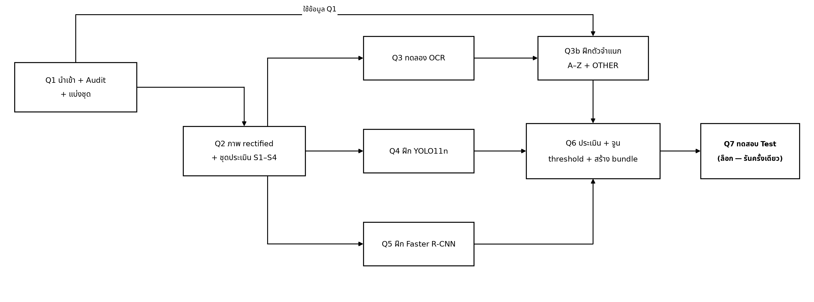
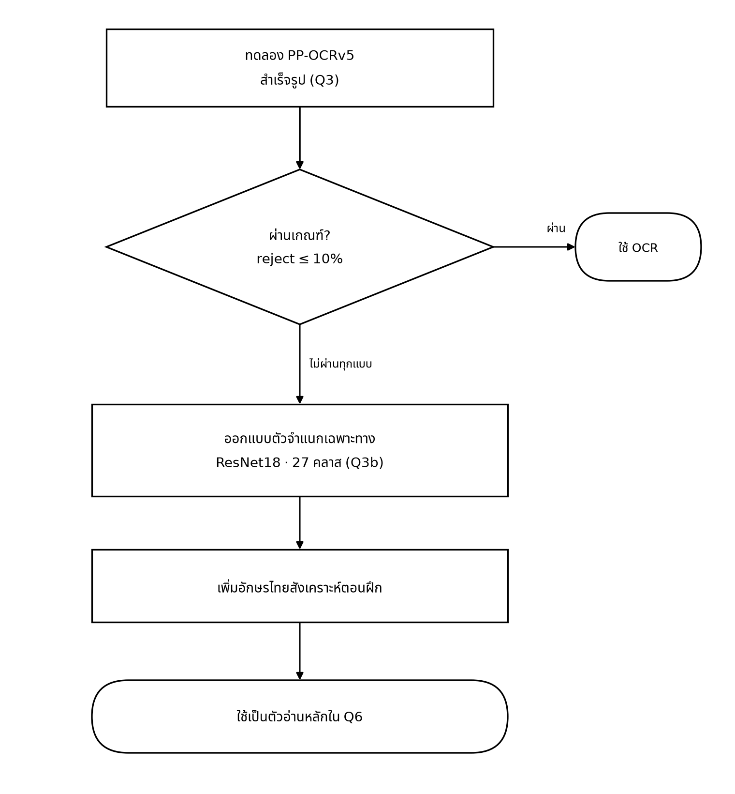
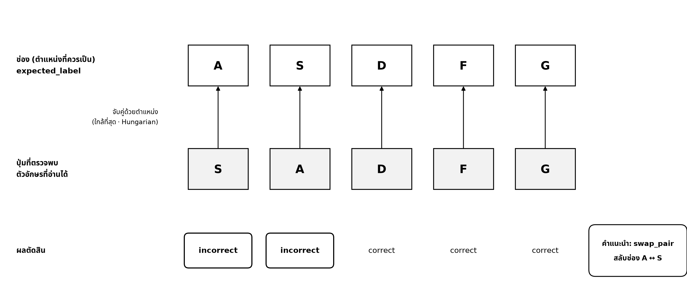
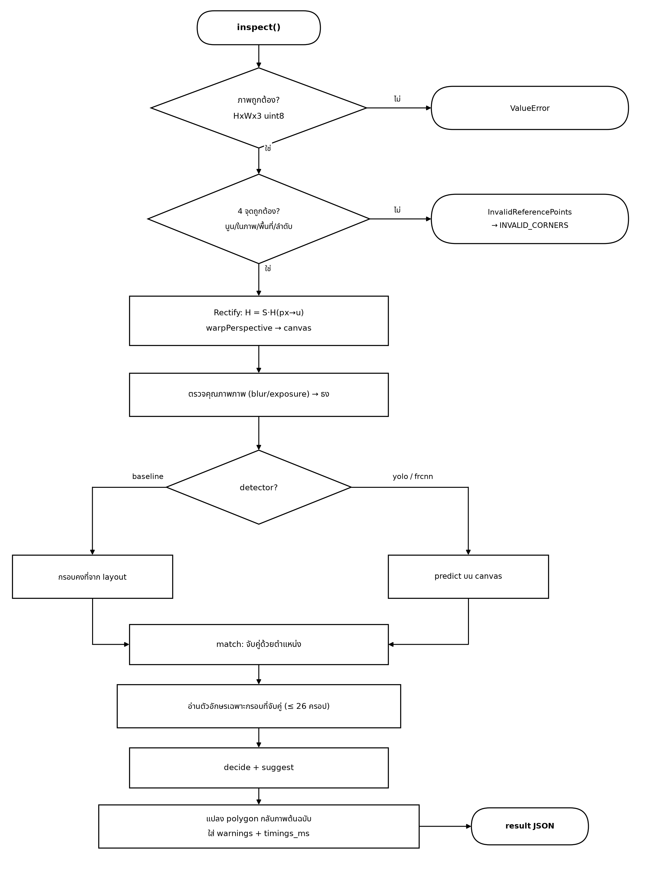
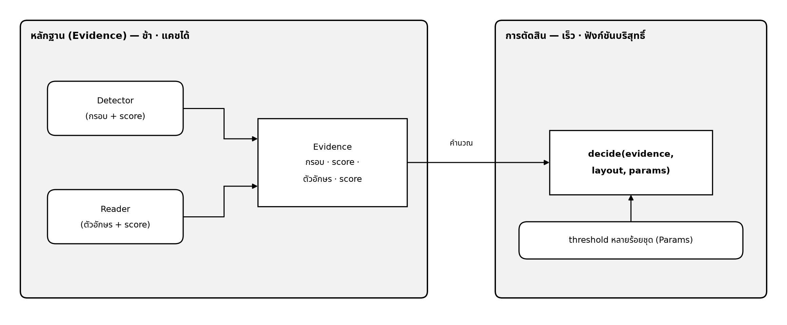
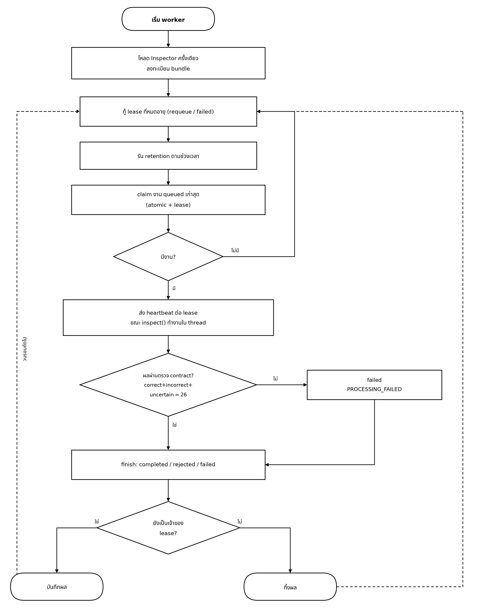
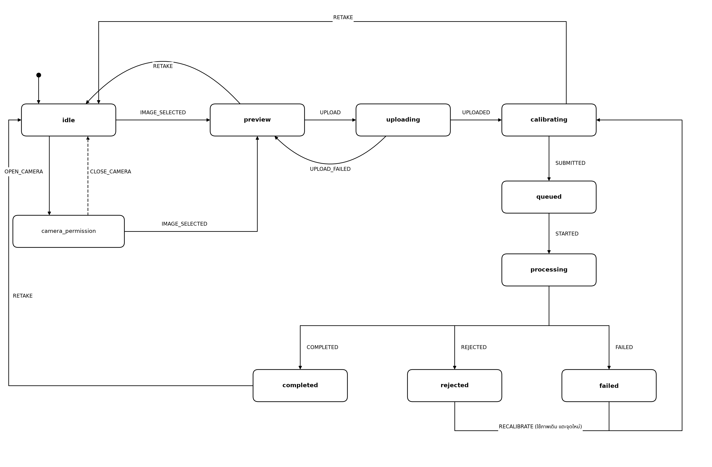
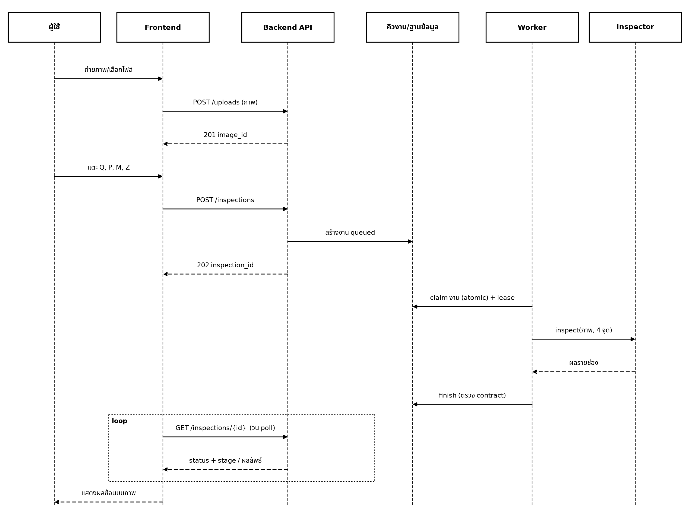

# บทที่ 3 การพัฒนา

บทนี้อธิบายการพัฒนาส่วนประกอบต่าง ๆ ของระบบ โดยส่วนที่สำคัญที่สุดคือหัวข้อ 3.4 อัลกอริทึมการจับคู่และการตัดสินใจ ซึ่งคณะผู้จัดทำออกแบบขึ้นเองทั้งหมด เหตุผลในการเลือกแต่ละวิธีนำเสนอไว้ในบทที่ 2 และผลการทดลองนำเสนอไว้ในบทที่ 4

## 3.1 เครื่องมือและโครงสร้างซอฟต์แวร์

1. **เครื่องมือที่ใช้:** ส่วน AI พัฒนาด้วยภาษา Python 3.12 ร่วมกับไลบรารี OpenCV, NumPy, SciPy, PyTorch และ Ultralytics ส่วน Backend ใช้ FastAPI ร่วมกับฐานข้อมูล MongoDB ส่วนหน้าเว็บใช้ SvelteKit ร่วมกับ TypeScript และฝึกโมเดลบนคอมพิวเตอร์โน้ตบุ๊กที่มีหน่วยประมวลผลกราฟิก NVIDIA RTX 4060 (8 GB)
2. **โครงสร้างโค้ด:** แบ่งออกเป็น 3 ส่วน ได้แก่ `ai/` สำหรับการประมวลผลภาพทั้งหมด `backend/` สำหรับเซิร์ฟเวอร์รับงานและจัดคิว และ `frontend/` สำหรับหน้าเว็บที่ผู้ใช้งานใช้
3. **การเชื่อมต่อระหว่างส่วนประกอบ:** หน้าเว็บส่งคำขอไปยังเซิร์ฟเวอร์ผ่าน `/api/v1` และสอบถามสถานะเป็นระยะ เซิร์ฟเวอร์ส่งภาพให้ `Inspector` ตรวจสอบ ส่วนโมเดลทั้งหมดถูกรวบรวมไว้ในโฟลเดอร์เดียวที่เรียกว่า model bundle การเปลี่ยนโมเดลจึงทำได้โดยเปลี่ยน bundle โดยไม่ต้องแก้ไขโค้ด
4. **การทดลองดำเนินการใน Notebook เดียว:** ค่าตั้งทั้งหมดอยู่ในไฟล์ `pipeline.yaml` แต่ละขั้นตอนบันทึกค่า hash ของค่าตั้งและโค้ดไว้ หากรันซ้ำโดยไม่มีการเปลี่ยนแปลง ขั้นตอนนั้นจะถูกข้าม การฝึกโมเดลที่หยุดกลางคันสามารถดำเนินการต่อจากจุดเดิมได้ และขั้นตอนการทดสอบจริง (Q7) ถูกล็อกให้รันได้เพียงครั้งเดียว ลำดับขั้นตอนทั้งหมดแสดงในรูปภาพที่ 4



*รูปภาพที่ 4 ลำดับขั้นตอนของ pipelin4.1 ชุดข้อมูลและการแบ่งชุดe การทดลอง*

## 3.2 การเตรียมข้อมูลและเรขาคณิต

### 3.2.1 การเตรียมข้อมูล (Q1–Q2)

1. **การรวมภาพซ้ำ:** ชุดข้อมูลจาก Kaggle มีภาพเดียวกันหลายสำเนา โดยชื่อไฟล์ต่างกันเพียงส่วน `.rf.<hash>` จึงตัดส่วนดังกล่าวออกเพื่อรวมสำเนาเป็นภาพต้นฉบับเดียว จากนั้นระบุยี่ห้อจากชื่อไฟล์ และรวมคีย์แคปทั้ง 59 ประเภทให้เป็นคลาสเดียวคือ `keycap`
2. **การคัดกรองภาพ:** ตรวจสอบว่าแต่ละภาพมองเห็นตัวอักษรครบหรือไม่ มีตัวอักษรซ้ำหรือไม่ มองเห็นปุ่มที่ใช้เป็นจุดอ้างอิงครบหรือไม่ และภาพหมุนผิดทิศหรือไม่ จากนั้นจัดกลุ่มภาพที่ใช้ประเมินได้และภาพที่ต้องคัดออก
3. **การแบ่งชุดข้อมูล:** สุ่มเลือกยี่ห้อเป็นชุดทดสอบจนได้ประมาณร้อยละ 15 แยกอีก 2 ยี่ห้อไว้ในชุด Validation เท่านั้น ส่วนที่เหลือแบ่งตามภาพต้นฉบับ จากนั้นโปรแกรมตรวจสอบว่าไม่มียี่ห้อใดอยู่ข้ามชุด หากพบจะหยุดการทำงานทันที การสุ่มใช้ค่า seed คงที่ (20261001) จึงได้ผลเหมือนเดิมทุกครั้ง
4. **การปรับภาพให้ตรง:** ใช้ homography แปลงภาพแล้วสร้างภาพใหม่ด้วยฟังก์ชัน `warpPerspective` ภาพฝึกแต่ละภาพถูกสร้างขึ้น 3 รูปแบบ คือใช้จุดอ้างอิงที่ถูกต้อง และใช้จุดที่เลื่อนแบบสุ่มเล็กน้อยอีก 2 รูปแบบ (ร้อยละ 5 และ 10 ของระยะปุ่ม) เพื่อจำลองกรณีที่ผู้ใช้งานกำหนดจุดคลาดเคลื่อน ได้ภาพฝึกทั้งหมด 9,144 ภาพ
5. **การสร้างภาพคีย์แคปสลับ (S3):** นำภาพคีย์แคปมาสลับตำแหน่งกัน 4 รูปแบบ ได้แก่ คู่ที่อยู่ติดกัน คู่ที่อยู่ต่างแถว หลายคู่ และการวน 3 ปุ่ม เนื่องจากคณะผู้จัดทำเป็นผู้สลับเอง จึงทราบเฉลยที่แน่นอน ภาพชุดนี้ใช้เพื่อการทดสอบเท่านั้น ไม่ใช้ในการฝึก

```python
def jitter_points(ref_px, sigma_u, rng):      # จำลองการกำหนดจุดคลาดเคลื่อน
    pitch = np.linalg.norm(ref_px[1] - ref_px[0]) / 9.0
    return ref_px + rng.normal(0.0, sigma_u * pitch, ref_px.shape)
```

### 3.2.2 Homography และการตรวจสอบจุดอ้างอิง

Homography คือการแปลงที่นำตำแหน่งบนภาพที่ถ่ายในมุมเอียงไปยังตำแหน่งบนภาพที่มองตรง การคำนวณต้องใช้จุดที่สอดคล้องกัน 4 คู่ ซึ่งในระบบนี้คือปุ่ม Q, P, M และ Z โดยมีสมการดังนี้

$$
u=\frac{h_{11}x+h_{12}y+h_{13}}{h_{31}x+h_{32}y+1},\qquad v=\frac{h_{21}x+h_{22}y+h_{23}}{h_{31}x+h_{32}y+1}
$$

สมการมีค่า $h$ ที่ไม่ทราบ 8 ค่า และจุด 4.1 ชุดข้อมูลและการแบ่งชุด4.1 ชุดข้อมูลและการแบ่งชุด4 คู่ให้สมการ 8 สมการพอดี จึงแก้หาค่าได้ด้วยฟังก์ชัน `cv2.getPerspectiveTransform` (ฝั่งหน้าเว็บเขียนตัวแก้สมการขึ้นเองเพื่อแสดงเส้นนำทางบนหน้าจอ) เมื่อตรวจสอบเสร็จ ระบบใช้การแปลงย้อนกลับเพื่อแสดงกรอบผลลัพธ์บนภาพต้นฉบับของผู้ใช้งาน

ก่อนการคำนวณ ระบบตรวจสอบว่าจุดอ้างอิงทั้ง 4 จุดใช้งานได้ ได้แก่ ต้องเป็นรูปสี่เหลี่ยมที่ด้านไม่ตัดกัน (ตรวจด้วย cross product ว่าทุกมุมมีทิศทางเดียวกัน) ต้องมีพื้นที่ไม่น้อยกว่าร้อยละ 0.2 ของภาพ และต้องกำหนดเรียงตามลำดับที่ถูกต้อง ทั้งหน้าเว็บและเซิร์ฟเวอร์ใช้กฎเดียวกัน ผู้ใช้งานจึงทราบข้อผิดพลาดก่อนส่งคำขอ

```python
cross = [(b[0]-a[0])*(c[1]-b[1]) - (b[1]-a[1])*(c[0]-b[0]) for a, b, c in triples(pts)]
if not (all(v > 0 for v in cross) or all(v < 0 for v in cross)):
    return "not convex / crossing"
```

### 3.2.3 การตรวจสอบคุณภาพภาพ

ภาพที่เบลอจะมีขอบวัตถุไม่คมชัด ระบบวัดความคมชัดด้วยความแปรปรวนของ Laplacian (ค่ายิ่งต่ำแสดงว่าภาพยิ่งเบลอ) และตรวจสอบสัดส่วนพิกเซลที่มืดหรือสว่างจัดเกินไป หากภาพมีปัญหา ระบบจะ **ไม่ปฏิเสธภาพ** แต่จะแสดงคำเตือนให้ผู้ใช้งานทราบ

## 3.3 การฝึกโมเดล

### 3.3.1 โมเดลตรวจจับคีย์แคป (Q4–Q5)

1. **YOLO11n:** เริ่มจากโมเดลที่ผ่านการฝึกบนชุดข้อมูล COCO แล้วฝึกต่อด้วยภาพคีย์บอร์ด สูงสุด 100 รอบ และหยุดอัตโนมัติเมื่อผลไม่ดีขึ้นติดต่อกัน 15 รอบ เปิดใช้เฉพาะการปรับแต่งภาพที่ไม่ทำให้ผังปุ่มผิดเพี้ยน (ปรับสี หมุนเล็กน้อย เลื่อน และขยาย) และปิดการกลับภาพหรือการตัดต่อภาพทั้งหมด
2. **Faster R-CNN:** เริ่มจากโมเดลที่ผ่านการฝึกบน COCO เช่นกัน เนื่องจากโมเดลมีขนาดใหญ่ จึงฝึกครั้งละ 2 ภาพและสะสมผลไว้ 4 รอบก่อนปรับค่าโมเดลหนึ่งครั้ง เพื่อให้ใช้หน่วยความจำกราฟิกขนาด 8 GB ได้
3. **การวัดผลด้วยวิธีเดียวกัน:** คณะผู้จัดทำเขียนโปรแกรมวัดผล (IoU และ mAP) ขึ้นเอง เพื่อให้เปรียบเทียบโมเดลทั้งสองได้อย่างเป็นธรรม
4. โมเดลทั้งสองบันทึกความคืบหน้าทุกรอบ หากระบบหยุดทำงานกลางคันสามารถฝึกต่อได้

```python
FORCED_ZERO = ("fliplr", "flipud", "mosaic", "mixup", "cutmix", "copy_paste",
               "erasing", "shear", "perspective", "bgr")      # ปิดการใช้งาน
```

### 3.3.2 ตัวอ่านตัวอักษร (Q3, Q3b)

1. **การทดลอง OCR สำเร็จรูป:** ทดลอง PP-OCRv5 หลายรูปแบบ โดยเปลี่ยนรุ่นของโมเดล ความละเอียด และวิธีตัดภาพคีย์แคป ทดสอบรูปแบบละ 1,040 ปุ่ม ผลที่อ่านได้จะถูกกรองให้เหลือตัวอักษร A–Z เพียงตัวเดียว (ตัดอักษรไทยออก และไม่แก้ไขผลโดยการคาดเดา เช่น ไม่เปลี่ยนเลข 0 เป็นตัวอักษร O)
2. **การฝึกตัวจำแนก:** เมื่อ OCR สำเร็จรูปไม่ผ่านเกณฑ์ คณะผู้จัดทำจึงนำ ResNet18 ที่ผ่านการฝึกกับภาพทั่วไป (ImageNet) มาเปลี่ยนชั้นสุดท้ายให้จำแนกคำตอบ 27 กลุ่ม ได้แก่ A–Z และ "ไม่ใช่ตัวอักษร" แล้วฝึกต่อด้วยภาพคีย์แคปขนาด 64×64 พิกเซล
3. **การเพิ่มความทนทานของโมเดล:** ระหว่างการฝึกมีการสุ่มขยาย เลื่อน หมุน ปรับแสง และทำให้ภาพเบลอ รวมถึงเพิ่มอักษรไทยลงบนภาพคีย์แคปครึ่งหนึ่งของข้อมูล (ตามผังแป้นพิมพ์เกษมณี และใช้สีเดียวกับตัวอักษรเดิม) เพื่อให้โมเดลสามารถละเว้นอักษรไทยได้
4. **การติดตามความผิดพลาดที่สำคัญ:** ติดตามว่าโมเดลอ่านปุ่มที่ไม่ใช่ตัวอักษร (เช่น ปุ่มตัวเลข) ผิดเป็นตัวอักษรบ่อยเพียงใด เนื่องจากกรณีดังกล่าวจะทำให้ระบบแจ้งว่าคีย์แคปประกอบผิดทั้งที่ถูกต้อง

ลำดับการตัดสินใจเลือกตัวอ่านแสดงในรูปภาพที่ 5 (ผลการทดลองนำเสนอในหัวข้อ 4.4)



*รูปภาพที่ 5 ลำดับการตัดสินใจเลือกตัวอ่านตัวอักษร*

```python
m = torchvision.models.resnet18(weights="DEFAULT")
m.fc = nn.Linear(m.fc.in_features, 27)          # A–Z + OTHER
```

## 3.4 อัลกอริทึมการจับคู่และการตัดสินใจ

ส่วนนี้ไม่ต้องใช้โมเดล แต่รับผลที่โมเดลประมวลผลได้มาคำนวณต่อ จึงสามารถทดสอบความถูกต้องได้โดยง่าย แนวคิดเบื้องหลังได้อธิบายไว้แล้วในหัวข้อ 2.5 ส่วนนี้นำเสนอขั้นตอนการทำงานจริง

### 3.4.1 การจับคู่คีย์แคปกับช่อง (Hungarian algorithm)

ขั้นตอนโดยสรุป ได้แก่ สร้างตารางระยะห่างระหว่างคีย์แคปทุกปุ่มกับทุกช่อง ตัดคู่ที่อยู่ห่างเกินเกณฑ์ออก เพิ่มตัวเลือก "ไม่จับคู่" ให้ทั้งคีย์แคปและช่อง แล้วใช้ Hungarian algorithm หาการจับคู่ที่มีระยะรวมน้อยที่สุด สุดท้ายตรวจสอบว่าคู่ใดมีคู่อื่นที่ระยะใกล้เคียงกันมาก หากมีจะระบุว่า "กำกวม"

```text
function match(det_centers[n], slot_centers[m], g, c_u, margin):
    D[i][j] ← ระยะระหว่างกรอบ i กับช่อง j (หน่วย u)
    C ← เมทริกซ์ (n+m) × (m+n) ค่าเริ่มต้น BIG
    C[0:n, 0:m]  ← D[i][j] ถ้า D[i][j] ≤ g มิฉะนั้น BIG    # ห่างเกินเกณฑ์ ไม่อนุญาตให้จับคู่
    C[i, m+i]    ← g + ε                                   # กรอบ i ไม่จับคู่
    C[n+j, j]    ← c_u                                     # ช่อง j ไม่ถูกจับคู่
    C[n:, m:]    ← 0
    (rows, cols) ← Hungarian(C)                            # ต้นทุนรวมต่ำสุด O((n+m)^3)
    for (r, c) ที่ r < n, c < m และ D[r][c] ≤ g:
        d2 ← ระยะน้อยที่สุดของคู่อื่นที่ ≤ g
        result[c] ← { det: r, dist: D[r][c], ambiguous: (d2 − D[r][c]) < margin }
    return result
```

### 3.4.2 การตัดสินรายช่องและการปฏิเสธภาพ

ขั้นตอนโดยสรุป ได้แก่ จับคู่คีย์แคปกับช่อง แล้วตรวจสอบว่าผังปุ่มสอดคล้องกันหรือไม่ หากไม่สอดคล้องจะปฏิเสธทั้งภาพ หากสอดคล้องจึงตัดสินผลทีละช่อง จากนั้นตรวจสอบอีกครั้งว่าผลผิดพร้อมกันเกือบทั้งหมดหรือไม่ (ซึ่งแสดงว่าผู้ใช้งานกำหนดจุดอ้างอิงเลื่อน) หากผ่านการตรวจสอบทั้งหมด ระบบจะส่งผลพร้อมข้อเสนอแนะการสลับ

```text
function decide(evidence, layout, P):
    m ← match(กรอบที่ score ≥ P.det_score_min, ...)
    matched_fraction ← |m| / 26 ;  mean_residual ← เฉลี่ยของ dist ใน m
    if not P.skip_layout_fit and (matched_fraction < fit_min or mean_residual > fit_max):
        return rejected(LAYOUT_MISMATCH)
    if ref_invalid ≥ P.ref_invalid_max:  return rejected(LAYOUT_MISMATCH)
    for each slot j:                                    # ตามลำดับเงื่อนไข
        j ∉ m                     → uncertain("detection_unavailable")
        m[j].ambiguous            → uncertain("mapping_ambiguous")
        letter ไม่ใช่ A–Z         → uncertain("ocr_invalid_label")
        ocr_score < ocr_score_min → uncertain("ocr_low_confidence", candidate=letter)
        มิฉะนั้น                   → correct ถ้า letter = expected มิฉะนั้น incorrect
    if #incorrect ≥ P.mismatch_min_wrong and #incorrect > 0.5 × (#correct+#incorrect):
        return rejected(LAYOUT_MISMATCH)                # กำหนดจุดเลื่อน: ผิดพร้อมกันเกือบทั้งหมด
    return completed(slots, suggest(slots))
```

ค่าเกณฑ์ทั้งหมดถูกรวบรวมไว้ใน `Params` จึงสามารถบันทึกไปพร้อมกับโมเดล และนำไปใช้ซ้ำได้ตรงตามค่าที่ปรับไว้

### 3.4.3 การเสนอแนะการสลับ

ขั้นตอนโดยสรุป ได้แก่ สร้างเส้นเชื่อมจากช่องที่ผิดไปยังช่องที่คีย์แคปนั้นควรอยู่ เส้นที่ชี้หากันคือคู่ที่ต้องสลับ และเส้นที่ต่อกันเป็นวงคือกลุ่มที่ต้องหมุนเวียน

```text
function suggest(slots):
    edge[X] ← ช่องที่ตัวอักษรของช่อง X ควรอยู่  (เฉพาะช่อง X ที่ incorrect)
    swap_pair: (a, b) ที่ edge[a] = b และ edge[b] = a
    cycle:     ติดตาม edge จากแต่ละช่อง หากวนกลับจุดเริ่มต้นและยาว ≥ 3
```

แต่ละช่องมีเส้นออกได้เพียงเส้นเดียว การติดตามเส้นเพื่อหาวงจึงทำได้รวดเร็ว ส่วนช่องที่มีผลเป็น "ไม่แน่ใจ" จะไม่มีเส้นเชื่อม จึงไม่ถูกนำไปเสนอแนะ

### 3.4.4 ตัวอย่างการคำนวณด้วยโค้ดจริง

**ตัวอย่างการจับคู่:** กำหนดให้มีคีย์แคป 3 ปุ่มและช่อง 3 ช่อง ช่องอยู่ที่ตำแหน่ง (0,0), (1,0) และ (2,0) คีย์แคปอยู่ที่ (0.10, 0.05), (1.05, −0.10) และ (2.60, 0.20) และกำหนดว่าระยะเกิน 0.5 ปุ่มไม่อนุญาตให้จับคู่ จะได้ตารางระยะดังตารางที่ 10

| กรอบ | ช่อง 0     | ช่อง 1     | ช่อง 2 |
| -------- | -------------- | -------------- | ---------- |
| 0        | **0.11** | ∞ (0.90)      | ∞ (1.90)  |
| 1        | ∞ (1.05)      | **0.11** | ∞ (0.96)  |
| 2        | ∞ (2.61)      | ∞ (1.61)      | ∞ (0.63)  |

ตารางที่ 10 แสดง ตารางระยะหลังตัดคู่ที่ห่างเกินเกณฑ์ (ตัวหนาคือคู่ที่ถูกเลือก)

คีย์แคปที่ 2 อยู่ห่างจากช่องที่ใกล้ที่สุด 0.63 ปุ่ม ซึ่งเกินเกณฑ์ ระบบจึงไม่บังคับจับคู่กับช่อง 2 ผลที่ได้คือการจับคู่ 2 คู่ และช่อง 2 ไม่ถูกจับคู่ จึงมีผลเป็น "ไม่แน่ใจ" แทนการคาดเดา

**ตัวอย่างการตัดสินใจ:** ตารางที่ 11 ได้จากการเรียกใช้ฟังก์ชัน `decide` จริง โดยป้อนข้อมูลที่กำหนดขึ้นเอง (คีย์แคปอยู่ตรงกึ่งกลางช่องทั้ง 26 ช่อง) **มิได้มาจากภาพถ่าย**

| กรณี                                                    | ข้อมูลที่ป้อน                                                                                                | ผลที่ระบบตอบ                                                                                                                                     |
| ----------------------------------------------------------- | ------------------------------------------------------------------------------------------------------------------------- | ------------------------------------------------------------------------------------------------------------------------------------------------------------ |
| 1 สลับ A↔S                                             | ช่อง A อ่านได้ S และช่อง S อ่านได้ A พร้อมคีย์แคปเกินนอกบล็อก 1 ปุ่ม | ถูก 24 ช่อง ผิด 2 ช่อง เสนอให้สลับ A กับ S และไม่นำคีย์แคปที่เกินมาจับคู่                          |
| 2 วนสามปุ่ม                                        | ช่อง D, F, G อ่านได้ F, G, D                                                                                   | ถูก 23 ช่อง ผิด 3 ช่อง เสนอให้หมุนเวียนคีย์แคปทั้งสามปุ่ม                                                    |
| 3 สลับ A↔S แต่อ่านช่อง A ไม่ชัดเจน | ช่อง A อ่านได้ S แต่ความมั่นใจเพียง 0.4                                                      | ถูก 24 ช่อง ผิด 1 ช่อง ไม่แน่ใจ 1 ช่อง**ไม่เสนอให้สลับ** แต่แสดงว่าช่อง A "น่าจะเป็น S" |
| 4 กำหนดจุดเลื่อนหนึ่งช่อง            | ตัวอักษรทุกแถวเลื่อนไปหนึ่งช่อง                                                            | ปฏิเสธภาพ (อ่านผิด 23 ช่อง) แม้คีย์แคปทุกปุ่มเรียงตรงตามผัง                                               |

ตารางที่ 11 แสดง ตัวอย่างผลของอัลกอริทึมการตัดสินใจจากการรันโค้ดจริง

กรณีที่ 1 ยืนยันว่าการจับคู่ด้วยตำแหน่งทำให้ตรวจพบคีย์แคปที่สลับกันได้ (รูปภาพที่ 6) กรณีที่ 3 แสดงว่าระบบไม่เสนอให้สลับเมื่อหลักฐานไม่ครบถ้วน และกรณีที่ 4 แสดงเหตุผลที่ต้องมีเงื่อนไข "ผิดพร้อมกัน" เนื่องจากการตรวจสอบว่าคีย์แคปเรียงตรงตามผังเพียงอย่างเดียวไม่สามารถตรวจพบกรณีนี้ได้



*รูปภาพที่ 6 ตัวอย่างการจับคู่ด้วยตำแหน่ง คีย์แคปในช่อง A อ่านได้ S และคีย์แคปในช่อง S อ่านได้ A จึงได้ผลผิด 2 ช่องและข้อเสนอให้สลับ A ↔ S*

### 3.4.5 เวลาประมวลผล

วัดบนเครื่องพัฒนา (CPU) โดยรัน 30 รอบและใช้ค่ามัธยฐาน ดังตารางที่ 12

| จำนวนกรอบ | `match` (ms) | `decide` รวมการจับคู่ (ms) |
| ------------------ | -------------- | ---------------------------------------- |
| 30                 | 0.50           | —                                       |
| 100                | 0.87           | 1.08                                     |
| 300                | 2.51           | —                                       |

ตารางที่ 12 แสดง เวลาของขั้นตอนการจับคู่และการตัดสินใจ (วัดจริง)

ขั้นตอนนี้ใช้เวลาเพียง 1–3 มิลลิวินาที ซึ่งน้อยกว่าขั้นตอนการอ่านตัวอักษรอย่างมาก จึงไม่เป็นปัจจัยที่ทำให้ระบบทำงานช้า

### 3.4.6 Inspector และการแยกหลักฐานออกจากการตัดสิน

`Inspector` ทำหน้าที่รวมทุกขั้นตอนเข้าด้วยกัน (รูปภาพที่ 7) โดยโหลดโมเดลเพียงครั้งเดียวเมื่อเริ่มทำงาน และใช้ตรวจสอบภาพได้ทุกภาพ เมื่อตรวจสอบเสร็จจะแปลงกรอบผลลัพธ์กลับไปแสดงบนภาพต้นฉบับของผู้ใช้งาน

เทคนิคที่ช่วยเพิ่มความเร็วอย่างมาก คือ การตัดสินใช้เฉพาะตัวอักษรของคีย์แคปที่ถูกจับคู่กับช่องเท่านั้น ระบบจึงจับคู่ก่อน แล้วอ่านตัวอักษรเฉพาะคีย์แคปเหล่านั้น (ไม่เกิน 26 ปุ่ม) แทนการอ่านคีย์แคปทั้งหมดที่ตรวจพบ ซึ่งในบางกรณีมีจำนวนประมาณ 300 ปุ่ม และใช้เวลาประมาณ 15 วินาทีบน CPU ทั้งนี้มีชุดทดสอบยืนยันว่าวิธีนี้ให้ผลเหมือนกับการอ่านทุกปุ่ม ส่วนการจัดเก็บผลของโมเดลแยกจากการตัดสินแสดงในรูปภาพที่ 8



*รูปภาพที่ 7 Flowchart การทำงานของ Inspector*



*รูปภาพที่ 8 การแยกหลักฐานออกจากการตัดสินเพื่อปรับค่า threshold โดยไม่ต้องประมวลผลด้วยโมเดลซ้ำ*

## 3.5 การปรับค่า threshold (Q6)

ขั้นแรก ให้โมเดลแต่ละตัวประมวลผลภาพในชุด Validation ทั้งหมด (1,516 ภาพ รวมรูปแบบที่เลื่อนจุดอ้างอิงและสลับคีย์แคป) แล้วจัดเก็บผลไว้ ผลที่จัดเก็บผูกกับเวอร์ชันของโมเดลและโค้ด หากมีการเปลี่ยนแปลงจะสร้างใหม่โดยอัตโนมัติ จากนั้นจึงทดลองชุดค่าเกณฑ์ต่าง ๆ หากมีไม่เกิน 400 ชุดจะทดลองครบทุกชุด หากมากกว่านั้นจะใช้วิธี coordinate descent คือปรับค่าทีละตัว เก็บค่าที่ทำให้คะแนนสูงขึ้น และทำซ้ำ 3 รอบ

```text
function tune(grid, base, J):                  # J = คะแนนรวม (หัวข้อ 2.5.7)
    best ← base ;  score ← J(best)
    repeat 3 รอบ:
        for each พารามิเตอร์ k:
            for each ค่า v ใน grid[k]:
                s ← J(best แทน k ด้วย v)
                if s > score: best, score ← ..., s
        หากไม่มีการเปลี่ยนแปลง: หยุด
```

หากทดลองทุกชุดจะต้องทดลองถึง 124,416 ชุด แต่วิธีปรับค่าทีละตัวทดลองเพียงประมาณ 35 ชุดต่อรอบ รวม 3 รอบไม่เกินประมาณ 105 ชุด ซึ่งเร็วกว่ามากกว่า 1,000 เท่า ข้อจำกัดคืออาจไม่ได้คำตอบที่ดีที่สุดในภาพรวม แต่ได้คำตอบที่ดีเพียงพอ เมื่อปรับค่าเสร็จ ระบบบันทึกค่าที่เลือกลงในไฟล์ `thresholds.yaml` เลือกโมเดลที่ได้คะแนนสูงสุด และล็อกค่าทั้งหมดไว้ก่อนการทดสอบจริง

```python
pen = (max(0, fa - max_false_alarm) + max(0, frj - max_false_rejection)
       + max(0, min_layout_mismatch - lm))
return f1 + w_layout * lm + 0.1 * coverage - 10.0 * pen
```

## 3.6 Backend

### 3.6.1 การรับงานและการจัดคิว

การตรวจสอบหนึ่งภาพใช้เวลาหลายวินาที เซิร์ฟเวอร์จึงไม่ให้ผู้ใช้งานรอผลโดยตรง แต่รับงานแล้วตอบกลับทันทีว่ารับงานแล้ว (HTTP 202) จากนั้น Worker จะนำงานจากคิวไปประมวลผล (รูปภาพที่ 9)

การรับงานดำเนินการด้วยคำสั่งเดียว (atomic) Worker หลายตัวจึงไม่รับงานเดียวกันซ้ำ ระหว่างประมวลผล Worker ต้องส่งสัญญาณยืนยันการทำงานเป็นระยะ (heartbeat) หากขาดสัญญาณเกิน 120 วินาที ระบบจะถือว่า Worker ตัวนั้นหยุดทำงาน และส่งงานกลับเข้าคิวเพื่อให้ Worker ตัวอื่นดำเนินการต่อ (ทำซ้ำได้ 1 ครั้ง) ก่อนบันทึกผล Worker ตรวจสอบว่าจำนวนช่องที่ถูก ผิด และไม่แน่ใจรวมกันได้ 26 ช่องพอดี หากไม่ครบจะบันทึกว่าการประมวลผลล้มเหลว แทนการส่งผลที่ผิดรูปแบบไปยังหน้าเว็บ

```text
claim():   find_one_and_update({status: queued}, {$set: {status: processing, worker_lease: {id, heartbeat}}})
recover(): งาน processing ที่ heartbeat เก่าเกิน LEASE (120 วินาที) → คืนคิว (retry+1) หรือ failed
finish():  อัปเดตเมื่อ status = processing และ worker_lease.id = worker_id เท่านั้น
```



*รูปภาพที่ 9 Flowchart การทำงานของ Worker*

### 3.6.2 การอัปโหลด การยืนยันตัวตน และการลบข้อมูล

1. **การอัปโหลด:** หากไฟล์มีขนาดเกินกำหนด ระบบจะยกเลิกการรับตั้งแต่ระหว่างการส่ง ตรวจสอบเนื้อหาไฟล์ว่าเป็น JPEG หรือ PNG จริงโดยไม่พิจารณาจากนามสกุล เปิดภาพเพื่อยืนยันความถูกต้อง จำกัดขนาดไม่เกิน 24 ล้านพิกเซล หมุนภาพให้ถูกทิศ แล้วบันทึกใหม่เพื่อลบข้อมูล GPS ที่แนบมา
2. **การยืนยันตัวตนโดยไม่ต้องลงทะเบียน:** เบราว์เซอร์ได้รับรหัสสุ่มซึ่งจัดเก็บไว้ใน cookie เซิร์ฟเวอร์จัดเก็บเฉพาะค่าที่ผ่านการเข้ารหัส และตรวจสอบว่าคำขอมาจากหน้าเว็บของระบบ
3. **การสร้างงาน:** ตรวจสอบการส่งคำขอซ้ำ → ตรวจสอบความเป็นเจ้าของและอายุของภาพ → ตรวจสอบจุดอ้างอิง 4 จุด → นำงานเข้าคิว (ทั้งระบบไม่เกิน 8 งาน และผู้ใช้งานแต่ละรายไม่เกิน 2 งาน)
4. **การลบข้อมูลอัตโนมัติ:** ภาพถูกลบหลัง 24 ชั่วโมง ข้อมูลผลการตรวจถูกลบหลัง 7 วัน และไฟล์ที่ไม่มีข้อมูลอ้างอิงจะถูกลบออก

### 3.6.3 API และความปลอดภัย

API ทั้งหมดอยู่ภายใต้ `/api/v1` ดังตารางที่ 13 รหัสข้อผิดพลาดที่ผู้ใช้งานอาจพบ ได้แก่ ไฟล์ไม่ใช่ภาพที่รองรับ (415) ไฟล์มีขนาดเกินกำหนด (413) จุดอ้างอิงไม่ถูกต้อง (422) ไม่พบข้อมูล (404) และคิวเต็ม (429) นอกจากนี้ผลการตรวจอาจเป็น "ปฏิเสธภาพ" หรือ "ประมวลผลล้มเหลว" มาตรการด้านความปลอดภัยสรุปไว้ในตารางที่ 14

| Method       | Path                      | ผลสำเร็จ | หมายเหตุ                                            |
| ------------ | ------------------------- | ---------------- | ----------------------------------------------------------- |
| GET          | `/health`               | 200              | สถานะของ API ฐานข้อมูล และโมเดล    |
| GET          | `/layouts`              | 200              | ผังปุ่มที่รองรับ                            |
| POST         | `/uploads`              | 201              | อัปโหลดภาพ                                        |
| GET / DELETE | `/uploads/{id}[/image]` | 200 / 204        | เรียกดูหรือลบภาพ (เฉพาะเจ้าของ) |
| POST         | `/inspections`          | **202**    | ส่งงานตรวจเข้าคิว                          |
| GET / DELETE | `/inspections/{id}`     | 200 / 204        | เรียกดูสถานะและผล หรือลบ             |
| GET          | `/inspections`          | 200              | ประวัติการตรวจ                                |

ตารางที่ 13 แสดง API endpoint ของระบบ (prefix `/api/v1`)

| ภัยคุกคาม                                                         | มาตรการป้องกัน                                                                                                                                                               |
| -------------------------------------------------------------------------- | ------------------------------------------------------------------------------------------------------------------------------------------------------------------------------------------ |
| การเข้าถึงข้อมูลของผู้อื่น                       | จัดเก็บรหัสในรูปแบบเข้ารหัส ตรวจสอบความเป็นเจ้าของทุกครั้ง และตอบกลับเสมือนไม่มีข้อมูลดังกล่าว |
| การปลอมแปลงคำขอข้ามเว็บไซต์ (CSRF)              | ตรวจสอบว่าคำขอมาจากหน้าเว็บของระบบ                                                                                                                       |
| ไฟล์อัปโหลดที่เป็นอันตราย                         | ตรวจสอบเนื้อหาไฟล์ เปิดภาพเพื่อยืนยัน จำกัดขนาด และลบข้อมูลแฝง                                                                  |
| การส่งงานจำนวนมากจนระบบทำงานเกินกำลัง | จำกัดจำนวนงานต่อผู้ใช้งานและทั้งระบบ                                                                                                                   |
| ไฟล์โมเดลที่เป็นอันตราย                             | ไม่รับไฟล์โมเดลจากผู้ใช้งาน ใช้เฉพาะโมเดลที่สร้างขึ้นเอง                                                                            |
| การรั่วไหลของข้อมูลส่วนบุคคล                   | ไม่บันทึกภาพหรือรหัสลงในไฟล์บันทึกการทำงาน และลบภาพโดยอัตโนมัติ                                                              |

ตารางที่ 14 แสดง ภัยคุกคามและมาตรการด้านความปลอดภัย

## 3.7 Frontend

1. **เครื่องมือ:** ใช้ SvelteKit ร่วมกับ TypeScript โดยสร้างชนิดข้อมูล (type) จากข้อกำหนด API ของเซิร์ฟเวอร์โดยอัตโนมัติ หากฝั่งใดเปลี่ยนรูปแบบข้อมูล โปรแกรมจะแจ้งข้อผิดพลาดตั้งแต่ขั้นตอนการเขียนโค้ด
2. **การควบคุมขั้นตอนด้วย state machine:** หน้าเว็บมี 10 สถานะ (รูปภาพที่ 10) ตั้งแต่ยังไม่เลือกภาพจนถึงแสดงผล การเปลี่ยนสถานะทำได้ตามเส้นทางที่กำหนดไว้เท่านั้น ทำให้หน้าเว็บไม่เข้าสู่สถานะที่ไม่ถูกต้อง
3. **ส่วนกำหนดจุดอ้างอิง:** ผู้ใช้งานแตะเพื่อวางจุด ลากเพื่อปรับตำแหน่ง ใช้ปุ่มลูกศรเพื่อเลื่อนอย่างละเอียด และย้อนกลับได้ ระหว่างการลากมีแว่นขยาย 3 เท่าเพื่อให้วางจุดบนโทรศัพท์มือถือได้แม่นยำ และตรวจสอบจุดทั้ง 4 ด้วยกฎเดียวกับเซิร์ฟเวอร์ก่อนส่งคำขอ
4. **การแสดงผล:** แสดงกรอบสีบนภาพพร้อมสัญลักษณ์ ✓ ! ? เพื่อให้ผู้ที่มีภาวะตาบอดสีอ่านผลได้ แสดงรายการ 26 ช่องพร้อมเหตุผลเป็นภาษาไทย และแสดงคำแนะนำ "น่าจะเป็น X" เมื่อระบบอ่านได้แต่ความมั่นใจยังไม่เพียงพอ

```ts
export function transition(state: FlowState, event: FlowEvent): FlowState {
	return T[state][event] ?? state;      // เหตุการณ์ที่ไม่ถูกต้องจะถูกละเว้น
}
```



*รูปภาพที่ 10 State machine ของส่วนติดต่อผู้ใช้ (10 สถานะ)*

## 3.8 เส้นทางข้อมูลแบบครบวงจร

ภาพรวมการไหลของข้อมูลตั้งแต่ผู้ใช้งานถ่ายภาพจนถึงการแสดงผลแสดงในรูปภาพที่ 11 โดยมีขั้นตอนดังนี้



*รูปภาพที่ 11 ลำดับการไหลของข้อมูลเมื่อผู้ใช้งานตรวจสอบภาพหนึ่งภาพ*

1. ผู้ใช้งานถ่ายภาพหรือเลือกไฟล์ หน้าเว็บส่งภาพไปยังเซิร์ฟเวอร์ เซิร์ฟเวอร์ตรวจสอบไฟล์และตอบกลับด้วยรหัสภาพ
2. ผู้ใช้งานกำหนดตำแหน่งปุ่ม Q, P, M และ Z บนภาพ หน้าเว็บตรวจสอบความถูกต้องของจุดทั้ง 4 ก่อนส่ง
3. หน้าเว็บส่งคำขอตรวจสอบ เซิร์ฟเวอร์ตรวจสอบจุดอ้างอิงอีกครั้ง นำงานเข้าคิว และตอบกลับทันที
4. Worker รับงาน ส่งสัญญาณยืนยันการทำงานเป็นระยะ และเรียก `Inspector` เพื่อตรวจสอบภาพ พร้อมรายงานขั้นตอนที่กำลังดำเนินการ
5. `Inspector` ปรับภาพให้ตรง → ตรวจจับคีย์แคป → จับคู่กับช่อง → อ่านตัวอักษร → ตัดสินผล → แปลงกรอบผลลัพธ์กลับไปยังภาพต้นฉบับ
6. Worker ตรวจสอบความครบถ้วนของผล แล้วบันทึกสถานะเป็น "เสร็จสิ้น" หรือ "ปฏิเสธภาพ"
7. หน้าเว็บแสดงความคืบหน้าทีละขั้นตอน แล้วแสดงผลบนภาพ หากภาพถูกปฏิเสธ ผู้ใช้งานสามารถกำหนดจุดอ้างอิงใหม่บนภาพเดิมได้
8. ภาพถูกลบโดยอัตโนมัติหลัง 24 ชั่วโมง

## 3.9 การทดสอบและความสามารถในการทำซ้ำ

1. **การทดสอบส่วน AI:** มีชุดทดสอบอัตโนมัติ 11 ไฟล์ ครอบคลุมการปรับภาพ ผังปุ่ม การจับคู่ การตัดสิน การตรวจสอบคุณภาพภาพ ตัวอ่านตัวอักษร และ `Inspector` (ผลการรันนำเสนอในหัวข้อ 4.10)
2. **การทดสอบเซิร์ฟเวอร์และหน้าเว็บ:** มีชุดทดสอบการอัปโหลด การสร้างงาน การทำงานของ Worker และการลบข้อมูล ส่วนหน้าเว็บทดสอบด้วย Playwright ทั้งบนหน้าจอคอมพิวเตอร์และหน้าจอโทรศัพท์มือถือจำลอง ในการทดสอบสามารถใช้โมเดลจำลองแทนโมเดลจริงได้ จึงทดสอบการทำงานได้ครบทุกขั้นตอนโดยไม่ต้องโหลดโมเดล
3. **ความสามารถในการทำซ้ำ:** ใช้ค่า seed คงที่ บันทึกค่า hash ของการแบ่งข้อมูล โมเดล และค่าตั้งไว้ตรวจสอบ และล็อกเวอร์ชันของไลบรารีทุกตัว ผู้อื่นจึงสามารถรันซ้ำและได้ผลลัพธ์เดียวกัน
