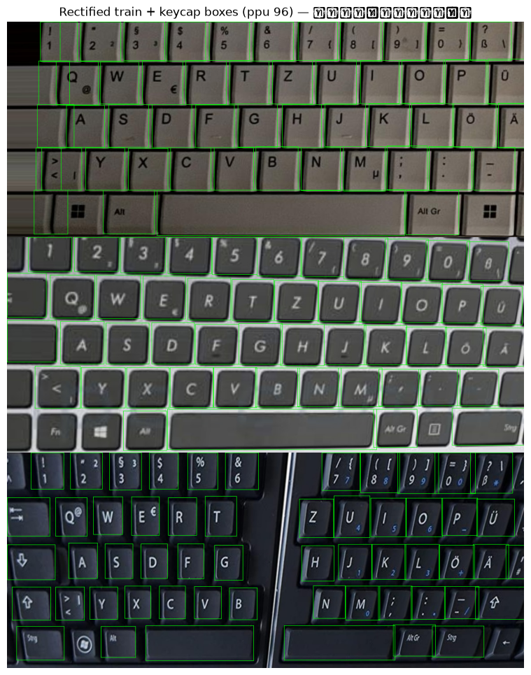
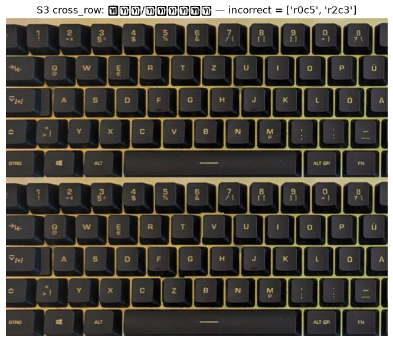
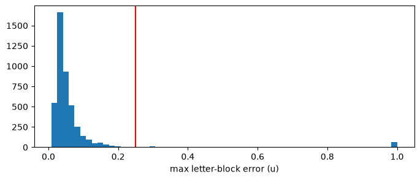
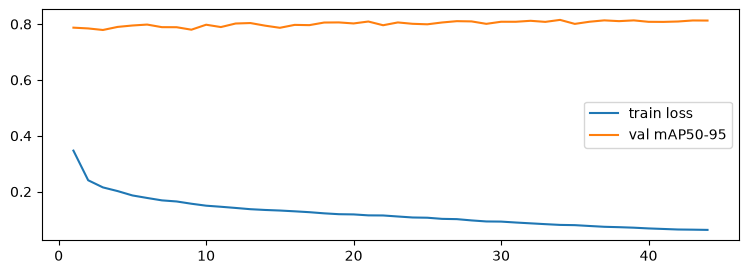

# บทที่ 3 การพัฒนา

บทนี้อธิบายการพัฒนาส่วนประกอบต่าง ๆ ของระบบ ตั้งแต่การเตรียมข้อมูล การฝึกโมเดล อัลกอริทึมการจับคู่และการตัดสินใจ ไปจนถึงระบบเว็บ ส่วนที่สำคัญที่สุดคือหัวข้อ 3.4 ซึ่งคณะผู้จัดทำออกแบบขึ้นเองทั้งหมด เหตุผลในการเลือกแต่ละวิธีนำเสนอไว้ในบทที่ 2 และผลการทดลองนำเสนอไว้ในบทที่ 4

## 3.1 เครื่องมือและโครงสร้างซอฟต์แวร์

1. **เครื่องมือที่ใช้:** ส่วน AI พัฒนาด้วยภาษา Python 3.12 ร่วมกับไลบรารี OpenCV, NumPy, SciPy, PyTorch และ Ultralytics ส่วน Backend ใช้ FastAPI ร่วมกับฐานข้อมูล MongoDB ส่วนหน้าเว็บใช้ SvelteKit ร่วมกับ TypeScript และฝึกโมเดลบนคอมพิวเตอร์โน้ตบุ๊กที่มีหน่วยประมวลผลกราฟิก NVIDIA RTX 4060 (8 GB)
2. **โครงสร้างโค้ด:** แบ่งออกเป็น 3 ส่วน ได้แก่ `ai/` สำหรับการประมวลผลภาพ `backend/` สำหรับเซิร์ฟเวอร์รับงานและจัดคิว และ `frontend/` สำหรับหน้าเว็บ โมเดลทั้งหมดถูกรวบรวมไว้ในโฟลเดอร์เดียวที่เรียกว่า model bundle การเปลี่ยนโมเดลจึงทำได้โดยไม่ต้องแก้ไขโค้ด
3. **การทดลองดำเนินการใน Notebook เดียว:** ค่าตั้งทั้งหมดอยู่ในไฟล์ `pipeline.yaml` แต่ละขั้นตอนบันทึกค่า hash ของค่าตั้งและโค้ดไว้ หากรันซ้ำโดยไม่มีการเปลี่ยนแปลง ขั้นตอนนั้นจะถูกข้าม การฝึกที่หยุดกลางคันสามารถดำเนินการต่อได้ และขั้นตอนการทดสอบจริง (Q7) ถูกล็อกให้รันได้เพียงครั้งเดียว ลำดับขั้นตอนแสดงในรูปภาพที่ 4


*รูปภาพที่ 4 ลำดับขั้นตอนของ pipeline การทดลอง*

## 3.2 การเตรียมข้อมูล

### 3.2.1 ขั้นตอนการเตรียมข้อมูล (Q1–Q2)

1. **การรวมภาพซ้ำ:** ชุดข้อมูลจาก Kaggle มีภาพเดียวกันหลายสำเนา จึงรวมสำเนาให้เป็นภาพต้นฉบับเดียว ระบุยี่ห้อจากชื่อไฟล์ และรวมคีย์แคปทั้ง 59 ประเภทเป็นคลาสเดียวคือ `keycap`
2. **การคัดกรองภาพ:** ตรวจสอบว่าแต่ละภาพมองเห็นตัวอักษรครบ ไม่มีตัวอักษรซ้ำ มองเห็นปุ่มที่ใช้เป็นจุดอ้างอิงครบ และไม่หมุนผิดทิศ ภาพที่ไม่ผ่านเกณฑ์ถูกคัดออก
3. **การแบ่งชุดข้อมูล:** สุ่มเลือกยี่ห้อเป็นชุดทดสอบประมาณร้อยละ 15 แยกอีก 2 ยี่ห้อไว้ในชุด Validation เท่านั้น ส่วนที่เหลือแบ่งตามภาพต้นฉบับ แล้วตรวจสอบว่าไม่มียี่ห้อใดอยู่ข้ามชุด การสุ่มใช้ค่า seed คงที่ จึงได้ผลเหมือนเดิมทุกครั้ง
4. **การปรับภาพให้ตรง:** ใช้ homography แปลงภาพทุกภาพให้อยู่ในมุมมองตรง ภาพฝึกแต่ละภาพถูกสร้างขึ้น 3 รูปแบบ คือใช้จุดอ้างอิงที่ถูกต้อง และใช้จุดที่เลื่อนแบบสุ่มเล็กน้อยอีก 2 รูปแบบ (ร้อยละ 5 และ 10 ของระยะปุ่ม) เพื่อจำลองกรณีที่ผู้ใช้งานกำหนดจุดคลาดเคลื่อน
5. **การสร้างชุดประเมิน:** สร้างชุด S1–S4 ตามที่ออกแบบไว้ในหัวข้อ 2.3 โดยชุด S3 นำภาพคีย์แคปมาสลับตำแหน่งกัน 4 รูปแบบ (คู่ที่อยู่ติดกัน คู่ที่อยู่ต่างแถว หลายคู่ และการวน 3 ปุ่ม) จึงทราบเฉลยที่แน่นอน และใช้เพื่อการทดสอบเท่านั้น

### 3.2.2 ข้อมูลที่ได้

ผลการคัดกรองข้อมูลแสดงในตารางที่ 10 และผลการแบ่งชุดข้อมูลแสดงในตารางที่ 11

| รายการ | จำนวน |
| --- | --- |
| ภาพทั้งหมด | 5,254 |
| ภาพต้นฉบับ (หลังรวมสำเนา) | 1,884 |
| ภาพต้นฉบับที่เห็นตัวอักษรครบ 26 ตัว | 1,608 |
| ภาพที่มีจุดอ้างอิงครบ | 4,463 |
| กลุ่มยี่ห้อที่ใช้ประเมินได้ | 71 |

ตารางที่ 10 แสดง ผลการคัดกรองข้อมูล Kaggle QWERTZ

| ชุดข้อมูล | ภาพ | ภาพต้นฉบับ |
| --- | --- | --- |
| Train | 3,762 | 1,356 |
| Validation | 226 | 226 |
| Test | 223 | 223 |
| คัดออก | 1,043 | 486 |

ตารางที่ 11 แสดง ผลการแบ่งชุดข้อมูล (seed 20261001)

ชุดทดสอบประกอบด้วยคีย์บอร์ด 11 ยี่ห้อที่ไม่ปรากฏในชุดฝึก และชุด Validation มีคีย์บอร์ด 2 ยี่ห้อที่ไม่ปรากฏในชุดฝึกเช่นกัน หลังการปรับภาพให้ตรง ได้ภาพฝึก 9,144 ภาพ ภาพ Validation 215 ภาพ และภาพทดสอบ 217 ภาพ ตัวอย่างภาพหลังปรับให้ตรงพร้อมกรอบคีย์แคปแสดงในรูปภาพที่ 5



*รูปภาพที่ 5 ตัวอย่างภาพฝึกที่ปรับให้ตรงแล้วพร้อมกรอบคีย์แคป จากคีย์บอร์ดสามรุ่น*

จำนวนรายการของชุดประเมินแสดงในตารางที่ 12 โดยชุด S1 มีจำนวนเป็น 2 เท่าของภาพ เนื่องจากแต่ละภาพประเมินทั้งด้วยจุดอ้างอิงที่ถูกต้องและจุดที่เลื่อนเล็กน้อย ข้อสังเกตคือชุด S4b ใน Validation ไม่มีรายการเลย จึงไม่สามารถประเมินกรณีที่มองเห็นปุ่มไม่ครบได้ ตัวอย่างภาพในชุด S3 แสดงในรูปภาพที่ 6

| ชุดประเมิน | S1 | S2 | S3 | S4a | S4b | S4c |
| --- | --- | --- | --- | --- | --- | --- |
| Validation | 430 | 430 | 860 | 215 | 0 | 11 |
| Test | 434 | 434 | 868 | 217 | 1 | 5 |

ตารางที่ 12 แสดง จำนวนรายการของชุดประเมิน S1–S4



*รูปภาพที่ 6 ตัวอย่างชุด S3 ภาพบนคือภาพเดิม ภาพล่างคือภาพหลังสลับคีย์แคป 2 ปุ่ม (ช่อง r0c5 และ r2c3)*

### 3.2.3 การปรับภาพและการตรวจสอบจุดอ้างอิง

Homography คือการแปลงที่นำตำแหน่งบนภาพที่ถ่ายในมุมเอียงไปยังตำแหน่งบนภาพที่มองตรง การคำนวณต้องใช้จุดที่สอดคล้องกัน 4 คู่ ซึ่งในระบบนี้คือปุ่ม Q, P, M และ Z

$$u=\frac{h_{11}x+h_{12}y+h_{13}}{h_{31}x+h_{32}y+1},\qquad v=\frac{h_{21}x+h_{22}y+h_{23}}{h_{31}x+h_{32}y+1}$$

สมการมีค่า $h$ ที่ไม่ทราบ 8 ค่า และจุด 4 คู่ให้สมการ 8 สมการพอดี จึงแก้หาค่าได้ด้วยฟังก์ชัน `cv2.getPerspectiveTransform`

ก่อนการคำนวณ ระบบตรวจสอบว่าจุดทั้ง 4 จุดเป็นรูปสี่เหลี่ยมที่ด้านไม่ตัดกัน มีพื้นที่ไม่น้อยกว่าร้อยละ 0.2 ของภาพ และกำหนดเรียงตามลำดับที่ถูกต้อง ทั้งหน้าเว็บและเซิร์ฟเวอร์ใช้กฎเดียวกัน นอกจากนี้ระบบตรวจสอบความคมชัดของภาพด้วยความแปรปรวนของ Laplacian หากภาพเบลอหรือแสงไม่เหมาะสม ระบบจะแสดงคำเตือนแต่ไม่ปฏิเสธภาพ

ผลการตรวจสอบว่าการใช้จุดอ้างอิง 4 จุดเพียงพอต่อการคำนวณตำแหน่งปุ่มอื่นหรือไม่ แสดงในรูปภาพที่ 7 ภาพส่วนใหญ่มีความคลาดเคลื่อนสูงสุดเพียงประมาณ 0.03–0.1 ปุ่ม ซึ่งต่ำกว่าเกณฑ์ 0.25 ปุ่มอย่างมาก แสดงว่าผัง letter-block ที่ใช้ร่วมกันทุกรุ่นมีความเหมาะสม ทั้งนี้มีกลุ่มเล็กที่คลาดเคลื่อนประมาณ 1.0 ปุ่ม (ประมาณ 60 ภาพ) ซึ่งสอดคล้องกับจำนวนภาพที่หมุนผิดทิศ แต่ยังไม่ได้ยืนยันสาเหตุ



*รูปภาพที่ 7 การกระจายของความคลาดเคลื่อนสูงสุดต่อภาพ (หน่วยปุ่ม) เมื่อคำนวณตำแหน่งปุ่มจากจุดอ้างอิง 4 จุด เส้นสีแดงคือเกณฑ์ 0.25 ปุ่ม*

## 3.3 การฝึกโมเดล

### 3.3.1 โมเดลตรวจจับคีย์แคป (Q4–Q5)

1. **YOLO11n:** เริ่มจากโมเดลที่ผ่านการฝึกบนชุดข้อมูล COCO แล้วฝึกต่อด้วยภาพคีย์บอร์ด เปิดใช้เฉพาะการปรับแต่งภาพที่ไม่ทำให้ผังปุ่มผิดเพี้ยน (ปรับสี หมุนเล็กน้อย เลื่อน และขยาย) และปิดการกลับภาพหรือการตัดต่อภาพทั้งหมด
2. **Faster R-CNN:** เริ่มจากโมเดลที่ผ่านการฝึกบน COCO เช่นกัน เนื่องจากโมเดลมีขนาดใหญ่ จึงฝึกครั้งละ 2 ภาพและสะสมผลไว้ 4 รอบก่อนปรับค่าโมเดลหนึ่งครั้ง เพื่อให้ใช้หน่วยความจำกราฟิก 8 GB ได้
3. โมเดลทั้งสองหยุดฝึกอัตโนมัติเมื่อผลบนชุด Validation ไม่ดีขึ้นติดต่อกันตามจำนวนรอบที่กำหนด และวัดผลด้วยโปรแกรมเดียวกัน (IoU และ mAP) เพื่อให้เปรียบเทียบได้อย่างเป็นธรรม

ข้อมูลการฝึกแสดงในตารางที่ 13 และกราฟการฝึก Faster R-CNN แสดงในรูปภาพที่ 8 ค่า loss ลดลงต่อเนื่องจาก 0.347 เหลือ 0.063 แต่ค่า mAP50-95 บน Validation เกือบคงที่ที่ประมาณ 0.80–0.815 ตั้งแต่รอบที่ 12 และสูงสุดที่รอบที่ 34 บ่งชี้ว่าโมเดลเริ่ม overfit เล็กน้อยหลังจากนั้น ซึ่งการหยุดฝึกอัตโนมัติได้จัดการแล้ว

| | YOLO11n | Faster R-CNN |
| --- | --- | --- |
| จุดเริ่มต้น | โมเดลที่ฝึกบน COCO | โมเดลที่ฝึกบน COCO |
| รอบที่ดีที่สุด / รอบที่ฝึกจริง | 42 / 57 | 34 / 44 |
| หยุดเมื่อผลไม่ดีขึ้นติดต่อกัน | 15 รอบ | 10 รอบ |
| เวลาที่ใช้ฝึก | 0.37 ชั่วโมง | ประมาณ 9.9 ชั่วโมง |
| จำนวนพารามิเตอร์ | 2.58 ล้าน | มากกว่าหลายเท่า |

ตารางที่ 13 แสดง ข้อมูลการฝึกโมเดลตรวจจับ



*รูปภาพที่ 8 กราฟการฝึก Faster R-CNN แสดงค่า loss ของการฝึกและค่า mAP50-95 ของชุด Validation ในแต่ละรอบ*

### 3.3.2 ตัวอ่านตัวอักษร (Q3, Q3b)

1. **การทดลอง OCR สำเร็จรูป:** ทดลอง PP-OCRv5 หลายรูปแบบ โดยเปลี่ยนรุ่นของโมเดล ความละเอียด และวิธีตัดภาพคีย์แคป ผลที่อ่านได้จะถูกกรองให้เหลือตัวอักษร A–Z เพียงตัวเดียว
2. **การฝึกตัวจำแนก:** เมื่อ OCR สำเร็จรูปไม่ผ่านเกณฑ์ (หัวข้อ 4.1) คณะผู้จัดทำจึงนำ ResNet18 ที่ผ่านการฝึกกับภาพทั่วไป (ImageNet) มาเปลี่ยนชั้นสุดท้ายให้จำแนกคำตอบ 27 กลุ่ม ได้แก่ A–Z และ "ไม่ใช่ตัวอักษร" แล้วฝึกต่อด้วยภาพคีย์แคปขนาด 64×64 พิกเซล
3. **การเพิ่มความทนทาน:** ระหว่างการฝึกมีการสุ่มขยาย เลื่อน หมุน ปรับแสง และทำให้ภาพเบลอ รวมถึงเพิ่มอักษรไทยลงบนภาพคีย์แคปครึ่งหนึ่งของข้อมูล เพื่อให้โมเดลสามารถละเว้นอักษรไทยได้

ลำดับการตัดสินใจเลือกตัวอ่านแสดงในรูปภาพที่ 9


*รูปภาพที่ 9 ลำดับการตัดสินใจเลือกตัวอ่านตัวอักษร*

## 3.4 อัลกอริทึมการจับคู่และการตัดสินใจ

ส่วนนี้ไม่ต้องใช้โมเดล แต่รับผลที่โมเดลประมวลผลได้มาคำนวณต่อ จึงสามารถทดสอบความถูกต้องได้โดยง่าย แนวคิดเบื้องหลังได้อธิบายไว้แล้วในหัวข้อ 2.5 ส่วนนี้นำเสนอขั้นตอนการทำงานจริง

### 3.4.1 การจับคู่คีย์แคปกับช่อง (Hungarian algorithm)

ขั้นตอนโดยสรุป ได้แก่ สร้างตารางระยะห่างระหว่างคีย์แคปทุกปุ่มกับทุกช่อง ตัดคู่ที่อยู่ห่างเกินเกณฑ์ออก เพิ่มตัวเลือก "ไม่จับคู่" ให้ทั้งคีย์แคปและช่อง แล้วใช้ Hungarian algorithm หาการจับคู่ที่มีระยะรวมน้อยที่สุด สุดท้ายตรวจสอบว่าคู่ใดมีคู่อื่นที่ระยะใกล้เคียงกันมาก หากมีจะระบุว่า "กำกวม"

```text
function match(det_centers[n], slot_centers[m], g, c_u, margin):
    D[i][j] ← ระยะระหว่างกรอบ i กับช่อง j (หน่วย u)
    C ← เมทริกซ์ (n+m) × (m+n) ค่าเริ่มต้น BIG
    C[0:n, 0:m]  ← D[i][j] ถ้า D[i][j] ≤ g มิฉะนั้น BIG    # ห่างเกินเกณฑ์ ไม่อนุญาตให้จับคู่
    C[i, m+i]    ← g + ε                                   # กรอบ i ไม่จับคู่
    C[n+j, j]    ← c_u                                     # ช่อง j ไม่ถูกจับคู่
    C[n:, m:]    ← 0
    (rows, cols) ← Hungarian(C)                            # ต้นทุนรวมต่ำสุด O((n+m)^3)
    for (r, c) ที่ r < n, c < m และ D[r][c] ≤ g:
        d2 ← ระยะน้อยที่สุดของคู่อื่นที่ ≤ g
        result[c] ← { det: r, dist: D[r][c], ambiguous: (d2 − D[r][c]) < margin }
    return result
```

### 3.4.2 การตัดสินรายช่องและการปฏิเสธภาพ

ขั้นตอนโดยสรุป ได้แก่ จับคู่คีย์แคปกับช่อง แล้วตรวจสอบว่าผังปุ่มสอดคล้องกันหรือไม่ หากไม่สอดคล้องจะปฏิเสธทั้งภาพ หากสอดคล้องจึงตัดสินผลทีละช่อง จากนั้นตรวจสอบอีกครั้งว่าผลผิดพร้อมกันเกือบทั้งหมดหรือไม่ (ซึ่งแสดงว่าผู้ใช้งานกำหนดจุดอ้างอิงเลื่อน) หากผ่านการตรวจสอบทั้งหมด ระบบจะส่งผลพร้อมข้อเสนอแนะการสลับ

```text
function decide(evidence, layout, P):
    m ← match(กรอบที่ score ≥ P.det_score_min, ...)
    matched_fraction ← |m| / 26 ;  mean_residual ← เฉลี่ยของ dist ใน m
    if not P.skip_layout_fit and (matched_fraction < fit_min or mean_residual > fit_max):
        return rejected(LAYOUT_MISMATCH)
    if ref_invalid ≥ P.ref_invalid_max:  return rejected(LAYOUT_MISMATCH)
    for each slot j:                                    # ตามลำดับเงื่อนไข
        j ∉ m                     → uncertain("detection_unavailable")
        m[j].ambiguous            → uncertain("mapping_ambiguous")
        letter ไม่ใช่ A–Z         → uncertain("ocr_invalid_label")
        ocr_score < ocr_score_min → uncertain("ocr_low_confidence", candidate=letter)
        มิฉะนั้น                   → correct ถ้า letter = expected มิฉะนั้น incorrect
    if #incorrect ≥ P.mismatch_min_wrong and #incorrect > 0.5 × (#correct+#incorrect):
        return rejected(LAYOUT_MISMATCH)                # กำหนดจุดเลื่อน: ผิดพร้อมกันเกือบทั้งหมด
    return completed(slots, suggest(slots))
```

### 3.4.3 การเสนอแนะการสลับ

ขั้นตอนโดยสรุป ได้แก่ สร้างเส้นเชื่อมจากช่องที่ผิดไปยังช่องที่คีย์แคปนั้นควรอยู่ เส้นที่ชี้หากันคือคู่ที่ต้องสลับ และเส้นที่ต่อกันเป็นวงคือกลุ่มที่ต้องหมุนเวียน

```text
function suggest(slots):
    edge[X] ← ช่องที่ตัวอักษรของช่อง X ควรอยู่  (เฉพาะช่อง X ที่ incorrect)
    swap_pair: (a, b) ที่ edge[a] = b และ edge[b] = a
    cycle:     ติดตาม edge จากแต่ละช่อง หากวนกลับจุดเริ่มต้นและยาว ≥ 3
```

แต่ละช่องมีเส้นออกได้เพียงเส้นเดียว การติดตามเส้นเพื่อหาวงจึงทำได้รวดเร็ว ส่วนช่องที่มีผลเป็น "ไม่แน่ใจ" จะไม่มีเส้นเชื่อม จึงไม่ถูกนำไปเสนอแนะ

### 3.4.4 ตัวอย่างการคำนวณด้วยโค้ดจริง

**ตัวอย่างการจับคู่:** กำหนดให้มีคีย์แคป 3 ปุ่มและช่อง 3 ช่อง ช่องอยู่ที่ตำแหน่ง (0,0), (1,0) และ (2,0) คีย์แคปอยู่ที่ (0.10, 0.05), (1.05, −0.10) และ (2.60, 0.20) และกำหนดว่าระยะเกิน 0.5 ปุ่มไม่อนุญาตให้จับคู่ จะได้ตารางระยะดังตารางที่ 14

| กรอบ | ช่อง 0 | ช่อง 1 | ช่อง 2 |
| --- | --- | --- | --- |
| 0 | **0.11** | ∞ (0.90) | ∞ (1.90) |
| 1 | ∞ (1.05) | **0.11** | ∞ (0.96) |
| 2 | ∞ (2.61) | ∞ (1.61) | ∞ (0.63) |

ตารางที่ 14 แสดง ตารางระยะหลังตัดคู่ที่ห่างเกินเกณฑ์ (ตัวหนาคือคู่ที่ถูกเลือก)

คีย์แคปที่ 2 อยู่ห่างจากช่องที่ใกล้ที่สุด 0.63 ปุ่ม ซึ่งเกินเกณฑ์ ระบบจึงไม่บังคับจับคู่กับช่อง 2 ผลที่ได้คือการจับคู่ 2 คู่ และช่อง 2 ไม่ถูกจับคู่ จึงมีผลเป็น "ไม่แน่ใจ" แทนการคาดเดา

**ตัวอย่างการตัดสินใจ:** ตารางที่ 15 ได้จากการเรียกใช้ฟังก์ชัน `decide` จริง โดยป้อนข้อมูลที่กำหนดขึ้นเอง (คีย์แคปอยู่ตรงกึ่งกลางช่องทั้ง 26 ช่อง) **มิได้มาจากภาพถ่าย**

| กรณี | ข้อมูลที่ป้อน | ผลที่ระบบตอบ |
| --- | --- | --- |
| 1 สลับ A↔S | ช่อง A อ่านได้ S และช่อง S อ่านได้ A พร้อมคีย์แคปเกินนอกบล็อก 1 ปุ่ม | ถูก 24 ช่อง ผิด 2 ช่อง เสนอให้สลับ A กับ S และไม่นำคีย์แคปที่เกินมาจับคู่ |
| 2 วนสามปุ่ม | ช่อง D, F, G อ่านได้ F, G, D | ถูก 23 ช่อง ผิด 3 ช่อง เสนอให้หมุนเวียนคีย์แคปทั้งสามปุ่ม |
| 3 สลับ A↔S แต่อ่านช่อง A ไม่ชัดเจน | ช่อง A อ่านได้ S แต่ความมั่นใจเพียง 0.4 | ถูก 24 ช่อง ผิด 1 ช่อง ไม่แน่ใจ 1 ช่อง **ไม่เสนอให้สลับ** แต่แสดงว่าช่อง A "น่าจะเป็น S" |
| 4 กำหนดจุดเลื่อนหนึ่งช่อง | ตัวอักษรทุกแถวเลื่อนไปหนึ่งช่อง | ปฏิเสธภาพ (อ่านผิด 23 ช่อง) แม้คีย์แคปทุกปุ่มเรียงตรงตามผัง |

ตารางที่ 15 แสดง ตัวอย่างผลของอัลกอริทึมการตัดสินใจจากการรันโค้ดจริง

กรณีที่ 1 ยืนยันว่าการจับคู่ด้วยตำแหน่งทำให้ตรวจพบคีย์แคปที่สลับกันได้ (รูปภาพที่ 10) กรณีที่ 3 แสดงว่าระบบไม่เสนอให้สลับเมื่อหลักฐานไม่ครบถ้วน และกรณีที่ 4 แสดงเหตุผลที่ต้องมีเงื่อนไข "ผิดพร้อมกัน" เนื่องจากการตรวจสอบว่าคีย์แคปเรียงตรงตามผังเพียงอย่างเดียวไม่สามารถตรวจพบกรณีนี้ได้


*รูปภาพที่ 10 ตัวอย่างการจับคู่ด้วยตำแหน่ง คีย์แคปในช่อง A อ่านได้ S และคีย์แคปในช่อง S อ่านได้ A จึงได้ผลผิด 2 ช่องและข้อเสนอให้สลับ A ↔ S*

### 3.4.5 Inspector

`Inspector` ทำหน้าที่รวมทุกขั้นตอนเข้าด้วยกัน (รูปภาพที่ 11) โดยโหลดโมเดลเพียงครั้งเดียวเมื่อเริ่มทำงาน และเมื่อตรวจสอบเสร็จจะแปลงกรอบผลลัพธ์กลับไปแสดงบนภาพต้นฉบับของผู้ใช้งาน เพื่อเพิ่มความเร็ว ระบบจับคู่คีย์แคปกับช่องก่อน แล้วอ่านตัวอักษรเฉพาะคีย์แคปที่ถูกจับคู่ (ไม่เกิน 26 ปุ่ม) แทนการอ่านคีย์แคปทั้งหมดที่ตรวจพบ ซึ่งในบางกรณีมีประมาณ 300 ปุ่มและใช้เวลาประมาณ 15 วินาทีบน CPU


*รูปภาพที่ 11 Flowchart การทำงานของ Inspector*

## 3.5 การปรับค่า threshold (Q6)

ขั้นแรก ให้โมเดลแต่ละตัวประมวลผลภาพในชุด Validation ทั้งหมดแล้วจัดเก็บผลไว้ จากนั้นจึงทดลองชุดค่าเกณฑ์ต่าง ๆ โดยไม่ต้องประมวลผลด้วยโมเดลซ้ำ หากชุดค่ามีไม่เกิน 400 ชุดจะทดลองครบทุกชุด หากมากกว่านั้นจะใช้วิธี coordinate descent คือปรับค่าทีละตัว เก็บค่าที่ทำให้คะแนนสูงขึ้น และทำซ้ำ 3 รอบ

```text
function tune(grid, base, J):                  # J = คะแนนรวม (หัวข้อ 2.5.7)
    best ← base ;  score ← J(best)
    repeat 3 รอบ:
        for each พารามิเตอร์ k:
            for each ค่า v ใน grid[k]:
                s ← J(best แทน k ด้วย v)
                if s > score: best, score ← ..., s
        หากไม่มีการเปลี่ยนแปลง: หยุด
```

หากทดลองทุกชุดจะต้องทดลองถึง 124,416 ชุด แต่วิธีปรับค่าทีละตัวทดลองเพียงประมาณ 105 ชุด ซึ่งเร็วกว่ามากกว่า 1,000 เท่า ข้อจำกัดคืออาจไม่ได้คำตอบที่ดีที่สุดในภาพรวม แต่ได้คำตอบที่ดีเพียงพอ เมื่อปรับค่าเสร็จ ระบบบันทึกค่าที่เลือก เลือกโมเดลที่ได้คะแนนสูงสุด และล็อกค่าทั้งหมดไว้ก่อนการทดสอบจริง

## 3.6 ระบบเว็บ

### 3.6.1 Backend

1. **การรับงานและการจัดคิว:** การตรวจสอบหนึ่งภาพใช้เวลาหลายวินาที เซิร์ฟเวอร์จึงรับงานแล้วตอบกลับทันที (HTTP 202) จากนั้น Worker นำงานจากคิวไปประมวลผล โดย Worker ต้องส่งสัญญาณยืนยันการทำงานเป็นระยะ หากขาดสัญญาณเกิน 120 วินาที งานจะถูกส่งกลับเข้าคิวเพื่อให้ Worker ตัวอื่นดำเนินการต่อ
2. **การตรวจสอบไฟล์:** ตรวจสอบเนื้อหาไฟล์ว่าเป็น JPEG หรือ PNG จริง จำกัดขนาด และลบข้อมูล GPS ที่แนบมากับภาพ
3. **การยืนยันตัวตนโดยไม่ต้องลงทะเบียน:** เบราว์เซอร์ได้รับรหัสสุ่มเก็บไว้ใน cookie เซิร์ฟเวอร์จัดเก็บเฉพาะค่าที่ผ่านการเข้ารหัส ผู้ใช้งานจึงเข้าถึงได้เฉพาะข้อมูลของตนเอง
4. **การลบข้อมูลอัตโนมัติ:** ภาพถูกลบหลัง 24 ชั่วโมง และข้อมูลผลการตรวจถูกลบหลัง 7 วัน

รายการ API และมาตรการด้านความปลอดภัยฉบับเต็มนำเสนอไว้ในภาคผนวก ช

### 3.6.2 Frontend

1. **การควบคุมขั้นตอนด้วย state machine:** หน้าเว็บมี 10 สถานะ (รูปภาพที่ 12) ตั้งแต่ยังไม่เลือกภาพจนถึงแสดงผล การเปลี่ยนสถานะทำได้ตามเส้นทางที่กำหนดไว้เท่านั้น ทำให้หน้าเว็บไม่เข้าสู่สถานะที่ไม่ถูกต้อง
2. **ส่วนกำหนดจุดอ้างอิง:** ผู้ใช้งานแตะเพื่อวางจุดและลากเพื่อปรับตำแหน่ง ระหว่างการลากมีแว่นขยาย 3 เท่าเพื่อให้วางจุดบนโทรศัพท์มือถือได้แม่นยำ
3. **การแสดงผล:** แสดงกรอบสีบนภาพพร้อมสัญลักษณ์ ✓ ! ? รายการ 26 ช่องพร้อมเหตุผลเป็นภาษาไทย และคำแนะนำ "น่าจะเป็น X" เมื่อระบบอ่านได้แต่ความมั่นใจยังไม่เพียงพอ


*รูปภาพที่ 12 State machine ของส่วนติดต่อผู้ใช้ (10 สถานะ)*

### 3.6.3 เส้นทางข้อมูลแบบครบวงจร

รูปภาพที่ 13 แสดงการไหลของข้อมูลตั้งแต่ผู้ใช้งานถ่ายภาพจนถึงการแสดงผล กล่าวโดยสรุปคือ หน้าเว็บอัปโหลดภาพและจุดอ้างอิง เซิร์ฟเวอร์นำงานเข้าคิว Worker เรียก `Inspector` ตรวจสอบภาพ แล้วบันทึกผล ขณะที่หน้าเว็บสอบถามสถานะเป็นระยะและแสดงผลบนภาพเมื่อเสร็จสิ้น


*รูปภาพที่ 13 ลำดับการไหลของข้อมูลเมื่อผู้ใช้งานตรวจสอบภาพหนึ่งภาพ*

## 3.7 การทดสอบและความสามารถในการทำซ้ำ

1. **การทดสอบอัตโนมัติ:** ส่วน AI มีชุดทดสอบ 11 ไฟล์ ครอบคลุมการปรับภาพ การจับคู่ การตัดสิน ตัวอ่านตัวอักษร และ `Inspector` ส่วนเซิร์ฟเวอร์และหน้าเว็บมีชุดทดสอบแยก (หน้าเว็บทดสอบด้วย Playwright ทั้งบนหน้าจอคอมพิวเตอร์และโทรศัพท์มือถือจำลอง) ผลการรันนำเสนอในหัวข้อ 4.7
2. **ความสามารถในการทำซ้ำ:** ใช้ค่า seed คงที่ บันทึกค่า hash ของการแบ่งข้อมูล โมเดล และค่าตั้ง และล็อกเวอร์ชันของไลบรารีทุกตัว ผู้อื่นจึงสามารถรันซ้ำและได้ผลลัพธ์เดียวกัน
