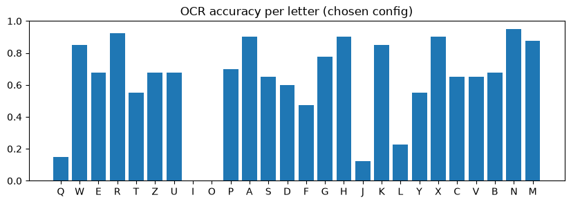

# บทที่ 4 ผลการทดลอง

บทนี้นำเสนอผลการทดลองที่วัดได้จริง ส่วนรายละเอียดของข้อมูลและกระบวนการฝึกโมเดลนำเสนอไว้ในบทที่ 3

> **ข้อควรทราบในการอ่านผลการทดลอง**
> 1. ผลทั้งหมดได้จาก **ข้อมูลตัวแทน (ภาพคีย์บอร์ด QWERTZ จาก Kaggle)** บน **ชุด Validation** เท่านั้น มิใช่ผลของระบบกับภาพถ่ายคีย์บอร์ด QWERTY จริง
> 2. **ยังไม่ได้รันชุดทดสอบ (Q7)** จึงไม่มีผลของชุดทดสอบในรายงานนี้
> 3. ค่า threshold ถูกเลือกจากชุด Validation ชุดเดียวกับที่รายงาน ผลของระบบโดยรวมจึงอาจสูงกว่าผลที่จะได้จากข้อมูลใหม่
> 4. ตัวเลขที่ยังไม่มีหลักฐานในโครงงานระบุเป็น `[รอตัวเลข]` โดยไม่มีการประมาณค่าขึ้นเอง

## 4.1 ผลการอ่านตัวอักษรด้วย OCR สำเร็จรูป

ทดลองกับภาพคีย์แคปจากชุด Validation รูปแบบละ 1,040 ปุ่ม โดย accuracy คือสัดส่วนที่อ่านถูกจากทั้งหมด (การอ่านไม่ได้นับเป็นการอ่านผิด) และ reject rate คือสัดส่วนที่อ่านไม่ได้

| ตัวรู้จำ | accuracy | reject rate | accuracy เฉพาะที่อ่านได้ |
| --- | --- | --- | --- |
| `rec_server` | 0.464 | 0.470 | 0.877 |
| `rec_en_mobile` | 0.592 | 0.234 | 0.773 |
| `rec_latin_mobile` | 0.532 | 0.338 | 0.804 |
| **`auto_server`** | **0.688** | 0.259 | **0.929** |

ตารางที่ 16 แสดง การเปรียบเทียบตัวรู้จำของ PP-OCRv5 (ความละเอียด 96 พิกเซลต่อปุ่ม ตัดภาพทั้งปุ่ม)

| วิธีตัดภาพ (ความละเอียด 64) | accuracy | reject rate |
| --- | --- | --- |
| ทั้งปุ่ม (`key_full`) | 0.613 | 0.336 |
| ทั้งปุ่มและขยายขอบ 10% | 0.507 | 0.437 |
| ส่วนกลาง 70% (`key_center_0.7`) | 0.815 | **0.161** |
| ส่วนกลาง 55% (`key_center_0.55`) | **0.819** | 0.163 |

ตารางที่ 17 แสดง ผลของวิธีตัดภาพคีย์แคปต่อการอ่านด้วย `auto_server`

1. การตัดเฉพาะส่วนกลางของปุ่มให้ผลดีกว่าการตัดทั้งปุ่มอย่างชัดเจน (ประมาณ 0.82 เทียบกับ 0.61) คาดว่าขอบและด้านข้างของคีย์แคปรบกวนการตรวจหาข้อความ ส่วนการเพิ่มความละเอียดเป็น 96 หรือ 128 ไม่ได้ช่วยเมื่อตัดเฉพาะส่วนกลาง
2. **อัตราการอ่านไม่ได้ต่ำสุดคือร้อยละ 16.1** ซึ่งสูงกว่าเกณฑ์ร้อยละ 10 ที่กำหนดไว้ **จึงไม่มีรูปแบบใดผ่านเกณฑ์** ผลนี้เป็นเหตุผลในการเปลี่ยนไปใช้ตัวจำแนกที่ฝึกขึ้นเอง
3. เมื่อ OCR อ่านได้ มักอ่านถูกต้อง (ร้อยละ 97–98 เมื่อตัดส่วนกลาง) ปัญหาหลักจึงอยู่ที่การอ่านไม่ได้ประมาณ 1 ใน 6 ของปุ่ม

รูปภาพที่ 14 แสดงความถูกต้องรายตัวอักษร พบว่าตัวอักษร I และ O อ่านถูกเกือบเป็นศูนย์ และ Q, J, L อ่านถูกต่ำมาก (ประมาณ 0.15, 0.12 และ 0.22) ซึ่งสอดคล้องกับการที่ระบบไม่แก้ไขผลโดยการคาดเดา (O อาจถูกอ่านเป็นเลข 0 และ I อาจถูกอ่านเป็นเลข 1) และปุ่ม Q ของผัง QWERTZ มีสัญลักษณ์ @ อยู่ด้วย ทั้งนี้สาเหตุดังกล่าวเป็นข้อสันนิษฐานที่ยังไม่ได้ยืนยัน

*รูปภาพที่ 14 ความถูกต้องในการอ่านของ PP-OCRv5 แยกรายตัวอักษร*

## 4.2 ผลของตัวจำแนกตัวอักษร (ResNet18)

โครงงานมีค่าตั้งและโค้ดการฝึก รวมถึงค่า hash ของโมเดลที่ฝึกแล้ว แต่ผลการวัดของตัวจำแนกไม่ได้ถูกบันทึกไว้ใน Notebook จึงยังไม่สามารถอ้างอิงตัวเลขได้

| ตัวชี้วัด | ค่า |
| --- | --- |
| accuracy (Validation) | `[รอตัวเลข]` |
| accuracy เฉพาะปุ่มตัวอักษร | `[รอตัวเลข]` |
| สัดส่วนปุ่มที่ไม่ใช่ตัวอักษรแต่ถูกอ่านเป็นตัวอักษร | `[รอตัวเลข]` |
| accuracy บนภาพที่มีอักษรไทย | `[รอตัวเลข]` |

ตารางที่ 18 แสดง ตัวชี้วัดของตัวจำแนกตัวอักษร (ต้องดึงจาก `q3b_keycls/metrics.json`)

หลักฐานทางอ้อม คือ การปรับค่าสามารถตั้งเกณฑ์ความมั่นใจขั้นต่ำได้สูงถึง 0.98–0.99 โดยคะแนนรวมยังสูงมาก (หัวข้อ 4.4) ซึ่งสอดคล้องกับการที่โมเดลให้คะแนนความมั่นใจสูงกับการอ่านที่ถูกต้อง แต่ไม่สามารถใช้แทนค่า accuracy ได้

## 4.3 ผลของโมเดลตรวจจับคีย์แคป

ประเมินบนชุด Validation จำนวน 215 ภาพ (11,222 กรอบ)

| ตัวชี้วัด | YOLO11n | Faster R-CNN |
| --- | --- | --- |
| Precision | **0.986** | 0.976 |
| Recall | **0.981** | 0.978 |
| mAP50 | **0.991** | 0.973 |
| mAP50-95 | **0.854** | 0.815 |
| เวลาประมวลผลต่อภาพ | ประมาณ 1 มิลลิวินาที (GPU) | ประมาณ 2 วินาที (CPU) |

ตารางที่ 19 แสดง ผลการเปรียบเทียบโมเดลตรวจจับบนชุด Validation

1. **YOLO11n ให้ผลดีกว่าในทุกตัวชี้วัด** ทั้งที่มีขนาดเล็กกว่ามากและใช้เวลาฝึกน้อยกว่าประมาณ 27 เท่า (ตารางที่ 13)
2. โมเดลทั้งสองได้ mAP50 สูงกว่า 0.97 แสดงว่าการตรวจหาตำแหน่งคีย์แคปบนภาพที่ปรับให้ตรงแล้วเป็นปัญหาที่ไม่ยาก
3. เวลาประมวลผลของสองโมเดลวัดภายใต้เงื่อนไขต่างกัน (GPU และ CPU) จึงไม่สามารถเปรียบเทียบกันโดยตรงได้

## 4.4 ผลของระบบโดยรวมและการปรับค่า threshold

คะแนนรวม $J$ (หัวข้อ 2.5.7 คะแนนสูงสุดตามทฤษฎีคือ 1.35) มีผล 2 ชุดที่ได้จากการรันคนละครั้ง ดังตารางที่ 20 และ 21

| โมเดล | ก่อนปรับค่า | หลังปรับค่า |
| --- | --- | --- |
| Baseline | −5.537 | −0.104 |
| YOLO11n | −4.886 | 0.289 |
| Faster R-CNN | −5.247 | **0.366** |

ตารางที่ 20 แสดง ชุดที่ 1: คะแนนรวมที่บันทึกใน Notebook (ใช้ PP-OCRv5 เป็นตัวอ่าน)

| โมเดล | คะแนนหลังปรับค่า | ความมั่นใจขั้นต่ำ | ระยะจับคู่สูงสุด (u) |
| --- | --- | --- | --- |
| Baseline | 1.204 | 0.99 | 0.5 |
| **YOLO11n** | **1.311** | 0.99 | 0.6 |
| Faster R-CNN | 1.201 | 0.98 | 0.7 |

ตารางที่ 21 แสดง ชุดที่ 2: ค่าที่บันทึกใน `thresholds.yaml` (ใช้ ResNet18 เป็นตัวอ่าน) และโมเดลที่ถูกเลือกคือ YOLO11n

**ความไม่สอดคล้องของผลสองชุด:** ผลทั้งสองชุดให้โมเดลที่ดีที่สุดต่างกัน หลักฐานในโครงงานบ่งชี้ว่าเป็นการรันคนละครั้งด้วยตัวอ่านต่างกัน กล่าวคือ ชุดที่ 1 ใช้ PP-OCRv5 ส่วนชุดที่ 2 ใช้ ResNet18 ข้อสรุปที่ได้คือ (1) การเปลี่ยนตัวอ่านเป็น ResNet18 ทำให้คะแนนรวมเพิ่มขึ้นจากประมาณ 0.3 เป็นมากกว่า 1.2 และ (2) ลำดับของโมเดลตรวจจับขึ้นอยู่กับตัวอ่านที่ใช้และมีความแตกต่างไม่มาก ก่อนส่งรายงานฉบับสมบูรณ์ควรรันขั้นตอนนี้ซ้ำให้เหลือผลชุดเดียว

**ผลรายสถานการณ์ (S1–S3):** ตัวเลขรายสถานการณ์อยู่ในไฟล์รายงานผลของขั้นตอน Q6 ซึ่งไม่ได้ถูกบันทึกไว้ในโครงงาน

| สถานการณ์ | F1 ของช่องที่ผิด | Coverage | false alarm |
| --- | --- | --- | --- |
| S1 เรียงถูกต้อง | — | `[รอ]` | `[รอ]` |
| S2 สลับ Y↔Z | `[รอ]` | `[รอ]` | `[รอ]` |
| S3 สลับจำลอง | `[รอ]` | `[รอ]` | `[รอ]` |

ตารางที่ 22 แสดง ผลรายสถานการณ์ของระบบโดยรวม (ยังไม่มีตัวเลข)

**ข้อสังเกตจากการปรับค่า:**
1. **เกณฑ์ความมั่นใจขั้นต่ำสูงมาก (0.98–0.99)** แสดงว่าระบบเลือกที่จะไม่ตอบเมื่อไม่มั่นใจ มากกว่าเสี่ยงตอบผิด ซึ่งเป็นผลจากการหักคะแนนการแจ้งเตือนผิดในอัตราสูง และสอดคล้องกับหลักการออกแบบ
2. **Baseline (1.204) ได้คะแนนใกล้เคียงกับ Faster R-CNN (1.201)** และต่ำกว่า YOLO11n เพียง 0.107 แสดงว่าบนข้อมูลตัวแทนนี้ การเพิ่มโมเดลตรวจจับให้ประโยชน์เพียงเล็กน้อย และเฉพาะ YOLO11n เท่านั้น

## 4.5 ผลการทดสอบความทนทาน (S4)

| สถานการณ์ | สิ่งที่วัด | ผล |
| --- | --- | --- |
| S4a กำหนดจุดเลื่อนหนึ่งช่อง (215 รายการ) | อัตราการปฏิเสธภาพ | ร้อยละ 91 จากการปรับค่ารอบก่อนหน้า ชุดล่าสุด `[รอตัวเลข]` |
| S4b มองเห็นปุ่มไม่ครบ | ช่องที่มองไม่เห็นเป็น "ไม่แน่ใจ" | **ประเมินไม่ได้** (ชุด Validation ไม่มีรายการ) |
| S4c ภาพหมุนผิดทิศ (11 รายการ) | ไม่ให้ผลที่ผิดพลาด | `[รอตัวเลข]` (จำนวนตัวอย่างน้อย) |

ตารางที่ 23 แสดง ผลการทดสอบความทนทานของระบบ

## 4.6 เวลาประมวลผลและทรัพยากร

การตรวจหนึ่งภาพบน CPU (ขณะที่ CPU มีงานอื่นทำงานอยู่ด้วย) แสดงในตารางที่ 24 โดยใช้ PP-OCRv5 เป็นตัวอ่าน

| ภาพ | ระบบ | ถูก / ผิด / ไม่แน่ใจ | เวลารวม | หน่วยความจำสูงสุด |
| --- | --- | --- | --- | --- |
| asus28 | Baseline | 23 / 0 / 3 | 4.6–5.1 วินาที | 1.3 GB |
| corsair14 (ฟอนต์เกมมิ่งและไฟ RGB) | Baseline | 14 / 0 / 12 | 5.4–5.6 วินาที | 1.3 GB |
| asus28 | Faster R-CNN | 14 / 0 / 12 | 7.2–7.4 วินาที | 1.8 GB |

ตารางที่ 24 แสดง เวลาและหน่วยความจำในการตรวจหนึ่งภาพบน CPU

ส่วนขั้นตอนการจับคู่และการตัดสินใจ (หัวข้อ 3.4) วัดเวลาได้ดังตารางที่ 25 ซึ่งใช้เวลาเพียง 1–3 มิลลิวินาที เวลาส่วนใหญ่จึงอยู่ที่ขั้นตอนการอ่านตัวอักษร โดยรวมแล้วการตรวจหนึ่งภาพใช้เวลาไม่กี่วินาทีบน CPU ซึ่งเหมาะกับการรับงานผ่านคิว ทั้งนี้เวลาของตัวจำแนก ResNet18 ยังไม่ได้วัด `[รอตัวเลข]`

| จำนวนกรอบที่ตรวจพบ | การจับคู่ (ms) | การตัดสินรวมการจับคู่ (ms) |
| --- | --- | --- |
| 30 | 0.50 | — |
| 100 | 0.87 | 1.08 |
| 300 | 2.51 | — |

ตารางที่ 25 แสดง เวลาของขั้นตอนการจับคู่และการตัดสินใจ (ค่ามัธยฐานจาก 30 รอบ)

## 4.7 ผลการทดสอบซอฟต์แวร์

| ชุดทดสอบ | ผล |
| --- | --- |
| ส่วน AI (`tests/ai/`) | **ผ่าน 153 รายการ และล้มเหลวตามที่คาดไว้ 1 รายการ** ใช้เวลา 15 วินาที |
| Backend (`backend/tests/`) | ยังไม่ได้รัน (ต้องติดตั้งไลบรารีของ Backend ก่อน) |
| Frontend (Playwright) | ยังไม่ได้รัน (ต้องติดตั้งและ build ก่อน) |

ตารางที่ 26 แสดง ผลการรันชุดทดสอบ

รายการที่ล้มเหลวตามที่คาดไว้คือ **ข้อจำกัดที่ทราบแล้ว** กล่าวคือ เมื่อผู้ใช้งานกำหนดจุดอ้างอิงถูกต้องบนคีย์บอร์ดแบบ Ortholinear (ปุ่มเรียงตรงไม่เยื้อง) ระบบจะไม่ปฏิเสธภาพ เนื่องจาก homography ปรับให้ผังเข้ากันได้เกือบสนิท แถวที่คลาดเคลื่อนต่างจากผังปกติเพียง 0.125 ปุ่ม ขณะที่คีย์บอร์ดปกติในชุดข้อมูลเองก็คลาดเคลื่อนได้ถึง 0.12 ปุ่ม จึงไม่สามารถแยกสองกรณีนี้ด้วยเกณฑ์ระยะได้

## 4.8 การใช้งานระบบเว็บ

> **[แทรกภาพหน้าจอ]** หน้าแรกและหน้าเลือกภาพ

*รูปภาพที่ 15 หน้าเริ่มต้นและการเลือกภาพ*

> **[แทรกภาพหน้าจอ]** การกำหนดจุดอ้างอิง 4 จุดพร้อมแว่นขยาย

*รูปภาพที่ 16 การกำหนดจุดอ้างอิง Q, P, M, Z*

> **[แทรกภาพหน้าจอ]** การแสดงความคืบหน้าทีละขั้นตอน

*รูปภาพที่ 17 หน้าแสดงความคืบหน้าของงาน*

> **[แทรกภาพหน้าจอ]** ผลการตรวจพร้อมกรอบสี สัญลักษณ์ ✓ ! ? และข้อเสนอแนะการสลับ

*รูปภาพที่ 18 หน้าแสดงผลการตรวจ*

> **[แทรกภาพหน้าจอ]** กรณีที่ระบบปฏิเสธภาพและแนะนำให้กำหนดจุดใหม่

*รูปภาพที่ 19 หน้าแสดงผลเมื่อระบบปฏิเสธภาพ*

## 4.9 การวิเคราะห์ข้อผิดพลาด

1. **ฟอนต์แบบเกมมิ่งและไฟ RGB ทำให้ผลแย่ลง:** ภาพ corsair14 มีช่องที่ไม่แน่ใจ 12 จาก 26 ช่อง (ร้อยละ 46) เทียบกับภาพ asus28 ที่มีเพียง 3 ช่อง (ร้อยละ 12) โดยทั้งสองภาพไม่มีช่องที่ตัดสินผิด แสดงว่าระบบเลือกที่จะไม่ตอบแทนการตอบผิดตามที่ออกแบบไว้ (ผลนี้มาจากตัวอย่างเพียง 2 ภาพ)
2. **OCR สำเร็จรูปอ่านบางตัวอักษรไม่ได้เลย** (I และ O) ซึ่งเป็นเหตุผลของการฝึกตัวจำแนกขึ้นเอง
3. **การกำหนดจุดเลื่อนหนึ่งช่อง** ไม่สามารถตรวจพบได้ด้วยการตรวจผังปุ่มเพียงอย่างเดียว ในการทดลองช่วงแรกระบบให้ผลผิด 13 ช่องแทนการปฏิเสธภาพ จึงได้เพิ่มเงื่อนไข "ผิดพร้อมกันเกือบทั้งหมด"
4. **คีย์บอร์ดแบบ Ortholinear ที่กำหนดจุดถูกต้องไม่ถูกปฏิเสธ** (หัวข้อ 4.7)

การวิเคราะห์ที่ยังต้องดำเนินการ ได้แก่ ตัวอย่างการตรวจพบผิดและตรวจพลาด ตารางความสับสนระหว่างตัวอักษร และการจำแนกสาเหตุของผล "ไม่แน่ใจ" `[รอตัวเลข]`

## 4.10 การตอบคำถามวิจัย

| คำถามวิจัย | คำตอบจากหลักฐานที่มี | ระดับความมั่นใจ |
| --- | --- | --- |
| 1 โมเดลตรวจจับใดดีที่สุด | ระดับโมเดลเดี่ยว **YOLO11n ดีกว่า Faster R-CNN** (mAP50-95 0.854 เทียบกับ 0.815) และเล็กกว่าและฝึกเร็วกว่ามาก ส่วนระดับระบบโดยรวม ลำดับขึ้นอยู่กับตัวอ่านและแตกต่างกันไม่มาก | ปานกลาง |
| 2 โมเดลตรวจจับช่วยเหนือ Baseline หรือไม่ | **เฉพาะ YOLO11n ที่ดีกว่าเล็กน้อย** (1.311 เทียบกับ 1.204) ส่วน Faster R-CNN ใกล้เคียงกับ Baseline (1.201) | ต่ำถึงปานกลาง |
| 3 ข้อผิดพลาดส่วนใหญ่เกิดจากขั้นตอนใด | หลักฐานชี้ว่า **การอ่านตัวอักษร** เป็นจุดอ่อนหลัก เนื่องจากการตรวจจับได้ mAP50 สูงกว่า 0.97 ขณะที่ OCR อ่านไม่ได้อย่างน้อยร้อยละ 16 และการเปลี่ยนตัวอ่านเพิ่มคะแนนรวมจากประมาณ 0.3 เป็นมากกว่า 1.2 | ปานกลาง |
| 4 แสง มุม และรูปแบบการสลับมีผลอย่างไร | ตอบได้บางส่วน ฟอนต์เกมมิ่งและไฟ RGB เพิ่มสัดส่วนช่องที่ไม่แน่ใจจากร้อยละ 12 เป็น 46 (2 ภาพ) | ต่ำ |
| 5 ระบบทำงานกับคีย์บอร์ดที่ไม่เคยเห็นได้ดีเพียงใด | **ยังตอบไม่ได้** ต้องรอผลแยกตามยี่ห้อและผลของชุดทดสอบ | — |

ตารางที่ 27 แสดง การตอบคำถามวิจัย

## 4.11 ปัจจัยที่อาจกระทบความถูกต้องของผลการทดลอง

1. **ข้อมูลตัวแทนต่างจากการใช้งานจริง:** เป็นภาพสินค้าคีย์บอร์ด QWERTZ มิใช่ภาพถ่ายจากโทรศัพท์มือถือของคีย์บอร์ด QWERTY ผลจึงอาจสูงกว่าการใช้งานจริง
2. **การปรับค่าและการรายงานใช้ข้อมูลชุดเดียวกัน:** ผลของระบบโดยรวมอาจสูงเกินจริง จนกว่าจะรันชุดทดสอบ
3. **ชุด Validation มีขนาดเล็ก:** 215 ภาพ และมียี่ห้อที่ไม่ปรากฏในชุดฝึกเพียง 2 ยี่ห้อ
4. **ข้อมูลจำลอง:** ชุด S3 และอักษรไทยที่เพิ่มลงบนภาพอาจง่ายหรือยากกว่าสภาพจริง
5. **ผลการปรับค่าสองชุดไม่สอดคล้องกัน** และเวลาประมวลผลวัดขณะ CPU มีงานอื่นทำงานอยู่
