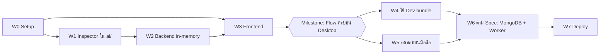

# KeyCheck — Web Implementation Plan (ขึ้นเว็บก่อน)

**อ้างอิง:** [`keycheck-technical-specification.md`](./keycheck-technical-specification.md) v1.1 (§4, §10–§15) · [`implementation-plan.md`](./implementation-plan.md) (Phase 0, 5–7) · [`qwertz-notebook-pipeline-plan.md`](./qwertz-notebook-pipeline-plan.md)
**เวอร์ชัน:** 0.1 — 5 ตุลาคม 2026
**สถานะ:** แผน ยังไม่เริ่มเขียนโค้ด ทำคู่ขนานกับการฝึกโมเดลรอบเต็มใน Notebook

---

## 0. เป้าหมายและหลักการ

ได้เว็บที่ใช้งานได้ครบหนึ่งรอบ **ภาพ → แตะ 4 จุด → รอ → ผลรายช่องบนภาพ** โดยไม่ต้องรอ Detector หรือภาพ QWERTY ของเรา

1. **บางและครบเส้นก่อน แล้วค่อยเพิ่มตาม Spec** ทำตามคำเตือนของ Spec §18 ว่า "ไม่ควรสร้างเว็บเต็มระบบก่อนพิสูจน์ว่าอ่านคีย์แคปได้" ระยะแรกจึงทำเฉพาะส่วนที่ต้องมีเพื่อให้ Flow ครบ ส่วนที่หนักของ Spec (MongoDB, Worker แยกโปรเซส, Retention, Deploy) ทำทีหลัง
2. **API ตรง Spec ตั้งแต่วันแรก** รูปแบบ `POST` ได้ 202 → Poll และ Result/Error contract ตาม §11.2–§11.5 ทำให้ตอนเปลี่ยนที่เก็บข้อมูลเป็น MongoDB **Frontend ไม่ต้องแก้**
3. **Baseline ใช้ได้จริง ไม่ใช่ Mock** ตัดภาพตามช่อง Layout แล้วให้ PaddleOCR อ่านจริง (§6.4) พอ Q6 สร้าง Dev bundle เสร็จก็เปลี่ยนแค่ Config
4. **Logic AI อยู่ใน `ai/` ที่เดียว** Backend เรียกผ่าน `Inspector` ไม่เขียน Pipeline ซ้ำ ใช้โค้ดชุดเดียวกับที่ Notebook ประเมินผล

### การตัดสินใจที่ตกลงแล้ว

| # | เรื่อง | ข้อตกลง | เหตุผล |
| --- | --- | --- | --- |
| W-D1 | ฐานข้อมูลในระยะแรก | **ยังไม่ใช้** เก็บสถานะงานในหน่วยความจำ + ไฟล์ภาพบนดิสก์ | เดโมในเครื่อง ผู้ใช้คนเดียว ไม่ต้องตั้ง Service เพิ่ม; เปลี่ยนเป็น MongoDB ใน W6 ตาม Spec §4.3 |
| W-D2 | คิวงาน | **ไม่ใช้ Redis** ใช้คิวในหน่วยความจำ แล้วเปลี่ยนเป็น MongoDB ใน W6 | คอขวดคือ Inference ไม่ใช่คิว; Redis ไม่ได้มาแทน DB; Spec §4.3 ระบุไว้แล้ว |
| W-D3 | รูปแบบ Frontend | **SPA (`adapter-static`)** + Same-origin ผ่าน Proxy | ตาม Implementation plan 0.C; Cookie ใช้ได้โดยไม่ต้องตั้ง CORS |
| W-D4 | Pipeline ระยะแรก | **Baseline** (Fixed crops + OCR) | ได้ผลจริงตั้งแต่วันแรก ไม่รอ Detector |

---

## 1. ภาพรวมระยะ (Phases)



| ระยะ | งาน | ต้องรออะไร | Milestone |
| --- | --- | --- | --- |
| **W0** | Setup: Generate Backend/Frontend, ทำ `ai/` เป็น Package, Dev proxy | — | |
| **W1** | `Inspector`: ภาพ + 4 จุด → ผลรายช่อง (Baseline) | W0 | |
| **W2** | Backend: Upload, Inspection, Worker thread, เก็บในหน่วยความจำ | W1 | |
| **W3** | Frontend: หน้าแรก, Calibration, ผลตรวจ | W0 (ใช้ Mock port ระหว่างรอ W2) | **เว็บครบเส้นบน Desktop** |
| **W4** | สลับไปใช้ Dev bundle จาก Q6 (YOLO / Faster R-CNN) | Notebook รอบเต็มจบ Q6 | Layout fit check ทำงาน |
| **W5** | HTTPS + ทดสอบกล้องบนมือถือ | W3 | **ใช้บนมือถือได้** |
| **W6** | ตาม Spec: MongoDB, Worker แยกโปรเซส, Lease, Retention, Tests | W3 | **ผ่าน Integration tests §16.2** |
| **W7** | Docker Compose + Proxy | W6 | **Demo ได้** |

W1 กับ W3 ทำพร้อมกันได้ เพราะ Frontend เริ่มจาก Mock port ตาม Pattern ของ Template (`port.ts` / `api.ts`)

---

## 2. W0 — Setup

### 2.1 โครงสร้าง Repository (Spec §15)

```
keycheck/
├── ai/                 # มีอยู่แล้ว + pyproject.toml ใหม่ + ai/inference/ (W1)
├── backend/            # ใหม่: Generate จาก tools/create-fastapi
├── frontend/           # ใหม่: Generate จาก tools/create-sveltekitten (SPA)
├── bundles/            # ใหม่: Model bundle สำหรับ Serving (weights ไม่ขึ้น Git)
├── layouts/  docs/  experiments/  notebooks/  tools/  tests/
└── var/                # ใหม่: ไฟล์ภาพที่ผู้ใช้อัปโหลด (ไม่ขึ้น Git)
```

### 2.2 งาน

1. [ ] **`ai/` เป็น Python package** (Implementation plan 0.D): `ai/pyproject.toml` ชื่อ `keycheck-ai` แบ่ง Dependency ด้วย Extras เพื่อให้ Backend ระยะแรกไม่ต้องลง Torch
   - Core: `numpy`, `scipy`, `opencv-contrib-python`, `pyyaml`, `pillow`
   - `[ocr]`: `paddlepaddle`, `paddleocr` (Baseline ใช้แค่นี้)
   - `[detector]`: `torch`, `torchvision`, `ultralytics` (ใช้ใน W4)
   - Pin เวอร์ชันเดียวกับ `requirements-colab.txt` ที่ผ่าน Smoke run แล้ว
2. [ ] **Generate Backend** ต้องรันจาก root ของ repo เพราะ Generator สร้างโฟลเดอร์ที่ `cwd/<ชื่อ>` และใช้ชื่อนั้นเป็นชื่อ Package:
   ```fish
   uv run --project tools/create-fastapi create-fastapi backend --db beanie --no-worker --no-examples --no-git --install
   ```
   - `--no-git` จำเป็น เพราะ Implementation plan 0.A เคยเจอปัญหา `.git` ซ้อนกัน
   - เลือก `beanie` ไว้เลย เพื่อให้ W6 ไม่ต้อง Generate ใหม่ แต่ระยะแรกปิดการเชื่อม DB ใน Lifespan เมื่อไม่ได้ตั้ง `MONGODB_URI`
   - ลบ Module `auth` และ `user` (JWT) ออก เก็บ `health` ไว้ (Spec §13 ใช้ Anonymous session ไม่ใช่ User login)
   - เพิ่ม Dependency `keycheck-ai[ocr]` แบบ Path (`{ path = "../ai", editable = true }`)
3. [ ] **Generate Frontend**:
   ```fish
   pnpm --dir tools/create-sveltekitten install                # dist/ Build มาแล้ว ลงแค่ Dependency
   node tools/create-sveltekitten/dist/index.js                 # รันที่ root: ชื่อ frontend, Template SPA
   ```
   - ตัด JWT-in-memory auth, Guards ที่เกี่ยวกับ Login และ Feature ตัวอย่าง `items` ออก
   - ตั้ง `PUBLIC_API_URL=""` (Relative path) และเพิ่ม Dev proxy ใน `vite.config.ts`:
     ```ts
     server: { proxy: { '/api': 'http://localhost:9000' } }
     ```
4. [ ] **`.gitignore`** เพิ่ม `var/` และ `bundles/**/weights_*`
5. [ ] **Bundle สำหรับ Baseline** สร้าง `bundles/baseline_dev_v0/bundle.json` ด้วยมือ ใช้ Format เดียวกับที่ [`ai/bundle.py`](../ai/bundle.py) สร้าง (`detector: "baseline"`, `weights_file: null`) ใช้ `px_per_unit`, `crop_mode`, `ocr` จาก Q3 และ `thresholds` จาก `q6.default_params` ใน [`pipeline.yaml`](../experiments/configs/qwertz/pipeline.yaml) → Inspector มีเส้นทางโค้ดเดียวทั้ง Baseline และ Detector

**เงื่อนไขผ่าน:** `./scripts/run-dev` เปิด `http://localhost:9000/docs` ได้, `pnpm dev` เปิดหน้าเว็บได้, `curl localhost:5173/api/v1/health` ผ่าน Proxy ไปถึง Backend

---

## 3. W1 — Inspector ใน `ai/`

ฟังก์ชันเดียวที่ทั้ง Worker และการทดลองกับภาพ QWERTY ของเราจะใช้ ตอนนี้ `ai/` มีชิ้นส่วนครบแล้ว แต่เขียนไว้สำหรับประเมินทั้ง Dataset ([`pipeline_eval.py`](../ai/evaluation/pipeline_eval.py)) ยังไม่มีตัวที่รับภาพเดียว

### 3.1 Interface

```python
# ai/inference/inspector.py
class Inspector:
    def __init__(self, bundle_dir: Path, *, layout_id: str = "qwerty_stagger_letters_v1", ocr_device: str = "cpu"): ...
        # โหลด Layout, OCR reader, Detector (None ถ้า baseline) และ Params ครั้งเดียว
    def inspect(self, image_bgr: np.ndarray, ref_points_px: np.ndarray, on_stage=None) -> dict: ...
        # คืน dict ตาม Result contract §11.4; on_stage(name) ใช้รายงาน stage ให้ API
```

### 3.2 ขั้นตอนภายใน `inspect()` (ใช้ของที่มีอยู่)

| ขั้น | `stage` | ฟังก์ชันที่ใช้ |
| --- | --- | --- |
| 1. ตรวจ 4 จุด | — | `validate_reference_points` → ไม่ผ่าน = `INVALID_CORNERS` |
| 2. Rectify | `rectifying` | `original_to_canvas_H`, `warp`, `canvas_size` ([geometry.py](../ai/preprocessing/geometry.py)) |
| 3. หากรอบปุ่ม | `detecting` | Baseline: `fixed_layout_boxes`; W4: `YoloDetector` / `FrcnnDetector` |
| 4. อ่านตัวอักษร | `reading` | `collect_evidence` ([evidence.py](../ai/pipeline/evidence.py)) |
| 5. จับคู่และตัดสิน | `matching` | `decide` ([decision.py](../ai/matching/decision.py)); Baseline ตั้ง `skip_layout_fit=True` |
| 6. แปลงกรอบกลับ | — | กรอบใน u → Canvas px → `invert_H` → พิกัดภาพเดิม → Normalize 0–1 |

### 3.3 สิ่งที่ต้องเพิ่มจากของเดิม

- **Polygon รายช่องบนภาพเดิม** (§7.2, §10.5): ช่องที่จับคู่กับ Detection ได้ ใช้มุมทั้ง 4 ของกรอบ Detection; ช่องที่ไม่มี Detection ใช้ `region_u` ของ Layout แล้วระบุ `polygon_source: "detection" | "layout"` เพื่อให้ UI วาดช่อง `uncertain` ได้ด้วย
- **`timings_ms`** ต่อขั้น และ **`warnings`** เช่น `layout_fit_not_checked` (Baseline ตรวจ §7.8 ไม่ได้) และ `proxy_model` (Dev bundle จาก Kaggle)
- **`model_bundle_id`**, `layout_id`, `coordinate_system: "original_oriented_normalized"`

### 3.4 วิธีตรวจ

สคริปต์ `ai/inference/demo.py <image> <x1,y1 ... x4,y4>` วาด Polygon สีตามสถานะลงภาพแล้วบันทึกไฟล์:

- ลองกับภาพ Validation ของ Kaggle โดยใช้จุดอ้างอิง GT จาก Q2 + Layout `qwertz_letters_eval_v1` → ตัวเลข correct/uncertain ควรใกล้กับ Baseline ใน `q6_eval/val_report.md`
- ลองกับภาพคีย์บอร์ดจริงของเรา 2–3 ภาพ (ถ้ามี) → **วัดเวลา Inference บน CPU** เพื่อใช้ตั้ง Timeout และ Queue capacity ใน W2

**เงื่อนไขผ่าน:** ผลมีครบ 26 ช่อง, Summary รวมได้ 26, Polygon ตรงปุ่มเมื่อดูด้วยตา, จุดอ้างอิงที่ไขว้กันได้ `INVALID_CORNERS`

---

## 4. W2 — Backend (เก็บในหน่วยความจำ)

### 4.1 Endpoints ระยะแรก (ส่วนย่อยของ §11.2)

| Method | Endpoint | ระยะแรกทำอะไร |
| --- | --- | --- |
| GET | `/api/v1/health` | API ok + สถานะโมเดล `loading` / `ready` / `error` + `model_bundle_id` |
| GET | `/api/v1/layouts` | คืน `qwerty_stagger_letters_v1` (กรอง `internal_only` ออก) |
| POST | `/api/v1/uploads` | ตรวจ Magic bytes JPEG/PNG, ≤ 15 MiB, ≤ 24 MP, Decode จริง, `exif_transpose`, ลบ EXIF, บันทึกลง `var/storage/` ด้วยชื่อจาก Internal ID |
| GET | `/api/v1/uploads/{id}/image` | ภาพที่จัด Orientation แล้ว (ใช้เป็นฐาน Calibration ตาม §10.4) |
| POST | `/api/v1/inspections` | ตรวจ Body + 4 จุด → ใส่คิว → **202** + `inspection_id` + `status_url`; คิวเต็ม = 429 `QUEUE_FULL` |
| GET | `/api/v1/inspections/{id}` | `status`, `stage` และผลเมื่อ `completed` / `rejected` |

ยังไม่ทำ: `DELETE`, `/overlay` (Frontend วาดเองด้วย SVG), `/inspections` (ประวัติ; Should-have)

### 4.2 โครงสร้างภายใน

- **Modules** ตาม Pattern ของ Template (`apiapp/modules/<name>/`): `uploads`, `inspections`, `layouts`, `health`
- **ที่เก็บข้อมูลผ่าน Interface** เพื่อให้ W6 เปลี่ยนแค่ Implementation:
  - `UploadRepo` / `InspectionRepo`: ระยะแรกเป็น `dict` + `threading.Lock`; W6 เป็น Beanie
  - `JobQueue`: ระยะแรกเป็น `queue.Queue(maxsize=QUEUE_CAPACITY)`; W6 เป็น Atomic claim บน MongoDB
  - ไฟล์ภาพอยู่บนดิสก์ตั้งแต่ระยะแรก W6 จึงย้ายแค่ Metadata
- **Worker thread เดียวใน Process ของ API**: สร้าง `Inspector` ครั้งเดียวตอน Lifespan เริ่ม แล้ววนหยิบงานจากคิว (Spec §4.3: โหลดโมเดลครั้งเดียว เริ่มที่ Worker เดียว) ไม่ใช้ `async` ทำ Inference เพราะ OCR ใช้ CPU เต็มและจะบล็อก Event loop
- **Session** (§13) ทำแบบเบาตั้งแต่ตอนนี้: ถ้ายังไม่มี Cookie ให้ออก Token สุ่มใน HttpOnly cookie (`SameSite=Lax`) เก็บเฉพาะ Hash แล้วตรวจ Ownership ใน `GET` ทุกตัว ทำตอนนี้เพื่อให้ Frontend ไม่ต้องแก้ทีหลัง
- **Error contract** (§11.5): Exception handler เดียว รูปแบบ `{"error": {code, message, retryable}}` ไม่ส่ง Stack trace ใช้ HTTP 413 / 415 / 422 / 429 ตาม Spec
- **กันส่งซ้ำ**: รับ `client_request_id` ถ้าซ้ำใน Session เดียวกันให้คืนงานเดิม (§10.6, §16.2)
- **Config** (`pydantic-settings`): `STORAGE_ROOT`, `MODEL_BUNDLE_DIR`, `OCR_DEVICE`, `MAX_UPLOAD_BYTES`, `MAX_IMAGE_PIXELS`, `QUEUE_CAPACITY`, `SESSION_SECRET`, `MONGODB_URI` (ว่าง = ใช้หน่วยความจำ)

### 4.3 สถานะงาน

```
queued → processing (stage: rectifying → detecting → reading → matching) → completed
                                                                        → rejected (LAYOUT_MISMATCH / INVALID_CORNERS)
                                                                        → failed   (PROCESSING_FAILED / MODEL_UNAVAILABLE)
```

### 4.4 ข้อจำกัดที่ยอมรับในระยะนี้ (แก้ใน W6)

- Restart Backend แล้วงานและสถานะหายหมด (ไฟล์ภาพยังอยู่ แต่ไม่มี Metadata อ้างถึง)
- Worker อยู่ใน Process เดียวกับ API ซึ่ง **ต่างจาก Spec §4.3** ที่ให้แยกโปรเซส
- ยังไม่มี Retention ต้องลบ `var/storage/` เอง

**เงื่อนไขผ่าน:** ทำครบเส้นด้วย `curl` ได้ (Upload → Inspection → Poll → ผล) และกรณีผิดได้ Error code ถูกต้อง: ไฟล์ใหญ่ (413), ชนิดผิด (415), Decode ไม่ได้, จุดไขว้ (422 `INVALID_CORNERS`), Cookie ของ Session อื่นอ่านผลไม่ได้

---

## 5. W3 — Frontend

### 5.1 Routes (§10.2)

| Route | หน้าที่ |
| --- | --- |
| `/` | ขอบเขตที่รองรับ (§17.2), วิธีถ่าย, ปุ่มถ่าย/เลือกภาพ, ชื่อ Layout (ไม่ทำ Dropdown) |
| `/inspect` | Preview จากภาพที่ Backend จัด Orientation แล้ว + `CornerPicker` + ยืนยัน |
| `/inspections/[id]` | Poll ทุก 1–2 วินาที แสดงชื่อ `stage` → ผล: `ResultOverlay` + Summary + `SlotList` |

### 5.2 Feature `inspection` ตาม Pattern ของ Template

```
src/lib/features/inspection/
├── schema.ts      # Zod: Upload, InspectionRequest, Result (§11.4), ApiError (§11.5)
├── port.ts        # InspectionApi interface
├── api.ts         # HTTP จริง (openapi-fetch) + mock.ts ใช้ระหว่างรอ W2
├── queries.ts     # TanStack Query; Poll ด้วย refetchInterval แล้วหยุดเมื่อสถานะจบ
└── components/    # Camera, CornerPicker, ResultOverlay, SlotList
```

### 5.3 Components

- **`Camera`**: ระยะแรกใช้ `<input type="file" accept="image/*" capture="environment">` ก่อน เพราะใช้ได้ทุกที่และไม่ต้องใช้ HTTPS ส่วน `getUserMedia` ทำใน W5
- **`CornerPicker`** (§10.4): จุด Normalized 0–1, ลำดับ Q → P → M → Z พร้อมภาพประกอบและข้อความ "แตะตามตำแหน่งช่อง ไม่ใช่ตามตัวอักษรที่เห็น", ลากปรับจุดได้, Undo/Reset, Pointer events + `touch-action: none`, ตรวจว่าจุดไม่ไขว้กันก่อนส่ง, ล้างจุดเมื่อเปลี่ยนภาพ
- **`ResultOverlay`** (§10.5): SVG ที่ `viewBox` เท่าขนาดภาพจริงซ้อนบนภาพ Polygon สีเขียว + ✓ / แดง + ⚠ / เหลือง + ? (ห้ามใช้สีอย่างเดียว) ช่องที่ `polygon_source: "layout"` วาดเป็นเส้นประ
- **`SlotList`**: "ช่อง A: ควรเป็น A / พบ S" + เหตุผลเป็นภาษาคน แตะแล้วเน้นกรอบ และใช้ Keyboard ได้

### 5.4 ข้อความที่ต้องมี

- แยก "ประมวลผลเสร็จ" กับ "ทุกปุ่มถูกต้อง" และไม่บอกว่าถูกทั้งหมดถ้ามี `uncertain`
- `warnings` มี `layout_fit_not_checked` → แสดงว่า "ระบบตรวจไม่ได้ว่าแตะจุดอ้างอิงถูกช่อง" (ข้อจำกัดของ Baseline §7.8)
- `warnings` มี `proxy_model` → แสดงป้ายว่าเป็นโมเดลทดลอง
- `LAYOUT_MISMATCH` → ขอให้แตะจุดอ้างอิงใหม่ หรือแจ้งว่าคีย์บอร์ดรุ่นนี้อาจไม่รองรับ
- ไม่แสดงเปอร์เซ็นต์ความคืบหน้า และไม่เรียก Score ว่า "ความแม่นยำ" (§10.5)

**เงื่อนไขผ่าน (Milestone):** บน Desktop browser เลือกภาพจริง → แตะ 4 จุด → เห็นผลบนภาพ ครบโดยไม่ต้องแก้มือ และ Reload หน้า `/inspections/[id]` แล้วยังเห็นผล (ตราบที่ Backend ยังไม่ Restart)

---

## 6. W4 — สลับไปใช้ Dev bundle

ทำหลัง Notebook รอบเต็มจบ Q6 ([qwertz-notebook-pipeline-plan.md](./qwertz-notebook-pipeline-plan.md) §5)

1. [ ] Copy `outputs/pipeline/qwertz_v1/q6_eval/bundle/` ไปที่ `bundles/keycheck_qwertz_dev_v1/`
2. [ ] เพิ่ม `keycheck-ai[detector]` ใน Backend env (Torch ต้องเป็น Build เดียวกับที่ฝึก)
3. [ ] `Inspector` อ่าน `bundle.json` → `detector: yolo | frcnn` แล้วโหลด `YoloDetector` / `FrcnnDetector` ([detectors.py](../ai/detection/detectors.py)) พร้อม Thresholds จาก Q6
4. [ ] ตั้ง `MODEL_BUNDLE_DIR=bundles/keycheck_qwertz_dev_v1` แล้ว Restart **ไม่ต้องแก้ Frontend**

**เงื่อนไขผ่าน:** แตะจุดอ้างอิงเลื่อนไปหนึ่งช่องแล้วได้ `LAYOUT_MISMATCH`; Polygon มาจาก Detection (`polygon_source: "detection"`) และเวลา Inference ยอมรับได้

**ข้อควรระวัง:** Detector ฝึกบนภาพสินค้า QWERTZ จากเว็บ ผลบนภาพถ่ายมือถือของคีย์บอร์ดไทย-อังกฤษยังไม่รู้ (pipeline plan §7) อย่าใช้ตัวเลขจาก Kaggle อ้างความแม่นยำของเว็บ

---

## 7. W5 — ทดสอบบนมือถือ

กล้องใน Browser ต้องใช้ Secure context คือ HTTPS หรือ `localhost` (§10.3) การเปิดผ่าน IP ใน LAN ด้วย HTTP จะใช้ `getUserMedia` ไม่ได้

1. [ ] ใช้ **Caddy** เป็น Reverse proxy หน้า Vite + Backend ให้ HTTPS ด้วย Certificate ภายใน (`tls internal`) แล้วติดตั้ง Root CA ในมือถือ ได้ Same-origin เหมือน Production ด้วย
2. [ ] `Camera` ใช้ `getUserMedia({ video: { facingMode: 'environment' } })` ถ้าถูกปฏิเสธสิทธิ์หรือไม่มี MediaDevices ให้กลับไปใช้ File input หยุด Media tracks เมื่อถ่ายเสร็จหรือออกจากหน้า
3. [ ] UX tests ตาม §16.3: แนวตั้ง/แนวนอน, อนุญาต/ปฏิเสธกล้อง, เน็ตช้าหรือหลุดระหว่าง Poll, ลากจุดแล้วหน้าไม่เลื่อน

**เงื่อนไขผ่าน:** ใช้มือถือจริงถ่ายคีย์บอร์ดแล้วได้ผลครบเส้น

---

## 8. W6 — ทำตาม Spec: MongoDB + Worker แยกโปรเซส

เปลี่ยนเฉพาะ Backend โดย **API และ Frontend เหมือนเดิม**

1. [ ] MongoDB ผ่าน Docker (`docker run -d -p 27017:27017 mongo:8` หรือใน Compose) แล้วตั้ง `MONGODB_URI`
2. [ ] Beanie documents ตาม §12: `uploads`, `inspections`, `layouts`, `model_bundles` พร้อม Indexes `(owner_session_hash, created_at)` และ `(status, created_at)`
3. [ ] เปลี่ยน `UploadRepo` / `InspectionRepo` เป็น Beanie
4. [ ] **Worker แยกโปรเซส** (`backend/apiapp/worker/`, `./scripts/run-worker`): Claim งาน `queued` ด้วย `find_one_and_update` แบบ Atomic, `worker_lease` (`worker_id`, `claimed_at`, `heartbeat_at`, `retry_count`), Lease หมดอายุ → Requeue แบบมีขอบเขตหรือ `failed` (§4.3) แล้วเอา Worker thread ใน API ออก
5. [ ] **Retention worker** (§12.5): ภาพ 24 ชม. / Metadata 7 วัน ลบไฟล์จริงด้วย และแจ้ง `IMAGE_EXPIRED`
6. [ ] `DELETE /uploads/{id}`, `DELETE /inspections/{id}` (409 ถ้ากำลัง `processing`)
7. [ ] **Integration tests** (§16.2) ด้วย `pytest` + `httpx` + Mock inspector: ครบวงจร, Worker ล่มแล้วงานไม่ค้าง, Session อื่นอ่าน/ลบไม่ได้, ไฟล์ผิดถูก Reject, ส่งซ้ำไม่เกิดงานซ้ำ, ลบแล้วไม่ทิ้งไฟล์หลง

**เงื่อนไขผ่าน:** Tests ผ่าน; Kill Worker ระหว่าง `processing` แล้วงานถูก Requeue หรือ `failed` ภายในเวลา Lease

---

## 9. W7 — Deploy (Docker Compose)

Services ตาม §14.1:

| Service | Image / เนื้อหา |
| --- | --- |
| `proxy` | Caddy: เสิร์ฟ Frontend ที่ Build แล้ว (Static) + `/api` → `api`, HTTPS |
| `api` | Backend (Dockerfile จาก Template) |
| `worker` | Backend image เดิม คำสั่ง `run-worker`, Mount `bundles/` แบบ Read-only |
| `mongodb` | `mongo:8` + Volume |

- `var/storage` เป็น Volume ที่แชร์ระหว่าง `api` กับ `worker` และไม่เปิดให้ภายนอกเข้าถึงตรงๆ
- Secrets อยู่ใน `.env` ไม่ขึ้น Git (§14.2) และ Commit Lockfiles ของทั้งสองฝั่ง
- เริ่มด้วย Inference บน CPU; GPU เป็นทางเลือกหลังวัด Latency

**เงื่อนไขผ่าน:** `docker compose up` บนเครื่องใหม่แล้ว Demo ได้ตามคู่มือ

---

## 10. วิธีรันระหว่างพัฒนา (หลัง W3)

```fish
# Terminal 1 — Backend (http://localhost:9000/docs)
cd backend; ./scripts/run-dev

# Terminal 2 — Frontend (http://localhost:5173)
cd frontend; pnpm dev
```

W6 เป็นต้นไปเพิ่ม MongoDB (Docker) และ Terminal ที่ 3 สำหรับ `./scripts/run-worker`

---

## 11. เรื่องที่ยังต้องตัดสินใจ

| # | เรื่อง | ข้อเสนอ |
| --- | --- | --- |
| W-Q1 | `slot_id` ใน API: Spec §11.4 ใช้ `"A"` แต่โค้ดใช้ตำแหน่ง `"r0c0"` (pipeline plan Q-D1) | ใช้ตามตำแหน่ง แล้วให้ UI แสดงด้วย `expected_label`; แก้ตัวอย่างใน Spec §11.4 |
| W-Q2 | Backend env: uv project ของตัวเอง vs ใช้ `.venv-ml` | uv project ของ Backend + `keycheck-ai` แบบ Path; ไม่ผูกกับ Env ที่ใช้ฝึก |
| W-Q3 | OCR ตอน Serving ใช้ CPU หรือ GPU | CPU ก่อน (`paddlepaddle-gpu` ล็อก cuDNN/NCCL คนละเวอร์ชันกับ Torch ใน Env ที่ใช้ฝึก); วัด Latency ใน W1 แล้วค่อยตัดสินใจ |
| W-Q4 | ทำ Session cookie ตั้งแต่ W2 หรือรอ W6 | ตั้งแต่ W2 เพราะมีขนาดเล็ก และทำให้ Frontend ไม่ต้องแก้ทีหลัง |
| W-Q5 | Overlay วาดฝั่ง Frontend (SVG) หรือ Backend สร้างภาพ (`/overlay`) | SVG ฝั่ง Frontend ใน MVP; `/overlay` สำหรับปุ่มดาวน์โหลดภาพผลตรวจ (Should-have §3.2) |

---

## 12. ความเสี่ยง

| ความเสี่ยง | การรับมือ |
| --- | --- |
| Inference บน CPU ช้า (OCR) ผู้ใช้รอนาน | วัดใน W1; แสดง `stage` ระหว่างรอ; จำกัด `QUEUE_CAPACITY`; พิจารณา GPU ใน W-Q3 |
| Baseline ตรวจไม่ได้ว่าแตะจุดอ้างอิงผิดช่อง จึงอาจตอบผิดแบบมั่นใจ | แสดงคำเตือน `layout_fit_not_checked`; เปิด Layout fit ใน W4 |
| Paddle + Torch ใน Process เดียวกินหน่วยความจำมาก | Worker เดียว, โหลดโมเดลครั้งเดียว; W6 แยก Worker ออกจาก API |
| รัน Serving พร้อมกับการฝึกโมเดล แล้วแย่ง CPU/GPU | ระหว่าง Notebook ฝึกอยู่ ให้ Serving ใช้ OCR บน CPU และอย่าโหลด Detector บน GPU |
| OCR ไม่ตอบหรืออ่านผิดบนปุ่มที่มีอักษรไทยหรือสัญลักษณ์รอง (เห็นแล้วใน Smoke Q3: `0`/O, `Q@`, `Mμ`) | UI แสดง `uncertain` พร้อมเหตุผล; แก้ที่ OCR config หลังรันเต็ม ไม่แก้ที่เว็บ |
| ระยะแรกเบี่ยงจาก Spec (ไม่มี DB, Worker อยู่ใน API) | บันทึกไว้ใน §4.4; W6 ต้องทำก่อนส่งงาน (Definition of Done §20) |
| Template มี Auth/ตัวอย่างที่ไม่ใช้ ทำให้โค้ดรก | ลบใน W0 ทันที ก่อนเริ่มเขียน Feature |
